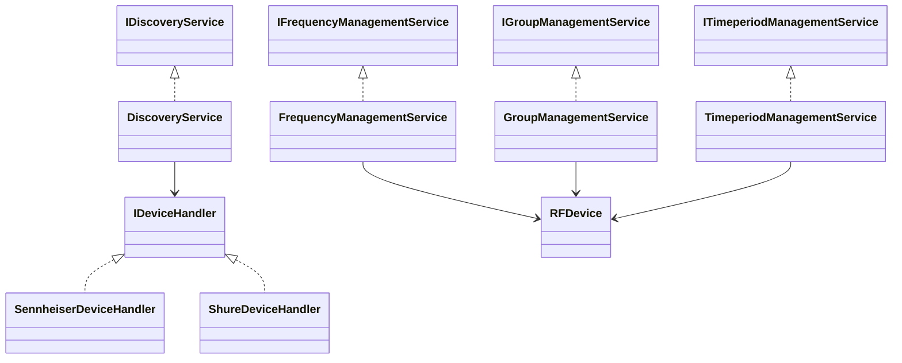

# API Interne - Interfaces

## Vue d'ensemble

Cette section documente les interfaces principales utilisées dans l'API interne de RF Go. Ces interfaces définissent les contrats entre les différents composants de l'application.

## Interfaces Principales

### IDeviceHandler

Interface pour la gestion des appareils spécifiques.

```csharp
public interface IDeviceHandler
{
    Task<RFDevice> DiscoverDevicesAsync();
    Task<bool> ConnectToDeviceAsync(string deviceId);
    Task<DeviceInfo> GetDeviceInfoAsync(string deviceId);
    Task<bool> UpdateDeviceAsync(RFDevice device);
    Task<bool> DisconnectFromDeviceAsync(string deviceId);
    event EventHandler<DeviceStatusChangedEventArgs> DeviceStatusChanged;
}
```

#### Méthodes
- `DiscoverDevicesAsync()` : Découvre les appareils disponibles
- `ConnectToDeviceAsync(string deviceId)` : Établit une connexion avec un appareil
- `GetDeviceInfoAsync(string deviceId)` : Récupère les informations d'un appareil
- `UpdateDeviceAsync(RFDevice device)` : Met à jour un appareil
- `DisconnectFromDeviceAsync(string deviceId)` : Déconnecte un appareil

#### Événements
- `DeviceStatusChanged` : Déclenché lorsque le statut d'un appareil change

### IDiscoveryService

Interface pour le service de découverte.

```csharp
public interface IDiscoveryService
{
    Task<IEnumerable<RFDevice>> DiscoverDevicesAsync();
    Task<RFDevice> GetDeviceInfoAsync(string deviceId);
    Task<bool> RegisterDeviceHandlerAsync(IDeviceHandler handler);
    Task<bool> UnregisterDeviceHandlerAsync(IDeviceHandler handler);
    event EventHandler<DeviceDiscoveredEventArgs> DeviceDiscovered;
}
```

#### Méthodes
- `DiscoverDevicesAsync()` : Découvre tous les appareils
- `GetDeviceInfoAsync(string deviceId)` : Récupère les informations d'un appareil
- `RegisterDeviceHandlerAsync(IDeviceHandler handler)` : Enregistre un handler d'appareil
- `UnregisterDeviceHandlerAsync(IDeviceHandler handler)` : Désenregistre un handler d'appareil

#### Événements
- `DeviceDiscovered` : Déclenché lorsqu'un nouvel appareil est découvert

### IFrequencyManagementService

Interface pour la gestion des fréquences.

```csharp
public interface IFrequencyManagementService
{
    Task<IEnumerable<FrequencyData>> GetAvailableFrequenciesAsync();
    Task<bool> AssignFrequencyAsync(RFDevice device, FrequencyData frequency);
    Task<bool> ValidateFrequencyAssignmentAsync(RFDevice device, FrequencyData frequency);
    Task<IEnumerable<InterferenceData>> CalculateInterferencesAsync(IEnumerable<FrequencyData> frequencies);
    event EventHandler<FrequencyAssignmentChangedEventArgs> FrequencyAssignmentChanged;
}
```

#### Méthodes
- `GetAvailableFrequenciesAsync()` : Récupère les fréquences disponibles
- `AssignFrequencyAsync(RFDevice device, FrequencyData frequency)` : Assign une fréquence
- `ValidateFrequencyAssignmentAsync(RFDevice device, FrequencyData frequency)` : Valide une assignation
- `CalculateInterferencesAsync(IEnumerable<FrequencyData> frequencies)` : Calcule les interférences

#### Événements
- `FrequencyAssignmentChanged` : Déclenché lorsqu'une assignation de fréquence change

### IGroupManagementService

Interface pour la gestion des groupes.

```csharp
public interface IGroupManagementService
{
    Task<RFGroup> CreateGroupAsync(string name);
    Task<bool> AddDeviceToGroupAsync(RFGroup group, RFDevice device);
    Task<bool> RemoveDeviceFromGroupAsync(RFGroup group, RFDevice device);
    Task<IEnumerable<RFGroup>> GetGroupsAsync();
    Task<bool> UpdateGroupAsync(RFGroup group);
    event EventHandler<GroupChangedEventArgs> GroupChanged;
}
```

#### Méthodes
- `CreateGroupAsync(string name)` : Crée un nouveau groupe
- `AddDeviceToGroupAsync(RFGroup group, RFDevice device)` : Ajoute un appareil à un groupe
- `RemoveDeviceFromGroupAsync(RFGroup group, RFDevice device)` : Retire un appareil d'un groupe
- `GetGroupsAsync()` : Récupère tous les groupes
- `UpdateGroupAsync(RFGroup group)` : Met à jour un groupe

#### Événements
- `GroupChanged` : Déclenché lorsqu'un groupe est modifié

### ITimeperiodManagementService

Interface pour la gestion des périodes.

```csharp
public interface ITimeperiodManagementService
{
    Task<RFTimeperiod> CreateTimeperiodAsync(DateTime startTime, DateTime endTime);
    Task<bool> AssignDeviceToTimeperiodAsync(RFTimeperiod timeperiod, RFDevice device);
    Task<bool> RemoveDeviceFromTimeperiodAsync(RFTimeperiod timeperiod, RFDevice device);
    Task<IEnumerable<RFTimeperiod>> GetTimeperiodsAsync();
    Task<bool> UpdateTimeperiodAsync(RFTimeperiod timeperiod);
    event EventHandler<TimeperiodChangedEventArgs> TimeperiodChanged;
}
```

#### Méthodes
- `CreateTimeperiodAsync(DateTime startTime, DateTime endTime)` : Crée une nouvelle période
- `AssignDeviceToTimeperiodAsync(RFTimeperiod timeperiod, RFDevice device)` : Assign un appareil à une période
- `RemoveDeviceFromTimeperiodAsync(RFTimeperiod timeperiod, RFDevice device)` : Retire un appareil d'une période
- `GetTimeperiodsAsync()` : Récupère toutes les périodes
- `UpdateTimeperiodAsync(RFTimeperiod timeperiod)` : Met à jour une période

#### Événements
- `TimeperiodChanged` : Déclenché lorsqu'une période est modifiée

## Diagramme des Dépendances



## Bonnes Pratiques d'Implémentation

1. **Séparation des Responsabilités**
   - Chaque interface doit avoir une responsabilité unique
   - Éviter les interfaces trop larges
   - Utiliser des interfaces spécifiques pour des cas d'utilisation spécifiques

2. **Gestion des Erreurs**
   - Définir clairement les exceptions possibles
   - Documenter les cas d'erreur
   - Fournir des messages d'erreur significatifs

3. **Performance**
   - Utiliser des méthodes asynchrones
   - Éviter les opérations bloquantes
   - Optimiser les appels de méthode

4. **Maintenance**
   - Documenter les changements d'interface
   - Maintenir la rétrocompatibilité
   - Tester les implémentations
