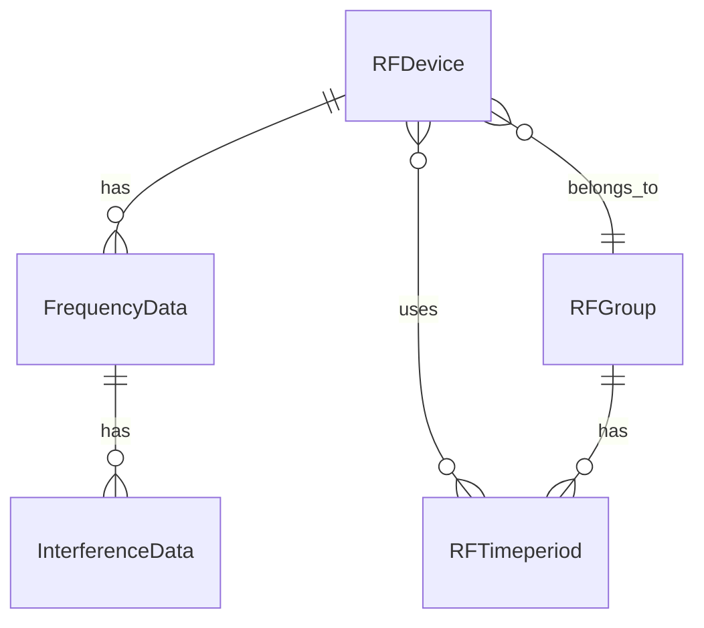

# API Interne - Modèles

## Vue d'ensemble

Cette section documente les modèles principaux utilisés dans l'API interne de RF Go. Ces modèles représentent les entités métier de l'application et sont utilisés pour le transfert de données entre les différentes couches.

## Modèles Principaux

### RFDevice

Modèle représentant un appareil audio sans fil.

```csharp
public class RFDevice
{
    public string DeviceId { get; set; }
    public string Name { get; set; }
    public string Manufacturer { get; set; }
    public string Model { get; set; }
    public List<FrequencyData> Frequencies { get; set; }
    public RFGroup Group { get; set; }
    public List<RFTimeperiod> Timeperiods { get; set; }
    public DeviceStatus Status { get; set; }
    public DateTime LastSeen { get; set; }
    public Dictionary<string, string> Properties { get; set; }

    public void UpdateStatus()
    {
        // Logique de mise à jour du statut
    }

    public IEnumerable<FrequencyData> GetFrequencies()
    {
        return Frequencies;
    }
}
```

#### Propriétés
- `DeviceId` : Identifiant unique de l'appareil
- `Name` : Nom de l'appareil
- `Manufacturer` : Fabricant de l'appareil
- `Model` : Modèle de l'appareil
- `Frequencies` : Liste des fréquences associées
- `Group` : Groupe auquel l'appareil appartient
- `Timeperiods` : Périodes d'utilisation
- `Status` : Statut actuel de l'appareil
- `LastSeen` : Dernière fois que l'appareil a été vu
- `Properties` : Propriétés supplémentaires

### FrequencyData

Modèle représentant les données de fréquence.

```csharp
public class FrequencyData
{
    public int Frequency { get; set; }
    public int Channel { get; set; }
    public string Band { get; set; }
    public bool IsAvailable { get; set; }
    public RFDevice Device { get; set; }
    public List<InterferenceData> Interferences { get; set; }

    public bool Validate()
    {
        // Logique de validation
        return true;
    }

    public List<InterferenceData> CalculateInterference()
    {
        // Logique de calcul d'interférence
        return Interferences;
    }
}
```

#### Propriétés
- `Frequency` : Valeur de la fréquence
- `Channel` : Numéro du canal
- `Band` : Bande de fréquence
- `IsAvailable` : Indique si la fréquence est disponible
- `Device` : Appareil associé
- `Interferences` : Liste des interférences détectées

### RFGroup

Modèle représentant un groupe d'appareils.

```csharp
public class RFGroup
{
    public string GroupId { get; set; }
    public string Name { get; set; }
    public List<RFDevice> Devices { get; set; }
    public List<RFTimeperiod> Timeperiods { get; set; }
    public GroupSettings Settings { get; set; }

    public void AddDevice(RFDevice device)
    {
        // Logique d'ajout d'appareil
    }

    public void RemoveDevice(RFDevice device)
    {
        // Logique de suppression d'appareil
    }

    public bool ValidateGroup()
    {
        // Logique de validation du groupe
        return true;
    }
}
```

#### Propriétés
- `GroupId` : Identifiant unique du groupe
- `Name` : Nom du groupe
- `Devices` : Liste des appareils du groupe
- `Timeperiods` : Périodes d'utilisation du groupe
- `Settings` : Paramètres du groupe

### RFTimeperiod

Modèle représentant une période d'utilisation.

```csharp
public class RFTimeperiod
{
    public string TimeperiodId { get; set; }
    public DateTime StartTime { get; set; }
    public DateTime EndTime { get; set; }
    public List<RFDevice> Devices { get; set; }
    public List<RFGroup> Groups { get; set; }
    public TimeperiodSettings Settings { get; set; }

    public bool ValidateTimeperiod()
    {
        // Logique de validation de la période
        return true;
    }

    public bool IsActive()
    {
        return DateTime.Now >= StartTime && DateTime.Now <= EndTime;
    }
}
```

#### Propriétés
- `TimeperiodId` : Identifiant unique de la période
- `StartTime` : Heure de début
- `EndTime` : Heure de fin
- `Devices` : Appareils associés
- `Groups` : Groupes associés
- `Settings` : Paramètres de la période

## Relations entre Modèles



## Validation des Modèles

### Règles de Validation
1. **RFDevice**
   - DeviceId ne doit pas être vide
   - Name ne doit pas être vide
   - Manufacturer ne doit pas être vide
   - Model ne doit pas être vide

2. **FrequencyData**
   - Frequency doit être dans une plage valide
   - Channel doit être positif
   - Band ne doit pas être vide

3. **RFGroup**
   - GroupId ne doit pas être vide
   - Name ne doit pas être vide
   - Devices ne doit pas être null

4. **RFTimeperiod**
   - TimeperiodId ne doit pas être vide
   - StartTime doit être avant EndTime
   - EndTime doit être dans le futur

## Sérialisation

Les modèles sont sérialisables en JSON pour la communication avec l'API :

```json
{
  "device": {
    "deviceId": "123",
    "name": "Microphone 1",
    "manufacturer": "Sennheiser",
    "model": "EW-D",
    "frequencies": [
      {
        "frequency": 470000,
        "channel": 1,
        "band": "UHF",
        "isAvailable": true
      }
    ]
  }
}
```

## Bonnes Pratiques

1. **Immuabilité**
   - Utiliser des propriétés en lecture seule quand possible
   - Valider les données à la création
   - Utiliser des constructeurs pour l'initialisation

2. **Validation**
   - Valider les données avant la persistance
   - Utiliser des attributs de validation
   - Fournir des messages d'erreur clairs

3. **Performance**
   - Éviter les collections trop grandes
   - Utiliser le lazy loading quand approprié
   - Optimiser les requêtes de base de données

4. **Maintenance**
   - Documenter les changements de modèle
   - Maintenir la rétrocompatibilité
   - Tester les validations 