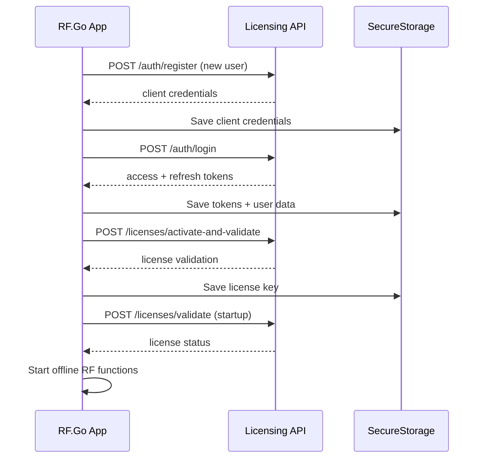

# API Licensing

## Vue d'ensemble

RF.Go utilise une **API de licensing externe** uniquement pour l'authentification utilisateur et la gestion des licenses. L'application fonctionne **entièrement offline** pour toutes les fonctionnalités RF - l'API sert exclusivement au licensing.

**Base URL** : `https://api.licensing.noobastudio.be`  
**API Key** : Fournie dans les headers `X-API-KEY`

## Authentication

### 1. Register User

**Endpoint** : `POST /auth/register`  
**Usage** : Création d'un nouveau compte utilisateur

```http
POST /auth/register
Content-Type: application/json
X-API-KEY: {apiKey}
X-DEVICE-ID: {deviceIdentifier}

{
    "firstName": "string",
    "lastName": "string", 
    "email": "string",
    "password": "string",
    "acceptedTerms": true
}
```

**Response** :
```json
{
    "message": "User registered successfully",
    "user": {
        "id": 123,
        "userName": "user@example.com",
        "firstName": "John",
        "lastName": "Doe",
        "email": "user@example.com",
        "emailConfirmed": false,
        "createdAt": "2024-01-15T10:30:00Z"
    },
    "client": {
        "clientId": "client-uuid",
        "clientSecret": "secret-string"
    }
}
```

### 2. Login User

**Endpoint** : `POST /auth/login`  
**Usage** : Authentification utilisateur et récupération du token

```http
POST /auth/login
Content-Type: application/x-www-form-urlencoded
X-API-KEY: {apiKey}
X-DEVICE-ID: {deviceIdentifier}

email={email}&password={password}&username={email}&client_id={clientId}&client_secret={clientSecret}&grant_type=password
```

**Response** :
```json
{
    "message": "Login successful",
    "user": {
        "id": 123,
        "userName": "user@example.com",
        "firstName": "John",
        "lastName": "Doe"
    },
    "token": {
        "accessToken": "jwt-access-token",
        "refreshToken": "jwt-refresh-token",
        "expiresIn": 3600,
        "tokenType": "Bearer"
    },
    "redirectTo": "/license"
}
```

### 3. Refresh Token

**Endpoint** : `POST /auth/refresh`  
**Usage** : Renouvellement du token d'accès

```http
POST /auth/refresh
Content-Type: application/json
X-API-KEY: {apiKey}
X-DEVICE-ID: {deviceIdentifier}
Authorization: Bearer {expiredAccessToken}

{
    "refreshToken": "jwt-refresh-token"
}
```

**Response** :
```json
{
    "accessToken": "new-jwt-access-token",
    "refreshToken": "new-jwt-refresh-token",
    "expiresIn": 3600
}
```

### 4. Logout

**Endpoint** : `POST /auth/logout`  
**Usage** : Déconnexion et invalidation des tokens

```http
POST /auth/logout
Content-Type: application/json
X-API-KEY: {apiKey}
Authorization: Bearer {accessToken}

{
    "token": "jwt-refresh-token"
}
```

## License Management

### 1. Activate License

**Endpoint** : `POST /licenses/activate-and-validate`  
**Usage** : Activation d'une license sur un device

```http
POST /licenses/activate-and-validate
Content-Type: application/json
X-API-KEY: {apiKey}
X-DEVICE-ID: {deviceIdentifier}
X-USER-KEY: {userId}
Authorization: Bearer {accessToken}

{
    "licenseKey": "license-key-string"
}
```

**Response** :
```json
{
    "valid": true,
    "message": "License activated successfully"
}
```

### 2. Validate License

**Endpoint** : `POST /licenses/validate`  
**Usage** : Validation d'une license existante au démarrage

```http
POST /licenses/validate
Content-Type: application/json
X-API-KEY: {apiKey}
X-USER-KEY: {userId}
X-DEVICE-ID: {deviceIdentifier}
X-LICENSE-KEY: {licenseKey}
Authorization: Bearer {accessToken}

{
    "licenseKey": "license-key-string",
    "deviceId": "device-identifier"
}
```

**Response** :
```json
{
    "valid": true,
    "message": "License is valid",
    "deviceId": "device-identifier",
    "licenseType": "Standard"
}
```

## Headers Standard

Tous les appels API utilisent ces headers :

| Header | Description | Obligatoire |
|--------|-------------|-------------|
| `X-API-KEY` | Clé API statique | ✅ Toujours |
| `X-DEVICE-ID` | Identifiant unique du device | ✅ Toujours |
| `X-USER-KEY` | ID utilisateur | ⚠️ Après login |
| `X-LICENSE-KEY` | Clé de license | ⚠️ Après activation |
| `Authorization` | Bearer token JWT | ⚠️ Après login |

## Implementation

### ApiService

Service centralisé pour tous les appels API :

```csharp
public class ApiService
{
    private readonly HttpClient _httpClient;

    public ApiService(HttpClient httpClient)
    {
        _httpClient = httpClient;
        _httpClient.BaseAddress = new Uri(AppConfig.ApiBaseUrl);
        _httpClient.DefaultRequestHeaders.Add("X-API-KEY", AppConfig.ApiKey);
    }

    private async Task AddSecureStorageHeadersAsync()
    {
        var userKey = await SecureStorage.GetAsync("userKey");
        var licenseKey = await SecureStorage.GetAsync("licenseKey");
        var deviceIdentifier = await GUID.GetOrCreateDeviceIdentifier();
        var token = await SecureStorage.GetAsync("access_token");

        // Dynamic headers based on available data
        if (!string.IsNullOrEmpty(userKey))
            _httpClient.DefaultRequestHeaders.Add("X-USER-KEY", userKey);
        if (!string.IsNullOrEmpty(licenseKey))
            _httpClient.DefaultRequestHeaders.Add("X-LICENSE-KEY", licenseKey);
        if (!string.IsNullOrEmpty(deviceIdentifier))
            _httpClient.DefaultRequestHeaders.Add("X-DEVICE-ID", deviceIdentifier);
        if (!string.IsNullOrEmpty(token))
            _httpClient.DefaultRequestHeaders.Authorization = new AuthenticationHeaderValue("Bearer", token);
    }
}
```

### Token Storage

Gestion sécurisée des tokens :

```csharp
public static class TokenStorage
{
    public static async Task SaveAccessTokenAsync(string token) 
        => await SecureStorage.SetAsync("access_token", token);
    
    public static async Task<string> GetAccessTokenAsync() 
        => await SecureStorage.GetAsync("access_token");
    
    public static async Task SaveRefreshTokenAsync(string token) 
        => await SecureStorage.SetAsync("refresh_token", token);
    
    public static async Task<string> GetRefreshTokenAsync() 
        => await SecureStorage.GetAsync("refresh_token");
}
```

## Flux d'authentification



## Gestion offline

**Important** : Seule l'authentification nécessite une connexion internet. Une fois la license validée, RF.Go fonctionne **entièrement offline** :

- ✅ Découverte des devices RF (mDNS local)
- ✅ Calculs d'intermodulations (algorithmes locaux)  
- ✅ Configuration des devices (protocols directs)
- ✅ Base de données locale (SQLite)

L'API n'est **jamais** sollicitée pour les fonctionnalités RF principales. 