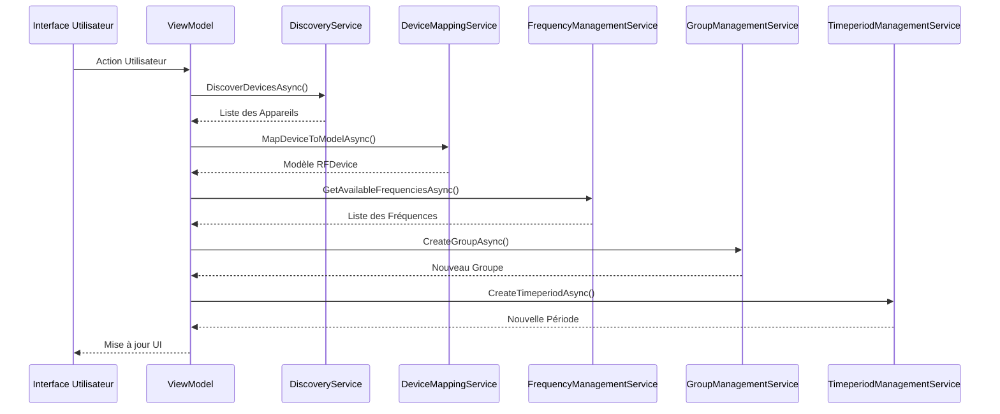

# API Interne - Services

## Vue d'ensemble

Cette section documente les services principaux de l'API interne de RF Go. Ces services constituent la couche métier de l'application et gèrent les interactions entre les différents composants.

## Services Principaux

### DiscoveryService

Service responsable de la découverte des appareils sur le réseau.

```csharp
public interface IDiscoveryService
{
    Task<IEnumerable<RFDevice>> DiscoverDevicesAsync();
    Task<RFDevice> GetDeviceInfoAsync(string deviceId);
    event EventHandler<DeviceDiscoveredEventArgs> DeviceDiscovered;
}
```

#### Méthodes
- `DiscoverDevicesAsync()` : Découvre tous les appareils disponibles
- `GetDeviceInfoAsync(string deviceId)` : Récupère les informations d'un appareil spécifique

#### Événements
- `DeviceDiscovered` : Déclenché lorsqu'un nouvel appareil est découvert

### DeviceMappingService

Service de mapping des données entre les modèles et les appareils.

```csharp
public interface IDeviceMappingService
{
    Task<RFDevice> MapDeviceToModelAsync(IDeviceHandler device);
    Task<IDeviceHandler> MapModelToDeviceAsync(RFDevice model);
    Task<bool> ValidateMappingAsync(RFDevice model);
}
```

#### Méthodes
- `MapDeviceToModelAsync(IDeviceHandler device)` : Convertit un appareil en modèle
- `MapModelToDeviceAsync(RFDevice model)` : Convertit un modèle en appareil
- `ValidateMappingAsync(RFDevice model)` : Valide le mapping d'un modèle

### FrequencyManagementService

Service de gestion des fréquences.

```csharp
public interface IFrequencyManagementService
{
    Task<IEnumerable<FrequencyData>> GetAvailableFrequenciesAsync();
    Task<bool> AssignFrequencyAsync(RFDevice device, FrequencyData frequency);
    Task<bool> ValidateFrequencyAssignmentAsync(RFDevice device, FrequencyData frequency);
}
```

#### Méthodes
- `GetAvailableFrequenciesAsync()` : Récupère les fréquences disponibles
- `AssignFrequencyAsync(RFDevice device, FrequencyData frequency)` : Assign une fréquence à un appareil
- `ValidateFrequencyAssignmentAsync(RFDevice device, FrequencyData frequency)` : Valide l'assignation d'une fréquence

### GroupManagementService

Service de gestion des groupes d'appareils.

```csharp
public interface IGroupManagementService
{
    Task<RFGroup> CreateGroupAsync(string name);
    Task<bool> AddDeviceToGroupAsync(RFGroup group, RFDevice device);
    Task<bool> RemoveDeviceFromGroupAsync(RFGroup group, RFDevice device);
    Task<IEnumerable<RFGroup>> GetGroupsAsync();
}
```

#### Méthodes
- `CreateGroupAsync(string name)` : Crée un nouveau groupe
- `AddDeviceToGroupAsync(RFGroup group, RFDevice device)` : Ajoute un appareil à un groupe
- `RemoveDeviceFromGroupAsync(RFGroup group, RFDevice device)` : Retire un appareil d'un groupe
- `GetGroupsAsync()` : Récupère tous les groupes

### TimeperiodManagementService

Service de gestion des périodes d'utilisation.

```csharp
public interface ITimeperiodManagementService
{
    Task<RFTimeperiod> CreateTimeperiodAsync(DateTime startTime, DateTime endTime);
    Task<bool> AssignDeviceToTimeperiodAsync(RFTimeperiod timeperiod, RFDevice device);
    Task<bool> RemoveDeviceFromTimeperiodAsync(RFTimeperiod timeperiod, RFDevice device);
    Task<IEnumerable<RFTimeperiod>> GetTimeperiodsAsync();
}
```

#### Méthodes
- `CreateTimeperiodAsync(DateTime startTime, DateTime endTime)` : Crée une nouvelle période
- `AssignDeviceToTimeperiodAsync(RFTimeperiod timeperiod, RFDevice device)` : Assign un appareil à une période
- `RemoveDeviceFromTimeperiodAsync(RFTimeperiod timeperiod, RFDevice device)` : Retire un appareil d'une période
- `GetTimeperiodsAsync()` : Récupère toutes les périodes

## Diagramme de Séquence



## Bonnes Pratiques d'Utilisation

1. **Gestion des Erreurs**
   - Toujours utiliser try-catch pour les appels de service
   - Logger les erreurs de manière appropriée
   - Fournir des messages d'erreur clairs aux utilisateurs

2. **Performance**
   - Utiliser le caching quand approprié
   - Limiter les appels de service inutiles
   - Utiliser des opérations asynchrones

3. **Sécurité**
   - Valider toutes les entrées
   - Vérifier les permissions
   - Utiliser des transactions pour les opérations critiques

4. **Maintenance**
   - Documenter les changements d'API
   - Maintenir la rétrocompatibilité
   - Tester régulièrement les services
