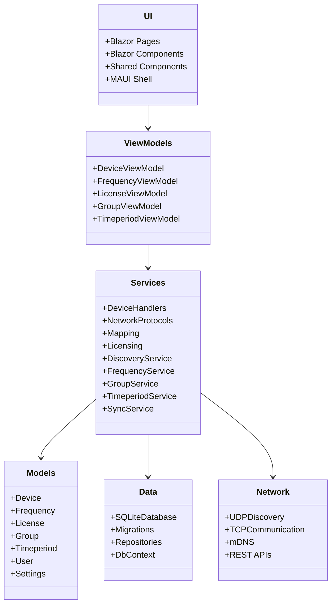
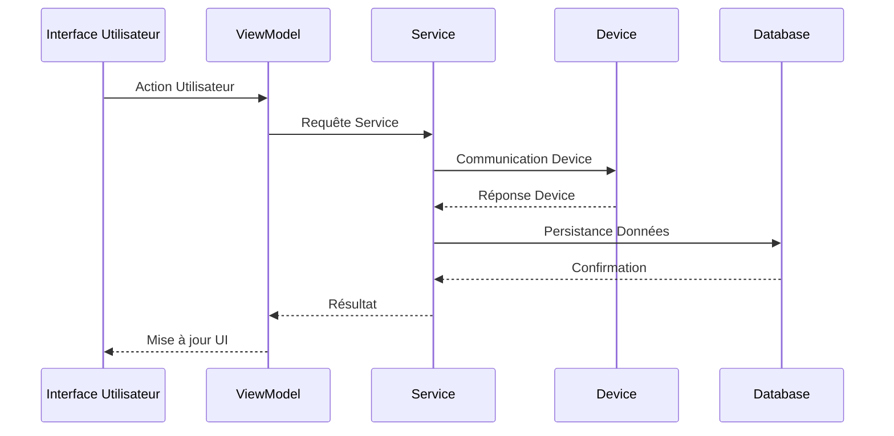

# Architecture

RF Go est conçu avec une architecture modulaire et extensible, permettant une gestion efficace des fréquences audio et des appareils. Cette documentation technique s'adresse aux développeurs souhaitant comprendre et contribuer au projet.

## Vue d'ensemble

L'application suit une architecture en couches basée sur le pattern MVVM (Model-View-ViewModel), avec une séparation claire des responsabilités. L'application est construite en utilisant .NET MAUI avec Blazor pour l'interface utilisateur, permettant un développement cross-platform.

## Composants principaux

### 1. Interface utilisateur (UI)

- **Blazor Pages** : Composants principaux de l'interface utilisateur
  - Pages de gestion des appareils
  - Pages de gestion des fréquences
  - Pages de configuration
  - Pages d'administration
- **Blazor Components** : Composants réutilisables
  - DeviceList
  - FrequencyAnalyzer
  - GroupManager
  - TimeperiodEditor
- **Shared Components** : Composants partagés entre les pages
  - Navigation
  - Notifications
  - Dialogs
  - Charts
- **MAUI Shell** : Navigation et structure de l'application
  - Routes définies
  - Navigation hiérarchique
  - Gestion des états
- **Responsive Design** : Adaptation aux différentes tailles d'écran
  - Layouts adaptatifs
  - Media queries
  - Composants responsifs

### 2. ViewModels

- Gestion de la logique de présentation
  - Validation des entrées
  - Gestion des états
  - Navigation
- Communication avec les services
  - Appels asynchrones
  - Gestion des erreurs
  - Mise en cache
- Gestion de l'état de l'application
  - State management
  - Persistance locale
  - Synchronisation
- Implémentation de INotifyPropertyChanged
  - Notifications de changements
  - Liaison de données bidirectionnelle
  - Mise à jour de l'UI
- Liaison de données avec les composants Blazor
  - Two-way binding
  - Event handling
  - State updates

### 3. Services

- **DeviceHandlers** : Gestion des appareils spécifiques
  - SennheiserHandler
  - ShureHandler
  - GenericHandler
  - Protocol abstraction
- **NetworkProtocols** : Implémentation des protocoles réseau
  - UDP discovery
  - TCP communication
  - REST APIs
  - mDNS/Bonjour
- **Mapping** : Mapping des données
  - AutoMapper profiles
  - Custom converters
  - Value resolvers
- **Licensing** : Gestion des licences
  - Validation
  - Activation
  - Feature flags
  - Security

### 4. Models

- Représentation des données
  - Entity classes
  - DTOs
  - ViewModels
- Validation des données
  - FluentValidation rules
  - Custom validators
  - Cross-field validation
- Logique métier
  - Business rules
  - Domain logic
  - State management
- Interfaces pour l'injection de dépendances
  - Service contracts
  - Repository interfaces
  - Factory interfaces

### 5. Data

- Gestion de la base de données SQLite
  - Entity Framework Core
  - Migrations
  - Seed data
- Accès aux données
  - Repositories
  - Unit of Work
  - Caching
- Migration des données
  - Versioning
  - Data transformations
  - Backup/restore
- Cache local
  - Memory cache
  - Disk cache
  - Cache invalidation

### 6. Network

- Découverte des appareils
  - mDNS/Bonjour
  - UDP broadcast
  - Service discovery
- Communication
  - TCP sockets
  - REST APIs
  - WebSockets
- Protocoles spécifiques
  - Sennheiser protocol
  - Shure protocol
  - Generic protocol
- Gestion des connexions
  - Connection pooling
  - Retry policies
  - Timeout handling

## Flux de données

## Sécurité

- Authentification des utilisateurs
  - JWT tokens
  - Refresh tokens
  - Role-based access
- Gestion des licences
  - Encryption
  - Digital signatures
  - License validation
- Communication sécurisée
  - TLS 1.3
  - Certificate pinning
  - Secure protocols
- Stockage sécurisé
  - Encrypted SQLite
  - Secure storage
  - Key management

## Extensibilité

L'architecture est conçue pour être extensible :

- Nouveaux types d'appareils
  - IDeviceHandler interface
  - Protocol abstraction
  - Device factory
- Nouveaux protocoles
  - INetworkProtocol interface
  - Protocol factory
  - Message handlers
- Nouvelles fonctionnalités
  - Dependency injection
  - Plugin system
  - Feature flags
- Nouveaux composants
  - Component library
  - Style system
  - Theme support

## Dépendances principales

- .NET MAUI
- Blazor
- Entity Framework Core
- SQLite
- AutoMapper
- FluentValidation
- JWT
- DNS/Bonjour
- MAUI Community Toolkit
- Refit
- Polly
- Serilog
