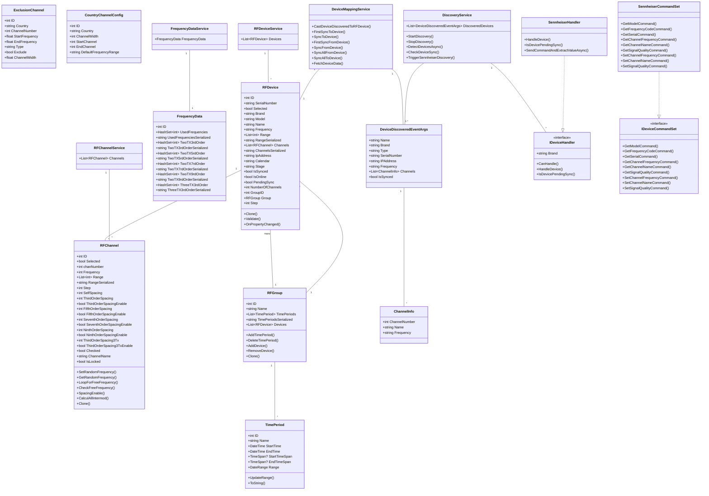

# Diagramme de Classes

## Vue d'ensemble

Ce diagramme présente la structure complète des classes de RF Go, incluant les modèles de données, les services, les handlers et les composants réseau.

## Description des Classes

### Modèles de Base de Données

1. **RFDevice**
   - Représente un appareil audio sans fil
   - Gère les informations de base (marque, modèle, nom)
   - Contient la liste des canaux RF
   - Gère l'état de synchronisation et de connexion
   - Implémente INotifyPropertyChanged pour les mises à jour UI
   - Validation des données et clonage

2. **RFChannel**
   - Représente un canal RF avec ses propriétés
   - Gère les espacements et les intermodulations
   - Calcul des fréquences disponibles
   - Validation des fréquences et des espacements
   - Gestion des verrouillages de fréquences

3. **RFGroup**
   - Représente un groupe d'appareils
   - Gère les périodes de temps
   - Contient la liste des appareils
   - Gestion des ajouts/suppressions d'appareils
   - Sérialisation des périodes de temps

4. **TimePeriod**
   - Représente une période de temps
   - Gestion des dates de début et de fin
   - Validation des plages de temps
   - Conversion en TimeSpan pour l'UI
   - Mise à jour des plages de dates

5. **ExclusionChannel**
   - Représente un canal exclu
   - Gère les plages de fréquences exclues
   - Informations sur le pays et le type
   - Largeur de canal et statut d'exclusion

6. **CountryChannelConfig**
   - Configuration des canaux par pays
   - Définit les plages de fréquences autorisées
   - Gère les largeurs de canal
   - Configuration par défaut des plages

7. **FrequencyData**
   - Stocke les données de fréquences utilisées
   - Gère les intermodulations d'ordre 3, 5, 7, 9
   - Gère les intermodulations à 3 émetteurs
   - Sérialisation des données de fréquences

8. **ChannelInfo**
   - Représente les informations d'un canal
   - Contient les numéros de canal et les fréquences

9. **DeviceDiscoveredEventArgs**
   - Représente un appareil découvert sur le réseau
   - Contient les informations de base de l'appareil
   - Gère les informations des canaux
   - Utilisé pour la conversion en RFDevice

### Services

1. **RFDeviceService**
   - Gère la liste des appareils
   - Fournit l'accès aux appareils

2. **RFChannelService**
   - Gère la liste des canaux
   - Fournit l'accès aux canaux

3. **FrequencyDataService**
   - Gère les données de fréquences
   - Fournit l'accès aux données d'intermodulation

4. **DeviceMappingService**
   - Gère la conversion entre DeviceDiscoveredEventArgs et RFDevice
   - Coordonne la synchronisation des appareils
   - Gère les mises à jour bidirectionnelles

5. **DiscoveryService**
   - Gère la découverte des appareils sur le réseau
   - Utilise mDNS/Bonjour pour la découverte
   - Coordonne les handlers d'appareils
   - Vérifie l'état de synchronisation

### Handlers et Commandes

1. **IDeviceHandler**
   - Interface pour les handlers d'appareils
   - Définit les opérations communes
   - Permet l'extensibilité

2. **SennheiserHandler**
   - Implémentation pour les appareils Sennheiser
   - Gère les protocoles spécifiques
   - Supporte les fonctionnalités avancées

3. **IDeviceCommandSet**
   - Interface pour les commandes d'appareils
   - Définit les commandes communes
   - Permet l'extensibilité

4. **SennheiserCommandSet**
   - Implémentation des commandes Sennheiser
   - Gère les commandes spécifiques
   - Supporte les fonctionnalités avancées
