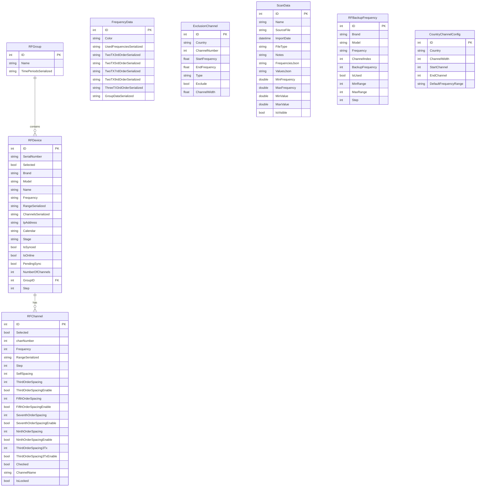

# Architecture des données

## Vue d'ensemble

RF.Go utilise **SQLite** comme base de données locale avec **Entity Framework Core** et **sqlite-net-pcl** pour l'accès aux données. L'architecture privilégie la performance locale et la synchronisation temps réel.

## Schéma de base de données

### Modèle relationnel



## Tables et responsabilités

### Tables principales

| Table | Rôle |
|-------|------|
| **RFDevice** | Appareils RF managés |
| **RFGroup** | Groupes temporels |
| **FrequencyData** | Cache intermodulations |
| **ScanData** | Données de scan spectral |
| **ExclusionChannel** | Canaux TV exclus |
| **RFBackupFrequency** | Fréquences de secours |
| **CountryChannelConfig** | Config par pays (non utilisé actuellement) |

## Stratégies de sérialisation

### Sérialisation JSON intégrée

**Problème** : SQLite ne supporte pas nativement les collections complexes
**Solution** : Propriétés sérialisées automatiques

```csharp
public class FrequencyData
{
    [Ignore]
    public HashSet<int> UsedFrequencies { get; set; } = new HashSet<int>();
    
    public string UsedFrequenciesSerialized
    {
        get => JsonSerializer.Serialize(UsedFrequencies);
        set => UsedFrequencies = JsonSerializer.Deserialize<HashSet<int>>(value);
    }
}
```

### Types sérialisés par table

| Modèle | Propriété sérialisée | Type original | Justification |
|--------|---------------------|---------------|---------------|
| **RFDevice** | `RangeSerialized` | `List<int>` | Plages de fréquences |
| **RFDevice** | `ChannelsSerialized` | `List<RFChannel>` | Canaux embarqués |
| **RFGroup** | `TimePeriodsSerialized` | `List<TimePeriod>` | Périodes temporelles |
| **FrequencyData** | `UsedFrequenciesSerialized` | `HashSet<int>` | Performance O(1) |
| **FrequencyData** | `GroupDataSerialized` | `Dictionary<int, FrequencyData>` | Données par groupe |
| **ScanData** | `FrequenciesJson` | `List<double>` | Données de scan |

## Optimisations de performance

### Gestion mémoire avec HashSet

**Utilisation réelle dans le code** :

```csharp
// Dans FrequencyCalculationService.cs et RFChannel.cs
public bool CheckFreeFrequency(int f1, HashSet<int> UsedFrequencies, HashSet<int> TwoTX3rdOrder, HashSet<int> TwoTX5rdOrder, HashSet<int> TwoTX7rdOrder, HashSet<int> TwoTX9rdOrder, HashSet<int> ThreeTX3rdOrder, List<(float StartFrequency, float EndFrequency)> excludedRanges)
{
    // Performance O(1) pour vérifications d'intermodulations
    return ((SpacingEnable(f1, TwoTX3rdOrder, ThirdOrderSpacingEnable, ThirdOrderSpacing))
                && (SpacingEnable(f1, TwoTX5rdOrder, FifthOrderSpacingEnable, FifthOrderSpacing))
                    && (SpacingEnable(f1, TwoTX7rdOrder, SeventhOrderSpacingEnable, SeventhOrderSpacing))
                        && (SpacingEnable(f1, TwoTX9rdOrder, NinthOrderSpacingEnable, NinthOrderSpacing))
                            && (SpacingEnable(f1, ThreeTX3rdOrder, ThirdOrderSpacing3TxEnable, ThirdOrderSpacing3Tx))
                                && !UsedFrequencies.Any(f => Math.Abs(f - f1) <= SelfSpacing));
}

public bool SpacingEnable(int f1, HashSet<int>freqs, bool OrderSpacingEnable, int OrderSpacing)
{
    if(OrderSpacingEnable) 
    {
        return !freqs.Any(f => Math.Abs(f-f1) <= OrderSpacing); // O(n) mais optimisé
    }
    else
    {
        return true;
    }
}
```

### Gestion des collections dans RFGroup

**Code réel du modèle** :
```csharp
public class RFGroup
{
    private readonly List<RFDevice> _devices = [];
    
    [Ignore]
    public IReadOnlyList<RFDevice> Devices => _devices; // Read-only exposure
    
    public void AddDevice(RFDevice device) // Controlled mutation
    {
        if (device != null && !_devices.Contains(device))
        {
            _devices.Add(device);
            device.GroupID = this.ID;
        }
    }
    
    public void RemoveDevice(RFDevice device)
    {
        if (device != null && _devices.Contains(device))
        {
            _devices.Remove(device);
            device.GroupID = this.ID;
        }
    }
}
```

## Initialisation de base de données

### Stratégie d'initialisation

**Base de données** : `RF_Go.db3`
**Initialisation** : Tables créées automatiquement si inexistantes

```csharp
private async Task CreateTablesAsync()
{
    await CreateTableIfNotExists<RFGroup>();
    await CreateTableIfNotExists<RFDevice>();
    await CreateTableIfNotExists<ExclusionChannel>();
    await CreateTableIfNotExists<FrequencyData>();
    await CreateTableIfNotExists<ScanData>();
    await CreateTableIfNotExists<RFBackupFrequency>();
    await CreateTableIfNotExists<CountryChannelConfig>();
    
    // Data seeding
    await InsertInitialGroups();
    await InsertInitialRFExclusionChannel();
}
```

### Seeding des données initiales

```csharp
private async Task InsertInitialGroups()
{
    var existingGroups = await Database.Table<RFGroup>().CountAsync();
    if (existingGroups == 0)
    {
        var initialGroups = new RFGroup();
        initialGroups.Name = "Default Group";
        await Database.InsertAsync(initialGroups);
    }
}

private async Task InsertInitialRFExclusionChannel()
{
    var existingExclusions = await Database.Table<ExclusionChannel>().CountAsync();
    if (existingExclusions == 0)
    {
        // Création des configurations de base pour chaque largeur de bande
        await InsertGenericChannels(470.0F, 6, "Generic-6MHz");
        await InsertGenericChannels(470.0F, 7, "Generic-7MHz");
        await InsertGenericChannels(470.0F, 8, "Generic-8MHz");
    }
}
```

## Sauvegarde et import/export

### Export structure

```csharp
var exportData = new
{
    Groups = await _dbContext.GetAllAsync<RFGroup>(),
    Devices = await _dbContext.GetAllAsync<RFDevice>(),
    ExclusionChannels = await _dbContext.GetAllAsync<ExclusionChannel>(),
    FrequencyData = await _dbContext.GetAllAsync<FrequencyData>(),
    ExportDate = DateTime.UtcNow
};
```

### Import de données


## Patterns d'accès aux données

### Repository générique

```csharp
public async Task<IEnumerable<TTable>> GetAllAsync<TTable>() where TTable : class, new()
{
    var table = GetTable<TTable>();
    return await table.ToListAsync();
}

public async Task<IEnumerable<TTable>> GetFilteredAsync<TTable>(Expression<Func<TTable, bool>> predicate) 
    where TTable : class, new()
{
    var table = GetTable<TTable>();
    return await table.Where(predicate).ToListAsync();
}
```

### Transactions et cohérence

```csharp
public async Task<bool> UpdateItemAsync<TTable>(TTable item) where TTable : class, new()
{
    try
    {
        var result = await Database.UpdateAsync(item);
        return result > 0;
    }
    catch (Exception ex)
    {
        Debug.WriteLine($"Error in UpdateItemAsync: {ex.Message}");
        throw; // Propagate for higher-level handling
    }
}
```

### Validation des données

```csharp
public class RFDevice : INotifyPropertyChanged
{
    public (bool IsValid, string ErrorMessage) Validate()
    {
        if (string.IsNullOrWhiteSpace(Brand))
        {
            return (false, $"{nameof(ID)} brand is required.");
        }
        return (true, string.Empty);
    }
}
```

Cette architecture de données supporte efficacement les exigences temps réel de RF.Go tout en maintenant la cohérence et les performances.
