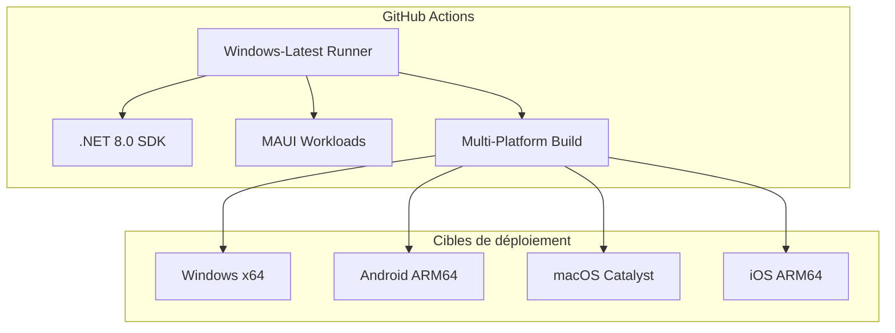
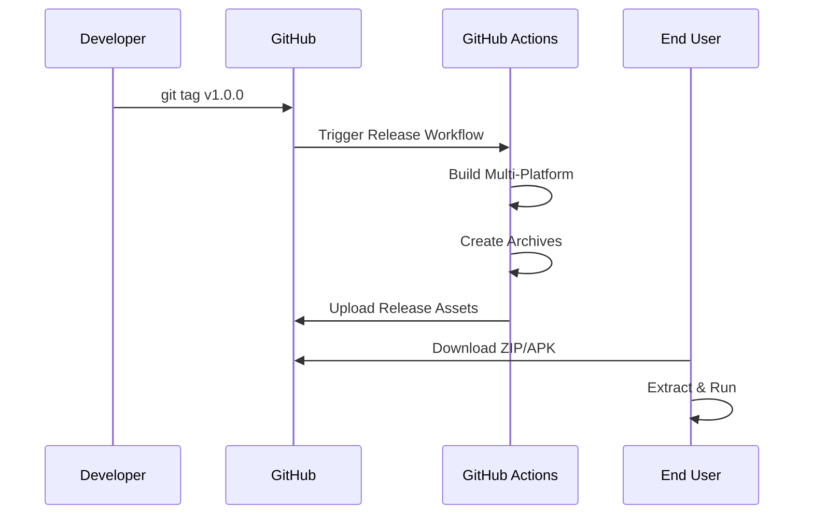
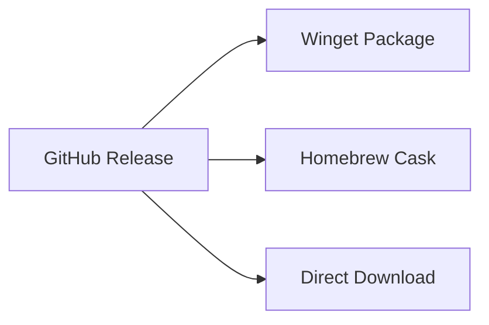
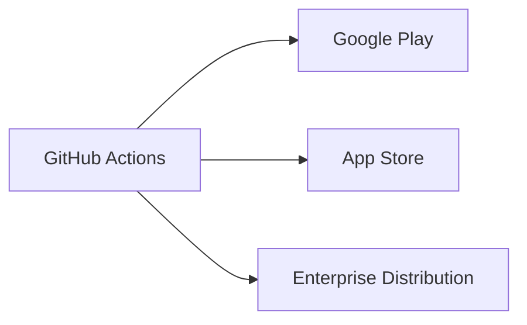

# Architecture de déploiement

## **Vue d'ensemble**

RF.Go utilise une stratégie de déploiement cross-platform basée sur **.NET MAUI 8.0** avec une distribution via **GitHub Actions** et des packages auto-suffisants pour simplifier l'installation utilisateur.

## **Architecture de déploiement actuelle**

### **Plateforme de build**



### **Configuration actuelle**

| Plateforme | Framework | Runtime | Packaging | Statut |
|------------|-----------|---------|-----------|---------|
| **Windows** | `net8.0-windows10.0.19041.0` | win-x64 self-contained | ZIP | ✅ Fonctionnel |
| **Android** | `net8.0-android` | android-arm64 | APK → ZIP | ⚠️ Debug uniquement |
| **macOS** | `net8.0-maccatalyst` | maccatalyst-x64 | ZIP | ⚠️ Pas de DMG |
| **iOS** | `net8.0-ios` | ios-arm64 | ZIP | ⚠️ Pas de signature |

## **Stratégie de packaging**

### **Windows - Exécutable autonome**

```bash
dotnet publish -c Release 
  -f net8.0-windows10.0.19041.0 
  -r win-x64 
  --self-contained 
  -p:PublishReadyToRun=false
  -p:PublishSingleFile=true
  -p:IncludeNativeLibrariesForSelfExtract=true
```

**Avantages** :

- ✅ Aucune installation .NET requise
- ✅ Déploiement simple (.exe unique)
- ✅ Compatible Windows 10/11

**Taille approximative** : ~150MB (avec runtime inclus)

### **Android - APK signé**

```bash
dotnet publish -c Release 
  -f net8.0-android 
  -r android-arm64 
  -p:AndroidSigningKeyStore=rf_go.keystore
  -p:AndroidSigningKeyAlias=rf_go
```

**Configuration requise** :

- Keystore pour signature
- Configuration Google Play Console
- Permissions réseau pour découverte mDNS

### **macOS - Bundle et DMG**

```bash
# 1. Générer le bundle .app
dotnet publish -c Release 
  -f net8.0-maccatalyst 
  -r maccatalyst-x64 
  -p:CreatePackage=true

# 2. Créer le DMG (à ajouter)
create-dmg \
  --volname "RF.Go Installer" \
  --window-pos 200 120 \
  --window-size 600 300 \
  --icon-size 100 \
  --icon "RF_Go.app" 175 120 \
  --hide-extension "RF_Go.app" \
  RF_Go.dmg \
  ./publish/maccatalyst-x64/
```

## **Signature de code**

### **Configuration de sécurité**

| Plateforme | Certificat | Processus | Statut |
|------------|-----------|-----------|---------|
| **Windows** | Code Signing | Authenticode | 🔄 À implémenter |
| **macOS** | Apple Developer | Notarization | 🔄 À implémenter |
| **iOS** | Apple Developer | App Store Connect | 🔄 À implémenter |
| **Android** | Play Console | Upload Key | 🔄 À implémenter |

### **Secrets GitHub**

```yaml
secrets:
  APPLE_DEVELOPER_ID: ${{ secrets.APPLE_DEVELOPER_ID }}
  APPLE_DEVELOPER_PASSWORD: ${{ secrets.APPLE_DEVELOPER_PASSWORD }}
  ANDROID_KEYSTORE: ${{ secrets.ANDROID_KEYSTORE }}
  ANDROID_KEYSTORE_PASSWORD: ${{ secrets.ANDROID_KEYSTORE_PASSWORD }}
  WINDOWS_CERTIFICATE: ${{ secrets.WINDOWS_CERTIFICATE }}
```

## **Stratégies de distribution**

### **Distribution actuelle - GitHub Releases**



### **Distribution recommandée - Stores**

#### **Desktop**



#### **Mobile**



## **Améliorations proposées**

### **1. Windows - Installateur MSI**

```xml
<!-- RF_Go.wixproj -->
<Project Sdk="WiX.Sdk/4.0.0">
  <PropertyGroup>
    <OutputType>Package</OutputType>
    <ProductName>RF.Go</ProductName>
    <ProductVersion>$(Version)</ProductVersion>
    <Manufacturer>RF.Go Team</Manufacturer>
  </PropertyGroup>
</Project>
```

### **2. macOS - DMG automatisé**

```yaml
- name: Create macOS DMG
  run: |
    brew install create-dmg
    create-dmg \
      --volname "RF.Go $(cat VERSION)" \
      --background ./assets/dmg-background.png \
      --window-pos 200 120 \
      --window-size 600 400 \
      --icon-size 100 \
      --icon "RF_Go.app" 175 120 \
      --hide-extension "RF_Go.app" \
      --app-drop-link 425 120 \
      RF_Go-${{ steps.get_version.outputs.VERSION }}-macos.dmg \
      ./publish/maccatalyst-x64/
```

### **3. Android - Play Store automatique**

```yaml
- name: Deploy to Play Store
  uses: r0adkll/upload-google-play@v1.1.3
  with:
    serviceAccountJsonPlainText: ${{ secrets.GOOGLE_PLAY_SERVICE_ACCOUNT }}
    packageName: com.rfgo.app
    releaseFiles: ./publish/android/*.apk
    track: production
```

### **4. Winget Package**

```yaml
- name: Update Winget Package
  uses: vedantmgoyal2009/winget-releaser@v2
  with:
    identifier: RFGo.RFGo
    installers-regex: '\.exe$'
    token: ${{ secrets.WINGET_TOKEN }}
```

## **Roadmap de déploiement**

### **Phase 1 - TFE (Actuel)**

- ✅ GitHub Actions multi-platform
- ✅ Self-contained Windows executable
- ✅ GitHub Releases automation

### **Phase 2 - Production**

- 🔄 Code signing toutes plateformes
- 🔄 DMG macOS automatisé
- 🔄 Play Store deployment
- 🔄 Windows MSI installer

### **Phase 3 - Distribution**

- 📋 Winget package
- 📋 Homebrew formula
- 📋 App Store Connect
- 📋 Auto-updates mechanism

## 🔧 **Configuration recommandée pour TFE**

### **Workflow optimisé**

```yaml
- name: Publish Windows (Self-Contained)
  run: |
    dotnet publish RF_Go/RF_Go.csproj \
      -c Release \
      -f net8.0-windows10.0.19041.0 \
      -r win-x64 \
      --self-contained \
      -p:PublishSingleFile=true \
      -p:IncludeNativeLibrariesForSelfExtract=true \
      -p:EnableCompressionInSingleFile=true \
      -o ./dist/windows/
```

Cette approche garantit un **déploiement simple** pour ton TFE : un seul fichier `.exe` que l'utilisateur peut directement exécuter sans aucune installation préalable.
