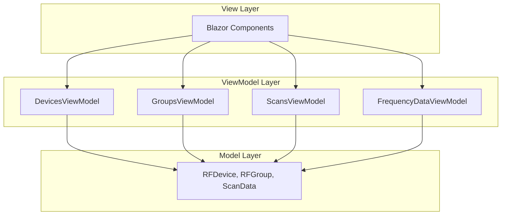
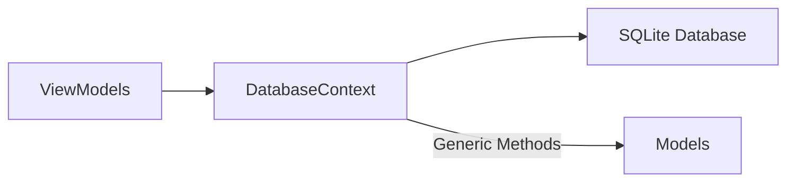
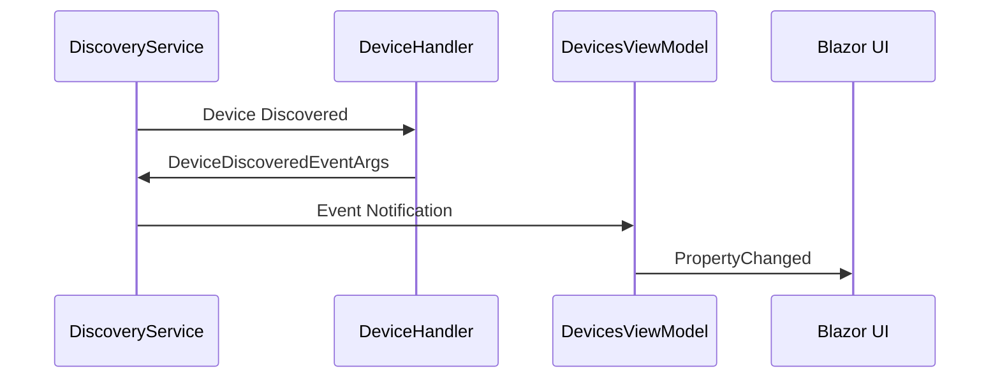
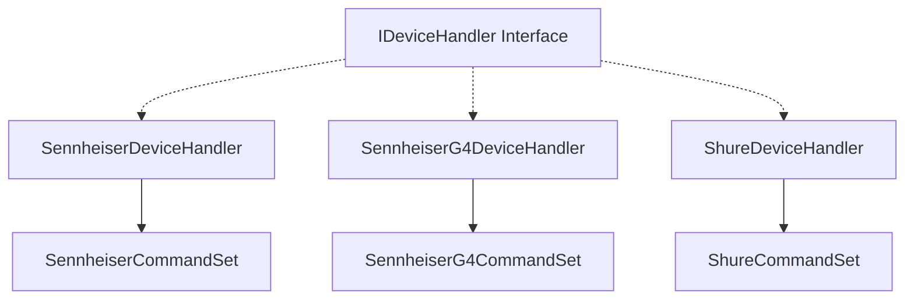
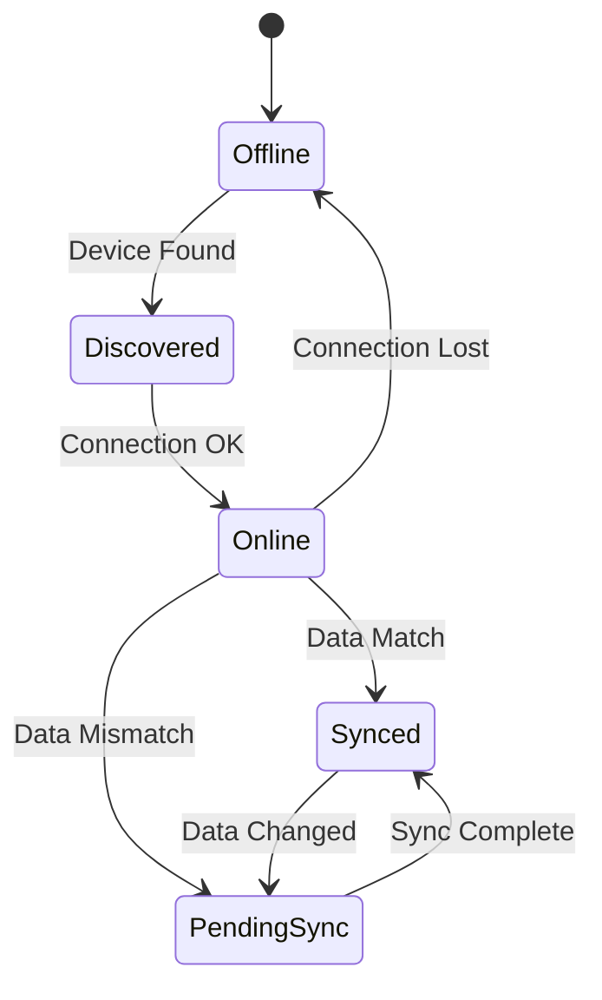

# Patterns de conception

## Attention cette section doit encore être revue

## **Vue d'ensemble**

RF.Go implémente plusieurs patterns de conception pour assurer une architecture modulaire, extensible et maintenable. Cette analyse se base sur l'implémentation réelle du code source.

## **Patterns architecturaux**

### **1. MVVM (Model-View-ViewModel)**

**Implémentation observée** :

```csharp
// ViewModels avec CommunityToolkit.Mvvm
public partial class DevicesViewModel : ObservableObject
{
    [ObservableProperty]
    private ObservableCollection<RFDevice> _devices = new();
    
    [ObservableProperty]
    private RFDevice _operatingDevice = new();
}
```

**Structure** :



**Avantages observés** :

- ✅ Séparation claire des responsabilités
- ✅ Data binding automatique avec `ObservableProperty`
- ✅ Testabilité des ViewModels indépendamment de l'UI

### **2. Repository Pattern**

**Implémentation via DatabaseContext** :

```csharp
public class DatabaseContext : IAsyncDisposable
{
    public async Task<IEnumerable<TTable>> GetAllAsync<TTable>()
    public async Task<bool> AddItemAsync<TTable>(TTable item)
    public async Task<bool> UpdateItemAsync<TTable>(TTable item)
    public async Task<bool> DeleteItemAsync<TTable>(TTable item)
}
```

**Abstraction des données** :



**Utilisation dans les ViewModels** :

```csharp
public async Task LoadDevicesAsync()
{
    var devices = await _context.GetAllAsync<RFDevice>();
    // Traitement...
}
```

## 🔧 **Patterns comportementaux**

### **3. Observer Pattern**

**Implémentation avec Events** :

```csharp
public class DiscoveryService
{
    public event EventHandler<DeviceDiscoveredEventArgs> DeviceDiscovered;
    
    private void OnServiceDiscovered(object sender, ServiceInstanceEventArgs e)
    {
        DeviceDiscovered?.Invoke(this, deviceInfo);
    }
}
```

**Notification de changements** :



### **4. Command Pattern**

**Abstraction des protocoles** :

```csharp
public interface IDeviceCommandSet
{
    string GetModelCommand();
    string GetFrequencyCodeCommand();
    string SetChannelFrequencyCommand(int channel, int frequency);
}

// Implémentations spécialisées
public class SennheiserCommandSet : IDeviceCommandSet
public class SennheiserG4CommandSet : IDeviceCommandSet  
public class ShureCommandSet : IDeviceCommandSet
```

**Utilisation polymorphe** :

```csharp
public class DeviceMappingService
{
    private IDeviceCommandSet _commandSet;
    
    private IDeviceHandler GetAppropriateHandler(RFDevice device)
    {
        // Sélection dynamique du bon handler
    }
}
```

## **Patterns créationnels**

### **5. Factory Pattern (Implicite)**

**Création dynamique de handlers** :

```csharp
public class DiscoveryService
{
    private List<IDeviceHandler> _handlers;
    
    private IDeviceHandler GetAppropriateHandlerForType(string brand, string type)
    {
        return _handlers.FirstOrDefault(h => h.CanHandle(serviceName));
    }
}
```

**Handlers spécialisés** :



### **6. Dependency Injection**

**Configuration des services** :

```csharp
// Injection dans les constructeurs
public class DevicesViewModel(DatabaseContext context) : ObservableObject
{
    private readonly DatabaseContext _context = context ?? throw new ArgumentNullException(nameof(context));
}
```

**Avantages** :

- ✅ Couplage faible entre composants
- ✅ Facilite les tests unitaires
- ✅ Configuration centralisée

## **Patterns structurels**

### **7. Adapter Pattern**

**Adaptation des formats réseau** :

```csharp
public class DeviceMappingService
{
    public RFDevice CastDeviceDiscoveredToRFDevice(DeviceDiscoveredEventArgs device)
    {
        // Conversion format réseau → modèle interne
        return new RFDevice
        {
            Name = device.Name,
            Brand = device.Brand,
            SerialNumber = device.SerialNumber,
            IpAddress = device.IPAddress
        };
    }
}
```

### **8. Strategy Pattern**

**Gestion multi-protocoles** :

```csharp
public interface IDeviceHandler
{
    string Brand { get; }
    bool CanHandle(string serviceName);
    Task<(bool IsEqual, bool IsNotResponding)> IsDevicePendingSync(DeviceDiscoveredEventArgs deviceInfo);
}

// Stratégies par marque
- SennheiserDeviceHandler : UDP Port 45
- SennheiserG4DeviceHandler : UDP avec G4Commands
- ShureDeviceHandler : TCP Port 2202
```

## **Patterns spécifiques au domaine RF**

### **9. State Pattern (Implicite)**

**États des devices** :

```csharp
public class RFDevice
{
    public bool IsSynced { get; set; }
    public bool IsOnline { get; set; }
    public bool PendingSync { get; set; }
}
```

**Transitions d'état** :



### **10. Builder Pattern (Configuration)**

**Construction de fréquences** :

```csharp
public class RFChannel
{
    public void SetRandomFrequency(
        HashSet<int> usedFreqs, 
        HashSet<int> intermod3rd,
        HashSet<int> intermod5th,
        HashSet<int> intermod7th,
        HashSet<int> intermod9th,
        HashSet<int> intermod3tx,
        List<(float Start, float End)> excludedRanges)
    {
        // Construction complexe avec multiples contraintes
    }
}
```

## **Patterns émergents**

### **11. Data Transfer Object (DTO)**

**Sérialisation JSON** :

```csharp
public class FrequencyData
{
    [Ignore]
    public HashSet<int> UsedFrequencies { get; set; }
    
    public string UsedFrequenciesSerialized
    {
        get => JsonSerializer.Serialize(UsedFrequencies);
        set => UsedFrequencies = JsonSerializer.Deserialize<HashSet<int>>(value);
    }
}
```

### **12. Event Sourcing (Partiel)**

**Tracking des changements** :

```csharp
public class DevicesViewModel
{
    public event EventHandler DevicesChanged;
    
    private void OnDevicesChanged()
    {
        DevicesChanged?.Invoke(this, EventArgs.Empty);
    }
}
```

## **Analyse des patterns**

### **Métrique de qualité**

| Pattern | Complexité | Maintenabilité | Extensibilité | Usage |
|---------|------------|----------------|---------------|-------|
| **MVVM** | Moyenne | ✅ Élevée | ✅ Élevée | Généralisé |
| **Repository** | Faible | ✅ Élevée | ✅ Élevée | Centralisé |
| **Command** | Faible | ✅ Élevée | ✅ Élevée | Protocoles |
| **Strategy** | Moyenne | ✅ Élevée | ✅ Élevée | Handlers |
| **Observer** | Faible | ✅ Moyenne | ✅ Élevée | Events |

### **Points forts observés**

1. **Cohérence architecturale** : Patterns utilisés de manière consistante
2. **Extensibilité** : Facilité d'ajout de nouvelles marques via interfaces
3. **Testabilité** : Injection de dépendances et séparation des couches
4. **Maintenabilité** : Code organisé selon les responsabilités

### **Évolutions possibles**

1. **Mediator Pattern** : Pour découpler davantage les ViewModels
2. **Unit of Work** : Pour les transactions complexes
3. **Chain of Responsibility** : Pour le traitement des erreurs réseau

Cette architecture pattern-driven contribue à la robustesse et à l'évolutivité de RF.Go dans un domaine techniquement complexe.
