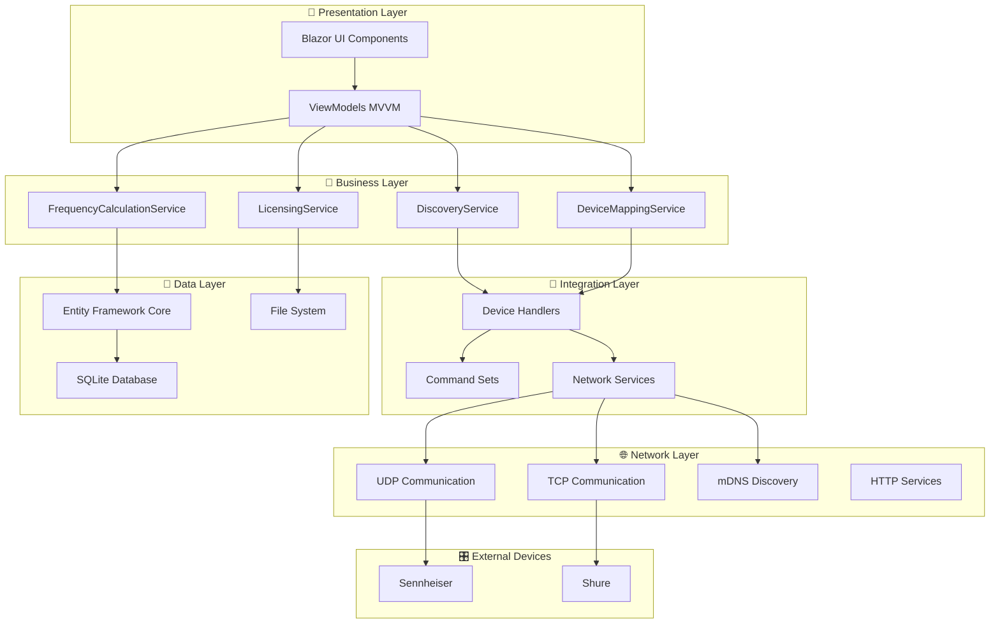
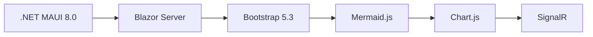
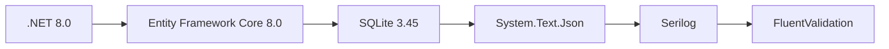
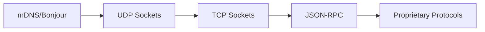
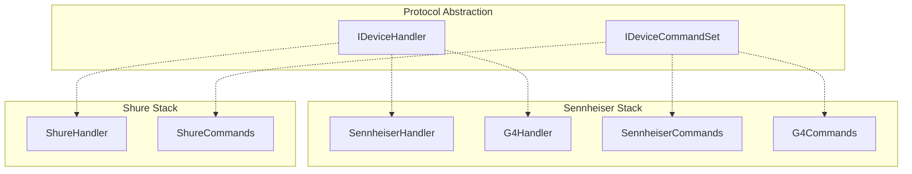

# Architecture système RF.Go

## 🎯 **Vision architecturale**

RF.Go implémente une **architecture en couches modulaire** optimisée pour la gestion temps réel des fréquences RF, avec une extensibilité multi-marques et une synchronisation bidirectionnelle avancée.

### **Principes architecturaux**

| Principe | Implémentation | Bénéfice |
|----------|----------------|----------|
| **Separation of Concerns** | Pattern MVVM strict | Maintenabilité, testabilité |
| **Single Responsibility** | Services spécialisés | Code focalisé, réutilisable |
| **Dependency Injection** | .NET DI Container | Couplage faible, testabilité |
| **Open/Closed** | Handlers extensibles | Ajout marques sans modification |
| **Protocol Abstraction** | Command Pattern | Support multi-protocoles |

## 🏗️ **Architecture système**



## 🛠️ **Stack technologique**

### **Frontend & UI**



### **Backend & Services**



### **Networking & Protocols**



## 🔧 **Patterns architecturaux**

### **1. MVVM (Model-View-ViewModel)**

```csharp
// Séparation stricte des responsabilités
View (Blazor) → ViewModel → Service → Model → Data
```

### **2. Repository Pattern**

```csharp
// Abstraction de l'accès aux données
IRepository<T> → EF Core → SQLite
```

### **3. Factory Pattern**

```csharp
// Création dynamique de handlers
DeviceHandlerFactory → IDeviceHandler → Concrete Handler
```

### **4. Command Pattern**

```csharp
// Abstraction des protocoles
IDeviceCommandSet → Brand Specific Commands
```

### **5. Observer Pattern**

```csharp
// Notifications temps réel
DeviceDiscovered → Event → UI Update
```

### **Stratégie de cache**

- **L1 Cache** : In-memory ViewModels
- **L2 Cache** : SQLite with indexes
- **L3 Cache** : Frequency calculation results

## 🔄 **Architecture d'intégration**

### **Support multi-protocoles**



## 📈 **Extensibilité et évolutivité**

### **Ajout de nouvelles marques**

1. Implémenter `IDeviceHandler`
2. Créer `BrandCommandSet`
3. Enregistrer dans DI Container
4. Aucune modification du core

### **Nouveaux protocoles**

1. Hériter de `NetworkService`
2. Implémenter la découverte
3. Définir le format de communication
