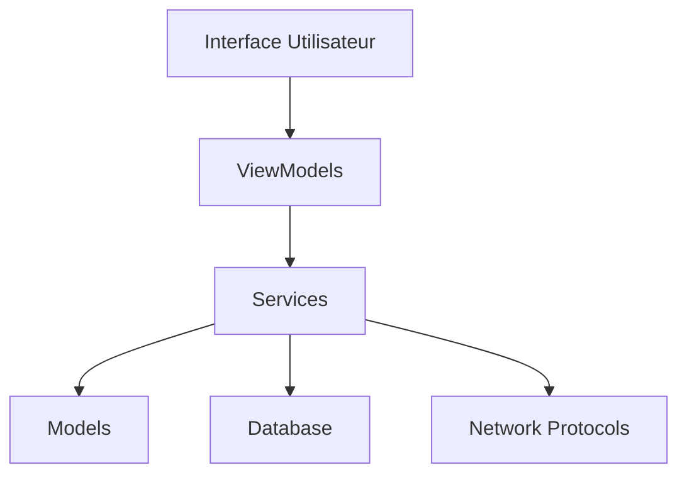
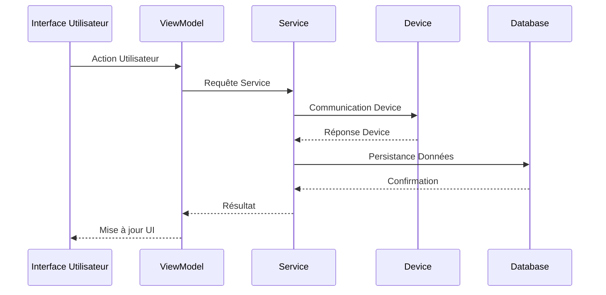

# Vue d'ensemble de l'Architecture

## Architecture Générale

RF Go suit une architecture modulaire basée sur le pattern MVVM (Model-View-ViewModel), avec une séparation claire des responsabilités. L'application est construite en utilisant .NET MAUI avec Blazor pour l'interface utilisateur.

## Composants Principaux

### 1. Interface Utilisateur (UI)
- **Pages** : Composants principaux de l'interface
- **Components** : Composants réutilisables
- **Shared** : Composants partagés entre les pages

### 2. ViewModels
- Gestion de la logique de présentation
- Communication avec les services
- Gestion de l'état de l'application

### 3. Services
- **DeviceHandlers** : Gestion des appareils spécifiques
- **NetworkProtocols** : Implémentation des protocoles réseau
- **Mapping** : Mapping des données entre les modèles
- **Licensing** : Gestion des licences

### 4. Models
- Représentation des données
- Validation des données
- Logique métier

### 5. Data
- Gestion de la base de données SQLite
- Accès aux données
- Migration des données

### 6. Network
- Découverte des appareils via DNS/Bonjour
- Communication UDP/TCP
- Protocoles spécifiques aux appareils

## Flux de Données

## Sécurité

- Authentification des utilisateurs
- Gestion des licences
- Communication sécurisée avec les appareils
- Stockage sécurisé des données

## Extensibilité

L'architecture est conçue pour être extensible :
- Nouveaux types d'appareils
- Nouveaux protocoles de communication
- Nouvelles fonctionnalités 