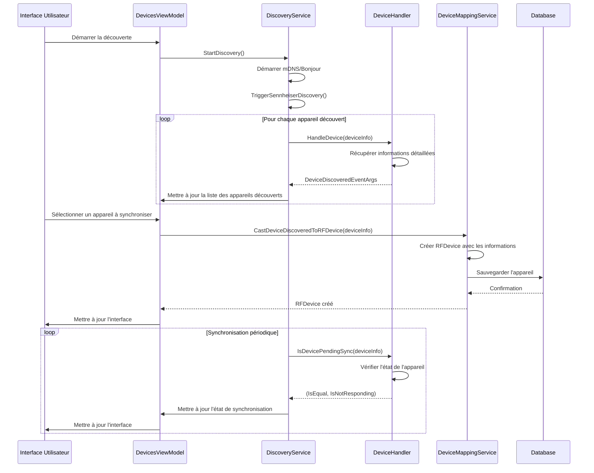
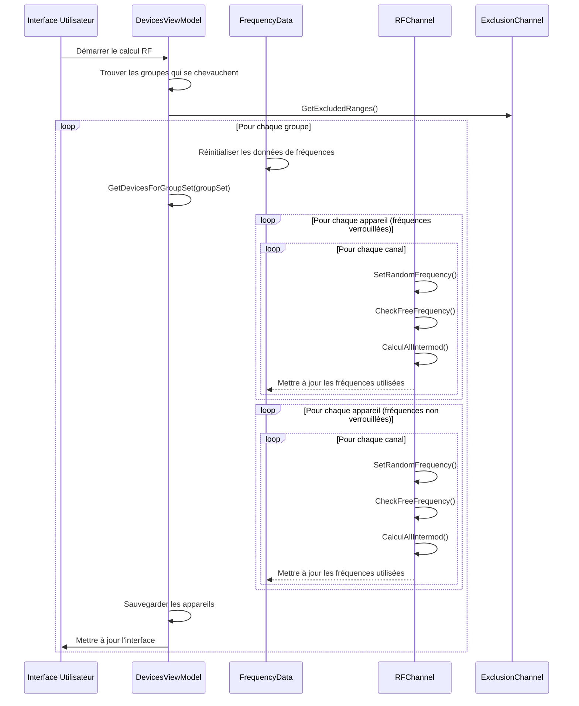
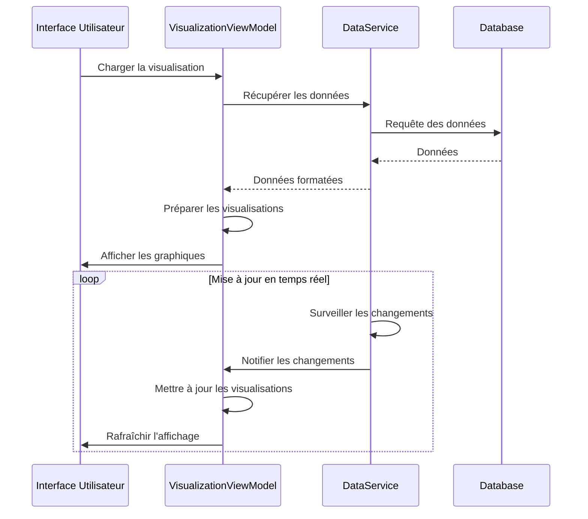
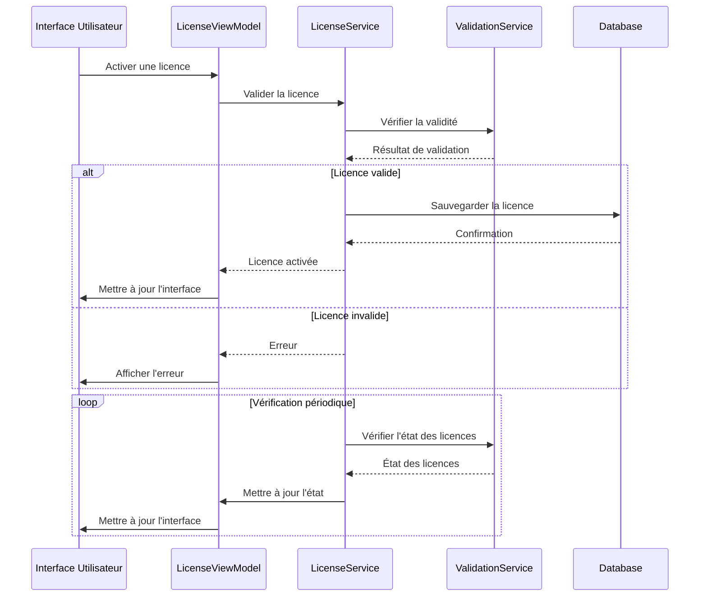
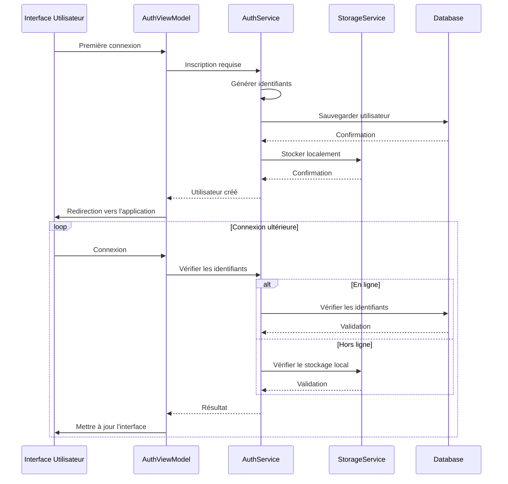
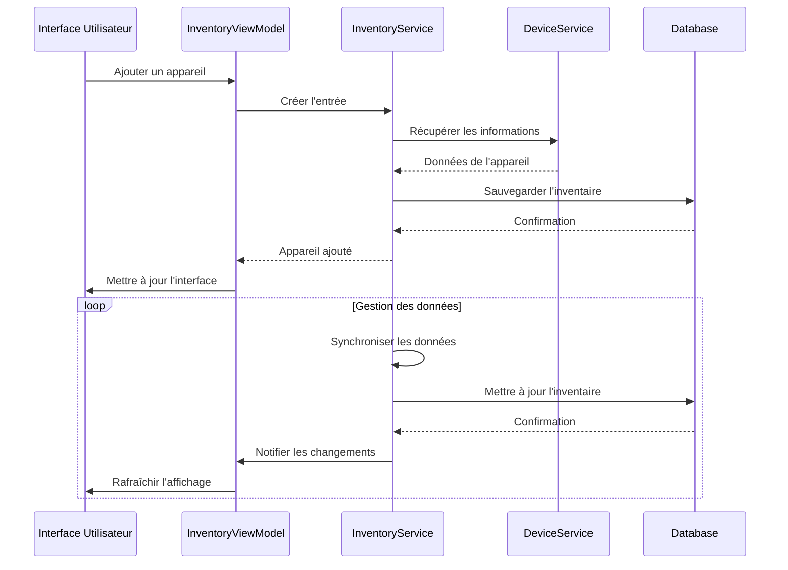

# Use Cases

## 1. Découverte et Synchronisation des Appareils

## 2. Calcul des Fréquences RF

## 3. Visualisation des Données

## 4. Gestion des Licences

## 5. Authentification et Gestion des Utilisateurs

## 6. Gestion de l'Inventaire

## Détails des Use Cases

### Découverte et Synchronisation

Ce use case décrit le processus de découverte des appareils sur le réseau et leur synchronisation avec l'application :

1. **Découverte des Appareils**
   - L'utilisateur démarre la découverte depuis l'interface
   - Le DiscoveryService utilise mDNS/Bonjour pour détecter les appareils
   - Les DeviceHandlers spécifiques récupèrent les informations détaillées
   - Les appareils découverts sont affichés dans l'interface

2. **Synchronisation**
   - L'utilisateur sélectionne un appareil à synchroniser
   - Le DeviceMappingService convertit les informations en RFDevice
   - L'appareil est sauvegardé dans la base de données
   - Une synchronisation périodique vérifie l'état des appareils

3. **Gestion de l'État**
   - Les appareils peuvent être en ligne/hors ligne
   - L'état de synchronisation est maintenu
   - Les mises à jour sont reflétées dans l'interface

### Calcul des Fréquences

Ce use case décrit le processus complexe de calcul des fréquences RF pour éviter les interférences :

1. **Préparation**
   - Identification des groupes d'appareils qui se chevauchent
   - Récupération des plages de fréquences exclues
   - Réinitialisation des données de fréquences

2. **Calcul des Fréquences**
   - Traitement des fréquences verrouillées en premier
   - Vérification des espacements et intermodulations
   - Calcul des fréquences disponibles
   - Mise à jour des données de fréquences

3. **Gestion des Intermodulations**
   - Calcul des intermodulations d'ordre 3, 5, 7, 9
   - Gestion des intermodulations à 3 émetteurs
   - Vérification des espacements entre fréquences

4. **Sauvegarde et Mise à Jour**
   - Sauvegarde des appareils avec leurs nouvelles fréquences
   - Mise à jour de l'interface utilisateur
   - Affichage des résultats du calcul

### Visualisation des Données

Ce use case décrit la gestion de l'interface graphique et la visualisation des données :

1. **Affichage des Données**
   - Chargement des données depuis la base
   - Formatage pour la visualisation
   - Mise à jour en temps réel
   - Gestion des différents types de visualisations

2. **Interactivité**
   - Filtrage des données
   - Zoom et navigation
   - Export des visualisations
   - Personnalisation de l'affichage

### Gestion des Licences

Ce use case décrit le système de gestion des licences :

1. **Activation des Licences**
   - Validation des clés de licence
   - Activation en ligne/hors ligne
   - Gestion des fonctionnalités
   - Vérification périodique

2. **Types de Licences**
   - Licences gratuites
   - Licences payantes
   - Licences d'essai
   - Licences d'entreprise

### Authentification et Gestion des Utilisateurs

Ce use case décrit le système d'authentification :

1. **Inscription**
   - Création du compte
   - Stockage sécurisé
   - Validation des données
   - Configuration initiale

2. **Connexion**
   - Authentification en ligne
   - Mode hors ligne
   - Gestion des sessions
   - Sécurité des données

### Gestion de l'Inventaire

Ce use case décrit la gestion des appareils dans l'inventaire :

1. **Ajout d'Appareils**
   - Saisie des informations
   - Validation des données
   - Association aux groupes
   - Stockage des configurations

2. **Gestion des Données**
   - Synchronisation
   - Mise à jour des informations
   - Historique des modifications
   - Export des données
