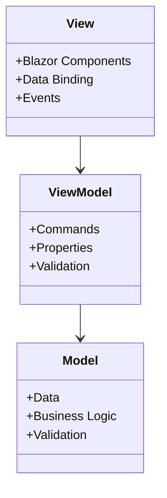

# Guide de Développement

## Vue d'ensemble

Ce guide fournit des instructions détaillées pour les développeurs souhaitant contribuer au projet RF Go. Il couvre les conventions de code, les bonnes pratiques, et les processus de développement.

## Environnement de Développement

### Prérequis

- Visual Studio 2022 avec .NET MAUI
- .NET 8.0 SDK
- Git
- SQLite
- Node.js (pour la documentation)

### Configuration

1. Clonez le dépôt :
   ```bash
   git clone https://github.com/votre-org/RF_Go.git
   ```

2. Installez les dépendances :
   ```bash
   dotnet restore
   npm install
   ```

3. Configurez la base de données :
   ```bash
   dotnet ef database update
   ```

## Structure du Projet

```
RF_Go/
├── Components/         # Composants Blazor
├── Data/              # Accès aux données
├── Interfaces/        # Interfaces de service
├── Licensing/         # Gestion des licences
├── Models/            # Modèles de données
├── Pages/             # Pages Blazor
├── Services/          # Services métier
├── Utils/             # Utilitaires
├── ViewModels/        # ViewModels
└── wwwroot/           # Fichiers statiques
```

## Conventions de Code

### Nommage

- **Classes** : PascalCase
- **Méthodes** : PascalCase
- **Variables** : camelCase
- **Interfaces** : IPascalCase
- **Constantes** : UPPER_CASE
- **Namespaces** : PascalCase

### Documentation

- Documentation XML pour les APIs publiques
- Commentaires pour le code complexe
- README.md pour chaque composant majeur

### Tests

- Tests unitaires pour chaque service
- Tests d'intégration pour les workflows
- Tests de performance pour les opérations critiques

## Processus de Développement

### Workflow Git

1. Créez une branche pour votre fonctionnalité :
   ```bash
   git checkout -b feature/ma-nouvelle-fonctionnalite
   ```

2. Committez vos changements :
   ```bash
   git add .
   git commit -m "feat: ajout de la nouvelle fonctionnalité"
   ```

3. Poussez votre branche :
   ```bash
   git push origin feature/ma-nouvelle-fonctionnalite
   ```

4. Créez une Pull Request

### Revue de Code

- Vérification du style de code
- Tests unitaires
- Documentation
- Performance
- Sécurité

## Architecture

### Pattern MVVM



### Injection de Dépendances

```csharp
public void ConfigureServices(IServiceCollection services)
{
    services.AddScoped<IDeviceService, DeviceService>();
    services.AddScoped<IFrequencyService, FrequencyService>();
    services.AddScoped<IGroupService, GroupService>();
    services.AddScoped<ITimeperiodService, TimeperiodService>();
}
```

## Tests

### Tests Unitaires

```csharp
[TestClass]
public class DeviceServiceTests
{
    [TestMethod]
    public async Task DiscoverDevicesAsync_ShouldReturnDevices()
    {
        // Arrange
        var service = new DeviceService();
        
        // Act
        var devices = await service.DiscoverDevicesAsync();
        
        // Assert
        Assert.IsNotNull(devices);
        Assert.IsTrue(devices.Any());
    }
}
```

### Tests d'Intégration

```csharp
[TestClass]
public class DeviceIntegrationTests
{
    [TestMethod]
    public async Task DeviceDiscovery_ShouldWorkWithRealDevices()
    {
        // Arrange
        var service = new DeviceService();
        
        // Act
        var devices = await service.DiscoverDevicesAsync();
        
        // Assert
        Assert.IsNotNull(devices);
        Assert.IsTrue(devices.Any(d => d.Type == "Sennheiser"));
    }
}
```

## Performance

### Optimisations

- Utilisation du caching
- Requêtes asynchrones
- Pagination des données
- Compression des réponses

### Monitoring

- Logging des performances
- Métriques d'utilisation
- Alertes de performance
- Profilage régulier

## Sécurité

### Bonnes Pratiques

- Validation des entrées
- Protection CSRF
- Sanitization des données
- Gestion sécurisée des secrets

### Tests de Sécurité

- Analyse statique
- Tests de pénétration
- Revue de code sécurité
- Audit de dépendances

## Déploiement

### Processus

1. Build de la solution
2. Tests automatiques
3. Création du package
4. Déploiement en staging
5. Validation
6. Déploiement en production

### Configuration

- Variables d'environnement
- Secrets
- Certificats
- Connexions base de données

## Support

### Ressources

- Documentation en ligne
- Forum de développement
- Wiki interne
- Sessions de formation

### Contact

- Équipe de développement
- Responsable technique
- Support utilisateurs
- Gestionnaire de projet 