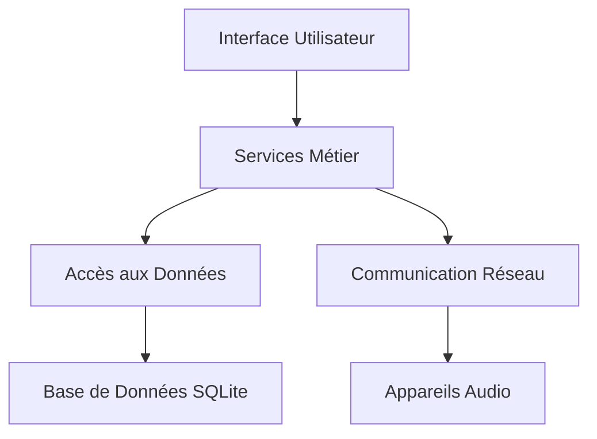

# Vue d'ensemble de l'Architecture

## Architecture Globale

RF Go utilise une architecture en couches avec une séparation claire des responsabilités :

## Principes de Conception

1. **Modularité** : Chaque composant est indépendant et peut être modifié sans affecter les autres
2. **Extensibilité** : Architecture permettant l'ajout facile de nouveaux types d'appareils
3. **Performance** : Optimisation pour la gestion en temps réel des fréquences
4. **Fiabilité** : Gestion robuste des erreurs et des cas limites

## Flux de Données

1. Découverte des appareils via UDP
2. Communication bidirectionnelle via TCP
3. Stockage local des configurations
4. Synchronisation périodique des données 