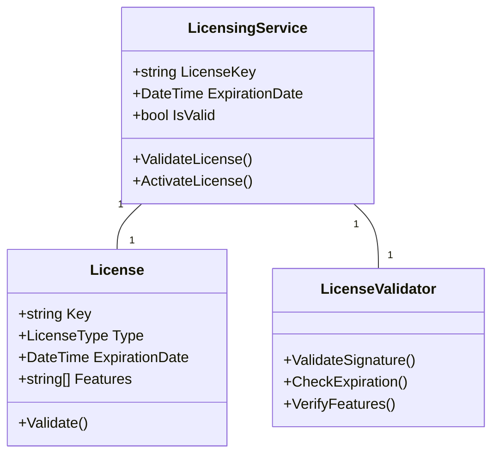

# Système de Licence

## Vue d'ensemble

RF Go utilise un système de licence pour gérer l'accès aux fonctionnalités de l'application. Le système supporte deux types de licences : gratuites et payantes.

## Types de Licences

### Licence Gratuite
- Automatiquement envoyée par email à l'inscription
- Accès à toutes les fonctionnalités de base
- Pas de limite de temps
- Identifiée par un code de licence unique

### Licence Payante
- Achetée sur le site web
- Accès à toutes les fonctionnalités avancées
- Période de validité définie
- Identifiée par un code de licence unique

## Architecture du Système de Licence



## Processus d'Activation

### Licence Gratuite
1. Inscription de l'utilisateur
2. Génération automatique de la licence
3. Envoi par email
4. Activation dans l'application

### Licence Payante
1. Achat sur le site web
2. Réception du code de licence
3. Activation dans l'application
4. Validation en ligne

## Implémentation Technique

### Validation des Licences
```csharp
public class LicensingService : ILicensingService
{
    private readonly LicenseValidator _validator;
    private License _currentLicense;

    public async Task<bool> ValidateLicenseAsync(string licenseKey)
    {
        var license = await _validator.ValidateAsync(licenseKey);
        if (license.IsValid)
        {
            _currentLicense = license;
            return true;
        }
        return false;
    }

    public bool HasFeature(string feature)
    {
        return _currentLicense?.Features.Contains(feature) ?? false;
    }
}
```

### Stockage des Licences
- Stockage sécurisé dans la base de données locale
- Chiffrement des clés de licence
- Sauvegarde des informations d'activation

## Fonctionnalités par Type de Licence

### Licence Gratuite
- Découverte des appareils
- Visualisation basique
- Gestion des groupes
- Configuration de base

### Licence Payante
- Toutes les fonctionnalités de la licence gratuite
- Analyse avancée des fréquences
- Rapports détaillés
- Support prioritaire
- Mises à jour automatiques

## Dépannage

### Problèmes Courants
1. Licence non reconnue
2. Date d'expiration atteinte
3. Erreur de validation
4. Problème d'activation

### Solutions
1. Vérifier la connexion internet
2. Confirmer la validité de la licence
3. Réactiver la licence
4. Contacter le support

## Sécurité

### Mesures de Protection
- Validation cryptographique des licences
- Protection contre la copie
- Vérification en ligne périodique
- Journalisation des activités de licence

### Bonnes Pratiques
1. Ne pas partager les clés de licence
2. Garder une copie de sauvegarde
3. Activer les licences sur les appareils autorisés
4. Signaler les problèmes au support 