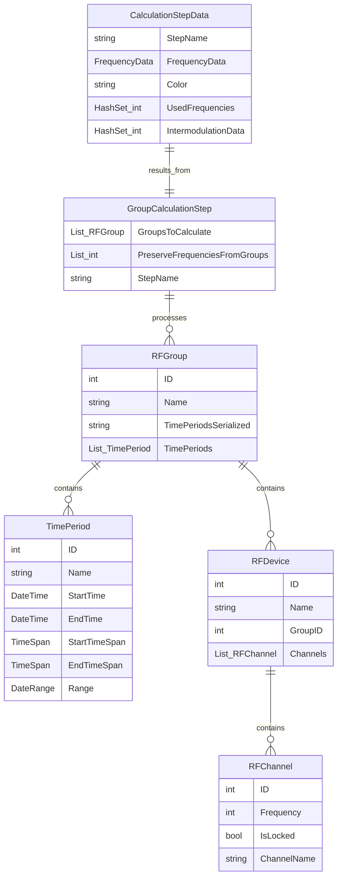
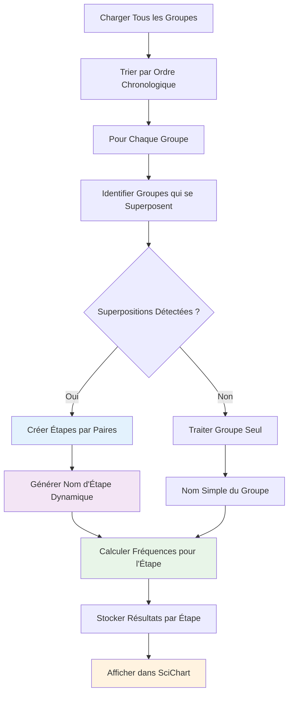
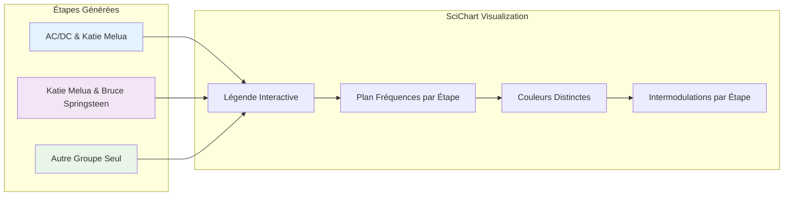

# Gestion temporelle - planification RF avancée

La **gestion temporelle** est une fonctionnalité distinctive de RF.Go qui permet de planifier l'utilisation des fréquences dans le temps. Cette approche optimise l'utilisation du spectre en calculant des **étapes de fréquences par paires** selon les superpositions temporelles réelles.

## Vue d'ensemble

### Concept de la gestion temporelle

La gestion temporelle dans RF.Go repose sur le principe que **les superpositions temporelles génèrent des étapes de calcul optimisées**. Au lieu de calculer tous les groupes ensemble, le système :

- **Analyse les superpositions chronologiques** entre groupes
- **Génère des étapes de calcul par paires** (ex: "Groupe A & B", "Groupe B & C")
- **Optimise les intermodulations** pour chaque combinaison temporelle
- **Permet la visualisation séparée** des plans de fréquences par étape

```mermaid
gantt
    title Exemple de Planification Temporelle RF avec Étapes de Calcul
    dateFormat HH:mm
    axisFormat %H:%M
    
    section Scène Principale
    AC/DC               :active, artist-a, 18:00, 19:00
    Katie Melua         :artist-b, 18:40, 20:00
    Bruce Springsteen   :artist-c, 19:35, 20:55
    
    section Étapes de Calcul Générées
    AC/DC & Katie Melua      :crit, step1, 18:40, 19:00
    Katie Melua & Bruce      :crit, step2, 19:35, 20:00
    
    section Résultat SciChart
    Plan Fréquences 1   :done, plan1, 18:00, 20:00
    Plan Fréquences 2   :done, plan2, 18:40, 20:55
```



## Architecture temporelle

### Modèle de données



### Types de superpositions temporelles

#### 1. **Superposition simple**

Deux groupes se chevauchent dans le temps :

```csharp
// Exemple: AC/DC (18:00-19:00) + Katie Melua (18:40-20:00)
// Résultat: Étape "AC/DC & Katie Melua"
var etapeSimple = new GroupCalculationStep {
    GroupsToCalculate = { groupACDC, groupKatieMelua },
    PreserveFrequenciesFromGroups = { },
    StepName = "AC/DC & Katie Melua"
};
```

#### 2. **Superposition multiple**

Un groupe se superpose avec plusieurs autres à des moments différents :

```csharp
// Katie Melua se superpose avec AC/DC puis avec Bruce Springsteen
// Résultat: 
// Étape 1: "AC/DC & Katie Melua" 
// Étape 2: "Katie Melua & Bruce Springsteen"
```

#### 3. **Groupes isolés**

Groupes sans superposition temporelle :

```csharp
// Groupe seul sans chevauchement
// Résultat: Étape "Nom du Groupe"
```

## Algorithme de calcul temporel

### Génération des étapes de calcul

L'algorithme `BuildGroupCalculationPlan()` analyse intelligemment les superpositions :



### Algorithme de calcul par étapes

```csharp
public class TemporalFrequencyCalculator 
{
    public async Task CalculateFrequenciesAsync()
    {
        // 1. Construire le plan de calcul par étapes
        var groupCalculationPlan = BuildGroupCalculationPlan();
        var calculationStepData = new Dictionary<string, FrequencyData>();
        
        foreach (var calculationStep in groupCalculationPlan)
        {
            // 2. Préparer les données de base pour cette étape
            var groupData = new FrequencyData();
            
            // 3. Copier fréquences des groupes préservés (si applicable)
            CopyPreservedFrequencies(calculationStep, groupData);
            
            // 4. Calculer nouvelles fréquences pour cette étape
            var devicesInGroups = GetDevicesForGroupSet(calculationStep.GroupsToCalculate);
            CalculateStepFrequencies(devicesInGroups, groupData);
            
            // 5. Générer nom d'étape dynamique
            var stepName = CreateCalculationStepName(calculationStep);
            // Résultat: "AC/DC & Katie Melua" ou "Bruce Springsteen"
            
            // 6. Stocker les résultats avec couleur unique
            calculationStepData[stepName] = groupData;
        }
        
        // 7. Convertir pour affichage SciChart
        UpdateSciChartVisualization(calculationStepData);
    }
    
    private List<GroupCalculationStep> BuildGroupCalculationPlan()
    {
        var sortedGroups = _groupsViewModel.Groups
            .Where(g => g.TimePeriods != null && g.TimePeriods.Any())
            .OrderBy(g => g.TimePeriods.Min(tp => tp.StartTime))
            .ToList();

        var calculationPlan = new List<GroupCalculationStep>();
        var processedGroupCombinations = new HashSet<string>();

        foreach (var group in sortedGroups)
        {
            // Trouver tous les groupes qui se superposent avec ce groupe
            var overlappingGroups = FindOverlappingGroups(group);
            
            // Pour chaque superposition, créer une étape de calcul
            foreach (var overlappingGroup in overlappingGroups)
            {
                // Traiter seulement si ce groupe commence avant l'autre (ordre chronologique)
                if (group.StartTime <= overlappingGroup.StartTime)
                {
                    var combinationKey = $"{Math.Min(group.ID, overlappingGroup.ID)}-{Math.Max(group.ID, overlappingGroup.ID)}";
                    
                    if (!processedGroupCombinations.Contains(combinationKey))
                    {
                        var step = new GroupCalculationStep
                        {
                            GroupsToCalculate = new List<RFGroup> { group, overlappingGroup },
                            PreserveFrequenciesFromGroups = new List<int>()
                        };

                        calculationPlan.Add(step);
                        processedGroupCombinations.Add(combinationKey);
                    }
                }
            }

            // Si pas de superposition, traiter le groupe seul
            if (overlappingGroups.Count == 0)
            {
                calculationPlan.Add(new GroupCalculationStep
                {
                    GroupsToCalculate = new List<RFGroup> { group },
                    PreserveFrequenciesFromGroups = new List<int>()
                });
            }
        }

        return calculationPlan;
    }
    
    private string CreateCalculationStepName(GroupCalculationStep calculationStep)
    {
        var groupNames = calculationStep.GroupsToCalculate
            .Select(g => g.Name)
            .ToList();

        if (groupNames.Count == 1)
        {
            return groupNames[0];  // "Bruce Springsteen"
        }
        else
        {
            return string.Join(" & ", groupNames);  // "AC/DC & Katie Melua"
        }
    }
}
```

## Interface utilisateur temporelle

### Affichage SciChart par étapes



### Exemples de résultats

#### Scénario 1: Groupes séquentiels
```
Groupe A: 14:00-15:00
Groupe B: 16:00-17:00
Groupe C: 18:00-19:00

Résultat SciChart:
- "Groupe A" (couleur 1)
- "Groupe B" (couleur 2) 
- "Groupe C" (couleur 3)
```

#### Scénario 2: Superpositions Multiples
```
AC/DC:           18:00 ████████████ 19:00
Katie Melua:          18:40 ████████████████████ 20:00
Bruce Springsteen:              19:35 ████████████████ 20:55

Résultat SciChart:
- "AC/DC & Katie Melua" (couleur 1) - Intermod combinées 
- "Katie Melua & Bruce Springsteen" (couleur 2) - Intermod combinées
```

#### Scénario 3: Superposition
```
Groupe 1: 14:00-16:00
Groupe 2: 15:00-17:00  (chevauche avec 1 et 3)
Groupe 3: 16:30-18:00

Résultat SciChart:
- "Groupe 1 & Groupe 2" (couleur 1)
- "Groupe 2 & Groupe 3" (couleur 2)
```

## Avantages de cette approche

### 🎯 **Optimisation**
- Chaque étape de calcul correspond à une **superposition temporelle réelle**
- Les intermodulations sont calculées uniquement pour les **groupes actifs simultanément**
- Évite les calculs inutiles pour groupes non-superposés

### 🎨 **Visualisation**
- **Légende explicite** : "Groupe A & B" au lieu de groupes séparés
- **Couleurs distinctes** pour chaque étape de calcul
- **Compréhension intuitive** des combinaisons temporelles

### ⚡ **Performance**
- **Calcul séquentiel** au lieu de calcul global massif
- **Réutilisation intelligente** des résultats entre étapes
- **Évitement des recalculs** redondants

### 🔧 **Flexibilitée**
- **Support des configurations complexes** avec multiples superpositions
- **Adaptation automatique** aux changements de planning
- **Évolutivité** pour événements de toute taille

Cette approche révolutionnaire transforme la gestion temporelle RF en un système intelligent qui **comprend et optimise automatiquement** les besoins réels de chaque configuration temporelle.
