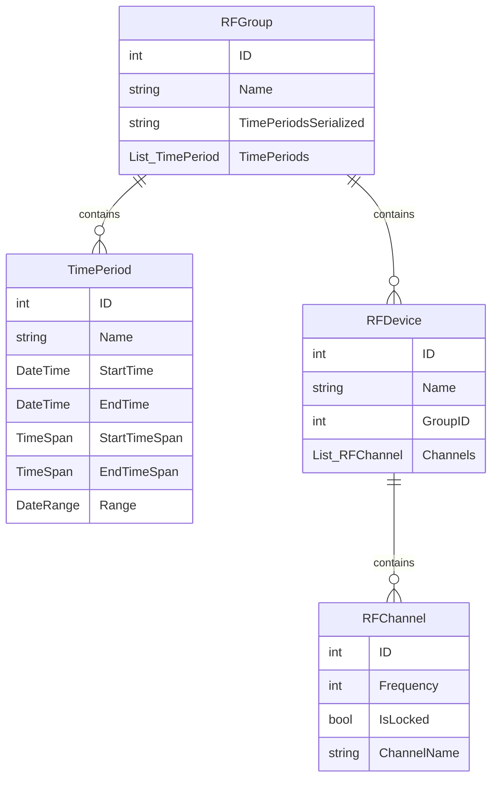
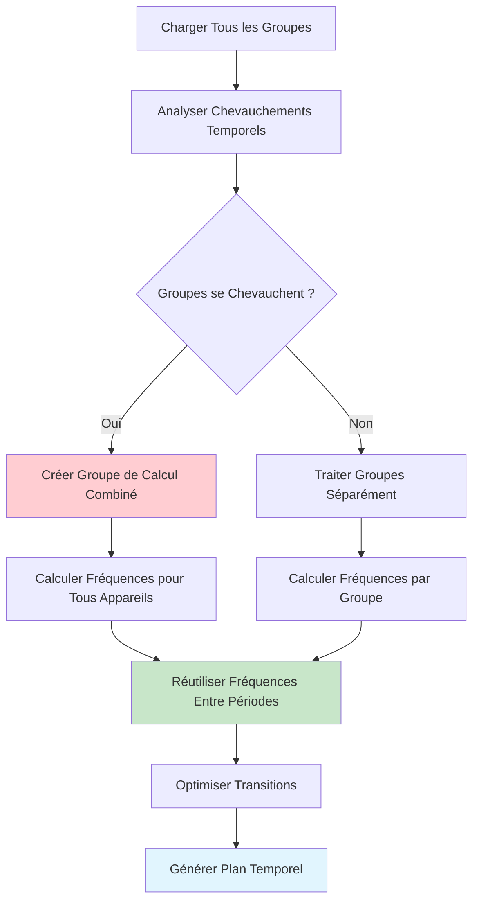
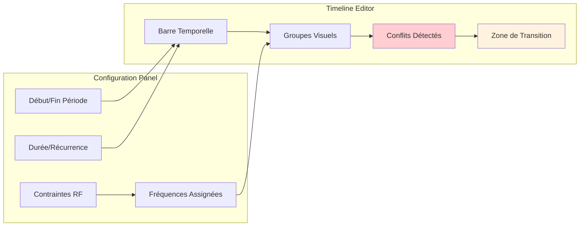

# Gestion temporelle - Planification RF avancée

La **gestion temporelle** est une fonctionnalité distinctive de RF.Go qui permet de planifier l'utilisation des fréquences dans le temps. Cette approche optimise l'utilisation du spectre en permettant la réutilisation des fréquences selon les créneaux horaires.

## Vue d'ensemble

### Concept de la gestion temporelle

La gestion temporelle dans RF.Go repose sur le principe que **toutes les fréquences ne sont pas nécessaires simultanément** lors d'un événement. En organisant les appareils en groupes temporels, il devient possible de :

- **Réutiliser les mêmes fréquences** à des moments différents
- **Optimiser l'occupation du spectre** disponible
- **Gérer les changements de scène** automatiquement
- **Planifier les transitions** entre configurations

```mermaid
gantt
    title Exemple de Planification Temporelle RF
    dateFormat HH:mm
    axisFormat %H:%M
    
    section Scène Principale
    Groupe Artiste A    :active, artist-a, 14:00, 15:30
    Groupe Artiste B    :artist-b, 16:00, 17:30
    Groupe Artiste C    :artist-c, 18:00, 19:30
    
    section Scène Secondaire
    Interview          :interview, 14:30, 15:00
    Talk Show          :talk, 15:45, 16:15
    Podcast Live       :podcast, 17:45, 18:15
    
    section Régie Générale
    Coordination       :crit, coord, 14:00, 20:00
    Secours            :backup, 14:00, 20:00
```



## Architecture temporelle

### Modèle de données



### Types de périodes temporelles

#### 1. **Périodes Fixes**

Créneaux horaires définis avec début et fin précis :

```csharp
var periodeFixe = new TimePeriod {
    Name = "Concert Principal",
    StartTime = new DateTime(2024, 06, 15, 20, 00, 00),
    EndTime = new DateTime(2024, 06, 15, 22, 30, 00)
};
```

## Algorithme de calcul temporel

### Détection des conflits temporels

L'algorithme analyse les chevauchements temporels pour optimiser la réutilisation des fréquences :



### Algorithme de réutilisation

```csharp
public class TemporalFrequencyCalculator 
{
    public void CalculateTemporalFrequencies(List<RFGroup> groups)
    {
        // 1. Analyser les chevauchements temporels
        var groupSets = AnalyzeTemporalOverlaps(groups);
        
        foreach (var groupSet in groupSets)
        {
            if (groupSet.HasOverlaps)
            {
                // Calcul combiné pour groupes qui se chevauchent
                CalculateCombinedFrequencies(groupSet.Groups);
            }
            else
            {
                // Réutilisation des fréquences entre périodes distinctes
                ReuseFrequenciesAcrossPeriods(groupSet.Groups);
            }
        }
        
        // 2. Optimiser les transitions entre périodes
        OptimizeTransitions(groupSets);
    }
    
    private void ReuseFrequenciesAcrossPeriods(List<RFGroup> sequentialGroups)
    {
        var availableFrequencies = new List<int>();
        
        foreach (var group in sequentialGroups.OrderBy(g => g.TimePeriods.First().StartTime))
        {
            // Réutiliser les fréquences des groupes précédents
            AssignFrequenciesFromPool(group, availableFrequencies);
            
            // Ajouter les nouvelles fréquences au pool
            availableFrequencies.AddRange(GetGroupFrequencies(group));
        }
    }
}
```

## Interface Utilisateur Temporelle

### Éditeur de Périodes Temporelles


