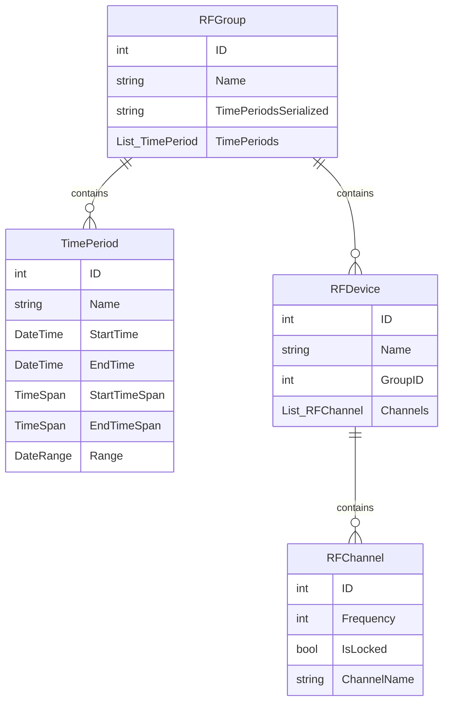
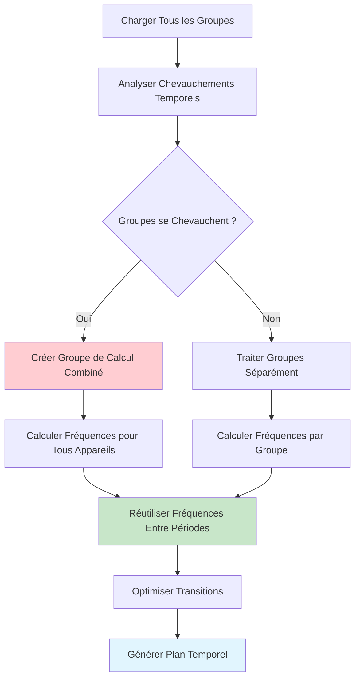
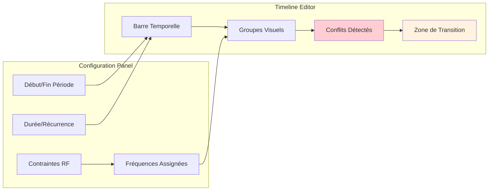
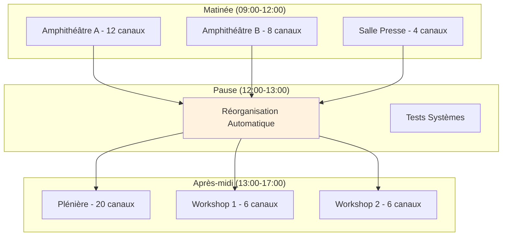

# Gestion Temporelle - Planification RF Avancée

La **gestion temporelle** est une fonctionnalité distinctive de RF.Go qui permet de planifier l'utilisation des fréquences dans le temps. Cette approche révolutionnaire optimise l'utilisation du spectre en permettant la réutilisation intelligente des fréquences selon les créneaux horaires.

## Vue d'Ensemble

### Concept de la Gestion Temporelle

La gestion temporelle dans RF.Go repose sur le principe que **toutes les fréquences ne sont pas nécessaires simultanément** lors d'un événement. En organisant les appareils en groupes temporels, il devient possible de :

- **Réutiliser les mêmes fréquences** à des moments différents
- **Optimiser l'occupation du spectre** disponible
- **Gérer les changements de scène** automatiquement
- **Planifier les transitions** entre configurations

```mermaid
gantt
    title Exemple de Planification Temporelle RF
    dateFormat HH:mm
    axisFormat %H:%M
    
    section Scène Principale
    Groupe Artiste A    :active, artist-a, 14:00, 15:30
    Groupe Artiste B    :artist-b, 16:00, 17:30
    Groupe Artiste C    :artist-c, 18:00, 19:30
    
    section Scène Secondaire
    Interview          :interview, 14:30, 15:00
    Talk Show          :talk, 15:45, 16:15
    Podcast Live       :podcast, 17:45, 18:15
    
    section Régie Générale
    Coordination       :crit, coord, 14:00, 20:00
    Secours            :backup, 14:00, 20:00
```



## Architecture Temporelle

### Modèle de Données



### Types de Périodes Temporelles

#### 1. **Périodes Fixes**
Créneaux horaires définis avec début et fin précis :
```csharp
var periodeFixe = new TimePeriod {
    Name = "Concert Principal",
    StartTime = new DateTime(2024, 06, 15, 20, 00, 00),
    EndTime = new DateTime(2024, 06, 15, 22, 30, 00)
};
```

#### 2. **Périodes Relatives**
Durées définies par rapport à un événement de référence :
```csharp
var periodeRelative = new TimePeriod {
    Name = "Soundcheck",
    StartTimeSpan = TimeSpan.FromHours(-2), // 2h avant le concert
    EndTimeSpan = TimeSpan.FromHours(-0.5)  // 30min avant le concert
};
```

#### 3. **Périodes Récurrentes**
Créneaux qui se répètent selon un pattern :
```csharp
var periodeRecurrente = new TimePeriod {
    Name = "Interview Horaire",
    StartTimeSpan = TimeSpan.FromMinutes(0),   // Début de chaque heure
    EndTimeSpan = TimeSpan.FromMinutes(15),    // 15 minutes
    RecurrencePattern = RecurrenceType.Hourly
};
```

## Algorithme de Calcul Temporel

### Détection des Conflits Temporels

L'algorithme analyse les chevauchements temporels pour optimiser la réutilisation des fréquences :



### Algorithme de Réutilisation Intelligente

```csharp
public class TemporalFrequencyCalculator 
{
    public void CalculateTemporalFrequencies(List<RFGroup> groups)
    {
        // 1. Analyser les chevauchements temporels
        var groupSets = AnalyzeTemporalOverlaps(groups);
        
        foreach (var groupSet in groupSets)
        {
            if (groupSet.HasOverlaps)
            {
                // Calcul combiné pour groupes qui se chevauchent
                CalculateCombinedFrequencies(groupSet.Groups);
            }
            else
            {
                // Réutilisation des fréquences entre périodes distinctes
                ReuseFrequenciesAcrossPeriods(groupSet.Groups);
            }
        }
        
        // 2. Optimiser les transitions entre périodes
        OptimizeTransitions(groupSets);
    }
    
    private void ReuseFrequenciesAcrossPeriods(List<RFGroup> sequentialGroups)
    {
        var availableFrequencies = new List<int>();
        
        foreach (var group in sequentialGroups.OrderBy(g => g.TimePeriods.First().StartTime))
        {
            // Réutiliser les fréquences des groupes précédents
            AssignFrequenciesFromPool(group, availableFrequencies);
            
            // Ajouter les nouvelles fréquences au pool
            availableFrequencies.AddRange(GetGroupFrequencies(group));
        }
    }
}
```

## Interface Utilisateur Temporelle

### Éditeur de Périodes Temporelles



### Fonctionnalités de l'Interface

#### 1. **Timeline Visuelle**
- Affichage graphique des périodes temporelles
- Détection visuelle des conflits et chevauchements
- Glisser-déposer pour ajuster les périodes
- Zoom temporel (minute, heure, jour)

#### 2. **Éditeur de Groupes**
```typescript
interface TimelineGroup {
    id: string;
    name: string;
    color: string;
    periods: TimePeriod[];
    devices: RFDevice[];
    conflicts: ConflictInfo[];
}

interface ConflictInfo {
    type: 'frequency' | 'temporal' | 'intermodulation';
    severity: 'warning' | 'error' | 'critical';
    description: string;
    suggestedResolution: string;
}
```

#### 3. **Assistant de Planification**
L'assistant guide l'utilisateur dans la création de plannings complexes :

1. **Analyse automatique** des créneaux disponibles
2. **Suggestions d'optimisation** du spectre
3. **Détection proactive** des conflits potentiels
4. **Propositions de reconfiguration** automatique

## Scénarios d'Usage Avancés

### 1. Festival Multi-Scènes

```mermaid
gantt
    title Festival Multi-Scènes - Gestion RF Temporelle
    dateFormat HH:mm
    axisFormat %H:%M
    
    section Scène Principale
    Artiste 1 (20 canaux)     :artist1, 14:00, 15:00
    Artiste 2 (16 canaux)     :artist2, 15:30, 16:30
    Artiste 3 (24 canaux)     :artist3, 17:00, 18:30
    
    section Scène Acoustique
    Duo (8 canaux)            :duo, 14:30, 15:15
    Solo (4 canaux)           :solo, 16:00, 16:45
    Trio (12 canaux)          :trio, 18:00, 19:00
    
    section Régie Mobile
    Interviews (6 canaux)     :interviews, 14:00, 19:00
    
    section Backup
    Fréquences Secours        :crit, backup, 14:00, 19:00
```



**Avantages temporels :**
- **Optimisation spectrale** : 24 canaux max au lieu de 64 canaux simultanés
- **Réutilisation intelligente** : Même bande pour différents artistes
- **Gestion des transitions** : Basculement automatique entre configurations

### 2. Conférence avec Sessions Parallèles



### 3. Spectacle avec Changements Scéniques

```csharp
public class SceneTransitionManager
{
    public async Task ExecuteSceneTransition(string fromScene, string toScene)
    {
        // 1. Préparer la nouvelle configuration
        var newConfig = await PrepareSceneConfiguration(toScene);
        
        // 2. Identifier les fréquences libérées
        var releasedFrequencies = await GetReleasedFrequencies(fromScene);
        
        // 3. Réallouer intelligemment
        await ReallocateFrequencies(newConfig, releasedFrequencies);
        
        // 4. Synchroniser les appareils
        await SynchronizeDevices(newConfig);
        
        // 5. Valider la transition
        await ValidateTransition(toScene);
    }
}
```

## Optimisations et Performances

### Métriques Temporelles

| Métrique | Valeur Typique | Objectif | Impact |
|----------|----------------|----------|--------|
| **Détection Conflits** | < 500ms | < 200ms | UX Fluide |
| **Calcul Réallocation** | 1-3s | < 2s | Temps Réel |
| **Transition Automatique** | 2-5s | < 3s | Continuité Service |
| **Optimisation Globale** | 10-30s | < 15s | Planification |

### Algorithmes d'Optimisation

#### 1. **Cache Temporel Intelligent**
```csharp
public class TemporalFrequencyCache
{
    private Dictionary<TimeSlot, FrequencyAllocation> _cache;
    
    public FrequencyAllocation GetOptimalAllocation(TimeSlot slot)
    {
        // Recherche dans le cache avec tolérance temporelle
        var cachedAllocation = FindSimilarTimeSlot(slot);
        
        if (cachedAllocation != null && IsReusable(cachedAllocation, slot))
        {
            return AdaptAllocation(cachedAllocation, slot);
        }
        
        // Calcul nouveau si pas de réutilisation possible
        return CalculateNewAllocation(slot);
    }
}
```

#### 2. **Prédiction des Besoins**
L'algorithme prédictif analyse les patterns d'usage pour optimiser les allocations futures :

- **Analyse historique** des événements similaires
- **Prédiction des pics** d'utilisation spectrale
- **Optimisation proactive** des ressources
- **Suggestions d'amélioration** de planning

## Intégration avec les Standards

### Compatibilité ITU-R

RF.Go respecte les recommandations ITU-R pour la gestion temporelle du spectre :

- **ITU-R SM.1268** : Planification des fréquences temporaires
- **ITU-R SM.1413** : Coordination automatique des fréquences
- **ITU-R M.1824** : Gestion dynamique du spectre

### Standards PMSE (Programme Making and Special Events)

Conformité avec les standards européens PMSE :
- **ECC Report 32** : Compatibilité temporelle
- **ECC Report 204** : Optimisation spectrale
- **ETSI EN 300 422** : Équipements PMSE

La gestion temporelle de RF.Go représente une avancée significative dans l'optimisation des fréquences RF, permettant une utilisation plus efficace du spectre disponible et une gestion simplifiée des événements complexes. 