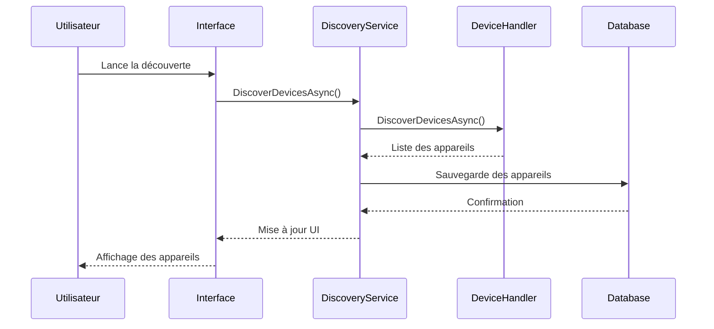
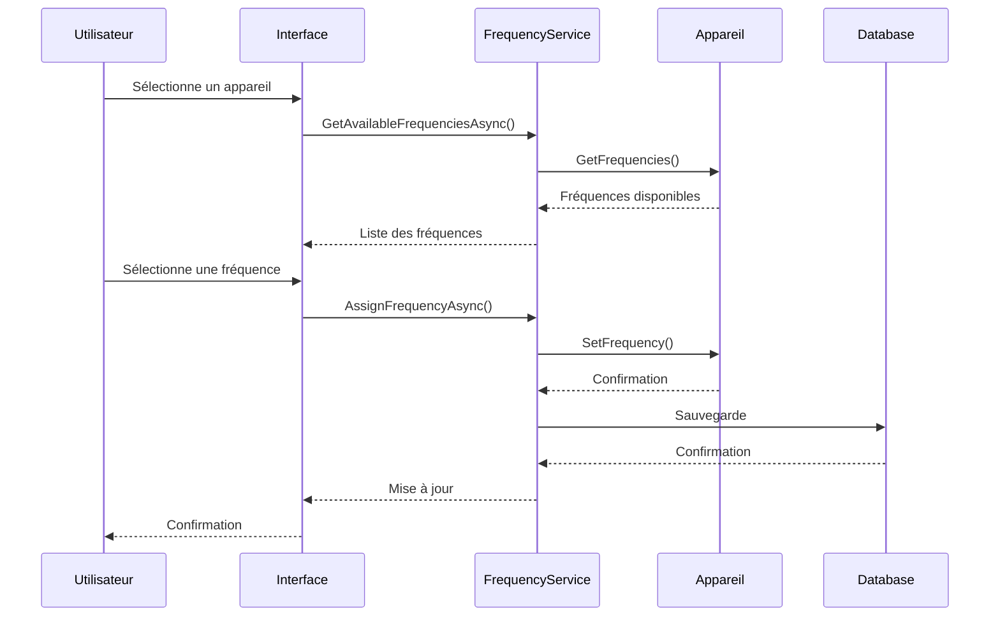
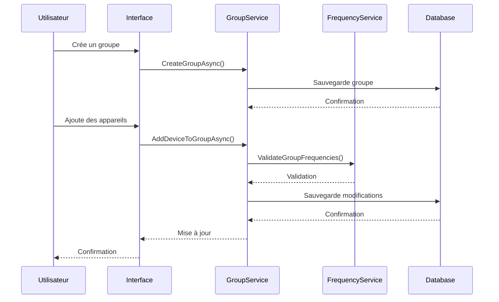
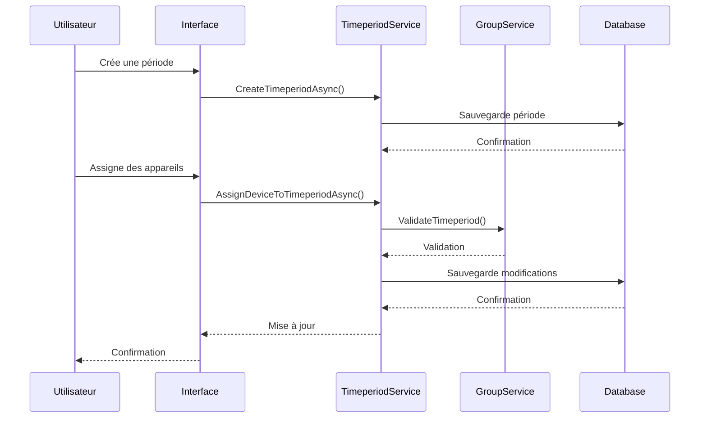
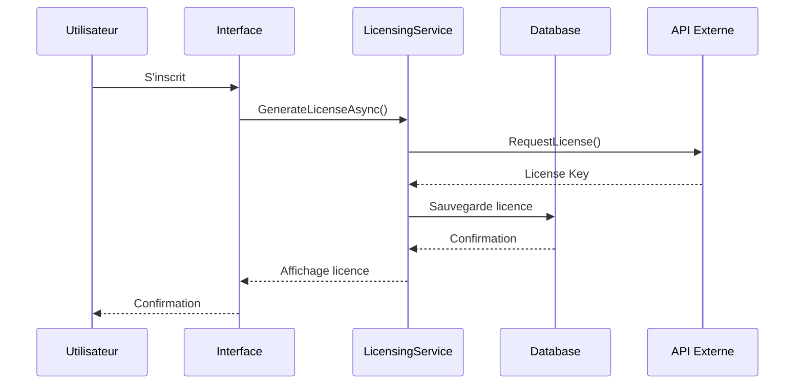
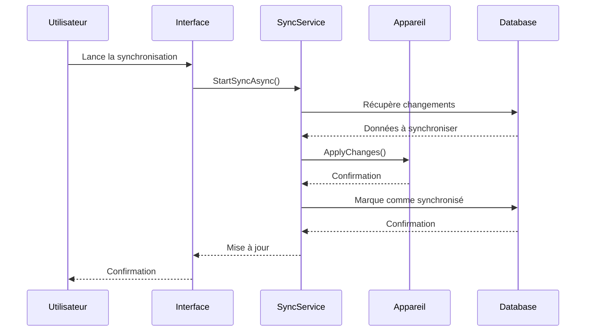

# Workflows de l'Application

## Vue d'ensemble

Cette section documente les workflows principaux de RF Go, décrivant les processus métier et les interactions entre les différents composants de l'application.

## Workflow de Découverte des Appareils

### Processus
1. Lancement de la découverte
2. Recherche des appareils sur le réseau
3. Identification des appareils
4. Mise à jour de l'interface utilisateur

## Workflow de Gestion des Fréquences

### Processus
1. Sélection d'un appareil
2. Analyse des fréquences disponibles
3. Assignation d'une fréquence
4. Validation de l'assignation

## Workflow de Gestion des Groupes

### Processus
1. Création d'un groupe
2. Ajout d'appareils au groupe
3. Configuration des paramètres du groupe
4. Validation du groupe

## Workflow de Gestion des Périodes

### Processus
1. Création d'une période
2. Assignation d'appareils à la période
3. Configuration des paramètres
4. Validation de la période

## Workflow de Gestion des Licences

### Processus
1. Inscription de l'utilisateur
2. Génération de la licence
3. Activation de la licence
4. Validation de la licence

## Workflow de Synchronisation

### Processus
1. Détection des changements
2. Préparation des données
3. Synchronisation avec les appareils
4. Confirmation de la synchronisation

## Bonnes Pratiques

1. **Gestion des Erreurs**
   - Capturer et logger les erreurs
   - Fournir des messages d'erreur clairs
   - Permettre la reprise après erreur

2. **Performance**
   - Optimiser les requêtes de base de données
   - Utiliser le caching quand approprié
   - Limiter les opérations synchrones

3. **Sécurité**
   - Valider toutes les entrées
   - Vérifier les permissions
   - Protéger les données sensibles

4. **Maintenance**
   - Documenter les changements
   - Tester les workflows
   - Surveiller les performances 