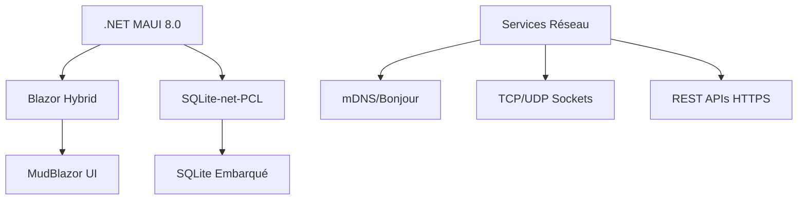

# Introduction à RF.Go

RF.Go est une application professionnelle de gestion de fréquences audio, conçue pour simplifier et optimiser la gestion des systèmes audio sans fil lors d'événements de grande envergure. Cette documentation technique vous guidera à travers l'architecture, les fonctionnalités et l'analyse UML approfondie de l'application.

## Vision et Contexte du Projet

RF.Go répond à un besoin critique du secteur professionnel de l'audio : **unifier la gestion multimarque des équipements RF** dans une interface moderne et intuitive. Contrairement aux solutions existantes (Shure Workbench, Sennheiser WSM) qui sont limitées à leurs écosystèmes respectifs, RF.Go offre une plateforme ouverte et extensible.

### Problématiques Adressées

- **Fragmentation des outils** : Chaque marque impose son logiciel propriétaire
- **Gestion temporelle insuffisante** : Impossibilité de planifier les fréquences dans le temps
- **Complexité des intermodulations** : Calculs manuels fastidieux et sources d'erreurs
- **Portabilité limitée** : Applications souvent liées à un seul OS

## Architecture de cette Documentation

Cette documentation est organisée pour accompagner votre compréhension progressive du système :

### 🔍 **[Analyse UML](./uml-analysis/overview.md)**

- **[Diagrammes de cas d'utilisation](./uml-analysis/use-cases.md)** - Scénarios nominaux et alternatifs détaillés
- **[Diagrammes de séquence](./uml-analysis/sequence-diagrams.md)** - Flux d'interactions temporels
- **[Diagrammes d'activités](./uml-analysis/activity-diagrams.md)** - Processus métier et algorithmes
- **[Diagrammes de classes](./uml-analysis/class-diagrams.md)** - Architecture orientée objet
- **[Diagrammes d'états](./uml-analysis/state-diagrams.md)** - Cycle de vie des entités principales
- **[Diagrammes de composants](./uml-analysis/component-diagrams.md)** - Architecture technique modulaire
- **[Diagrammes de déploiement](./uml-analysis/deployment-diagrams.md)** - Infrastructure et déploiement

### 🏛️ **[Architecture Technique](./architecture/overview.md)**

- **[Vue d'ensemble](./architecture/overview.md)** - Architecture globale MVVM
- **[Composants métier](./architecture/components.md)** - Services et handlers
- **[Flux de données](./architecture/data-flow.md)** - Circulation de l'information

### ⚡ **[Fonctionnalités Métier](./features/device-management.md)**

- **[Gestion des appareils](./features/device-management.md)** - Découverte et synchronisation
- **[Calcul des fréquences](./features/frequency-management.md)** - Algorithmes d'optimisation RF
- **[Gestion temporelle](./features/time-management.md)** - Planification par créneaux
- **[Visualisation avancée](./features/frequency-visualization.md)** - Interfaces graphiques
- **[Système de licences](./features/licensing.md)** - Modèle économique et sécurité

### 🌐 **[Protocoles et Intégrations](./protocols/dns-discovery.md)**

- **[Découverte réseau](./protocols/dns-discovery.md)** - mDNS, UDP, TCP
- **[Protocoles propriétaires](./protocols/device-specific.md)** - Sennheiser, Shure, Wisycom

### 👨‍💻 **[Guide Développeur](./development/setup.md)**

- **[Configuration environnement](./development/setup.md)** - .NET MAUI, Blazor, SQLite
- **[Tests et validation](./development/testing.md)** - Stratégie de tests
- **[Contribution](./development/contributing.md)** - Standards de développement

## Cas d'Usage Métier

### Événements Live

RF.Go a été créé pour la gestion d'événements nécessitant une coordination RF :

- **🎭 Festivals simple ou multi-scènes** : Réutilisation intelligente du spectre entre scènes
- **🎪 Spectacles** : Gestion des changements de configuration temporels
- **🏢 Conférences** : Adaptation aux réglementations locales
- **📺 Productions TV/Radio** : Intégration avec infrastructures broadcast

## Technologies utilisées

RF.Go s'appuie sur un stack technologique moderne :



## Public Cible de cette Documentation

### 👨‍💼 **Jury TFE et Évaluateurs**

- Analyse UML
- Architecture technique détaillée
- Justifications des choix technologiques
- Démonstration de maîtrise des concepts avancés

### 👨‍💻 **Développeurs et Contributeurs**

- Standards de développement .NET
- Patterns d'architecture enterprise
- Guides d'extension et de maintenance
- Documentation API

### 🎧 **Ingénieurs du Son Techniques**

- Workflows métier détaillés
- Algorithmes de calcul RF expliqués
- Guides de déploiement sur site
- Troubleshooting et optimisations

## Prérequis Techniques

### Environnement de Développement

```bash
# .NET 8.0 SDK minimum
dotnet --version  # >= 8.0.0

# Visual Studio 2022 17.8+ ou VS Code
# Workloads MAUI installés
dotnet workload install maui
```

### Environnement de Production

- **OS** : Windows 10+, macOS 12+
- **RAM** : 4GB minimum, 8GB recommandé
- **Réseau** : Multicast activé pour découverte automatique
- **Matériel RF** : Équipements compatibles (Sennheiser EW-DX, Shure ULXD, etc.)

---

## Navigation Rapide

| Section | Description | Public |
|---------|-------------|--------|
| **[🔍 Analyse UML](./uml-analysis/overview.md)** | Modélisation du système | Jury TFE, Architectes |
| **[🏛️ Architecture du software](./architecture/overview.md)** | Design technique | Développeurs |
| **[⚡ Fonctionnalités](./features/device-management.md)** | Capacités métier | Utilisateurs finaux |
| **[🌐 Protocoles](./protocols/dns-discovery.md)** | Intégrations réseau | Intégrateurs |
| **[👨‍💻 Développement](./development/setup.md)** | Guides techniques | Contributeurs |

Cette documentation reflète l'évolution continue de RF.Go et constitue le complément technique essentiel au TFE présenté.
