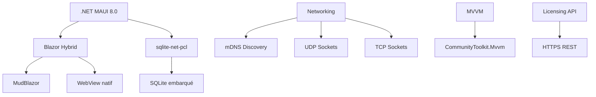

# Introduction à RF.Go

RF.Go est une application professionnelle de gestion de fréquences audio **multiplateforme et offline-first**, conçue pour simplifier et optimiser la gestion des systèmes audio sans fil lors d'événements de grande envergure. Cette documentation technique complète présente l'analyse UML rigoureuse, l'architecture technique réelle et les choix d'implémentation du projet TFE.

## Vision et contexte du projet

RF.Go répond à un besoin critique du secteur professionnel de l'audio : **unifier la gestion multimarque des équipements RF** dans une interface moderne et intuitive. Contrairement aux solutions existantes (Shure Workbench, Sennheiser WSM) qui sont limitées à leurs écosystèmes respectifs, RF.Go offre une plateforme ouverte et **entièrement fonctionnelle offline**.

### Problématiques adressées

- **Fragmentation des outils** : Chaque marque impose son logiciel propriétaire
- **Gestion temporelle insuffisante** : Impossibilité de planifier les fréquences dans le temps  
- **Complexité des intermodulations** : Calculs manuels fastidieux et sources d'erreurs (jusqu'au 9ème ordre)
- **Dépendance réseau** : Solutions cloud inutilisables sans connexion
- **Portabilité limitée** : Applications souvent liées à un seul OS

### Innovation clé : Offline-first

RF.Go fonctionne **entièrement sans connexion internet** une fois l'authentification effectuée :

- ✅ Découverte locale des devices (mDNS)
- ✅ Calculs d'intermodulations en temps réel
- ✅ Base de données SQLite embarquée
- ✅ Synchronisation directe avec les équipements RF

## Architecture de cette documentation

Cette documentation technique accompagne l'évaluation TFE et guide les développeurs :

### 🔍 **[Analyse UML Complète](../uml-analysis/overview)**

Modélisation rigoureuse selon UML 2.5 avec matrices de cohérence :

- **[Use Cases détaillés](../uml-analysis/use-cases/overview)** - 10 UC avec scénarios nominaux/alternatifs complets
- **[Diagrammes de séquence](../uml-analysis/sequence-diagrams)** - Flux temporels end-to-end avec gestion d'erreurs
- **[Diagrammes d'activités](../uml-analysis/activity-diagrams)** - Algorithmes RF complexes (calculs intermodulations, Magic Sync)
- **[Diagrammes d'états](../uml-analysis/state-diagrams)** - Machines à états avec matrices de transition
- **[Diagrammes de classes](../uml-analysis/class-diagrams)** - Architecture OO avec patterns appliqués
- **[Diagrammes de déploiement](../uml-analysis/deployment-diagrams)** - Architecture cross-platform réelle

### 🏛️ **[Architecture Technique](../architecture/overview)**

Documentation de l'implémentation réelle :

- **[Déploiement](../architecture/deployment)** - GitHub Actions, exécutables self-contained
- **[Patterns de conception](../architecture/design-patterns)** - MVVM, Repository, Command réellement utilisés
- **[Architecture données](../architecture/data-architecture)** - SQLite avec 8 tables, sérialisation JSON
- **[Choix technologiques](../architecture/technology-choices)** - Blazor Hybrid, motivations offline-first

### ⚡ **[Fonctionnalités Métier](../features/device-management)**

Capacités techniques détaillées :

- **[Gestion des appareils](../features/device-management)** - Découverte multi-protocoles, synchronisation Magic Sync
- **[Calcul des fréquences]../(features/frequency-management)** - Algorithmes d'optimisation RF avec HashSet O(1)
- **[Gestion temporelle](../features/time-management)** - Planification par créneaux avec réutilisation spectrale
- **[Sauvegarde et scans](../features/scan-management)** - Import/export fichiers SDB2, visualisation spectrale
- **[Fréquences de secours](../features/backup-frequencies)** - Génération automatique par type d'équipement
- **[Authentification](../features/authentication)** - Tokens JWT, SecureStorage cross-platform

### 🌐 **[Protocoles et Intégrations](../protocols/dns-discovery)**

Implémentation des protocols RF propriétaires :

- **[Découverte mDNS](../protocols/dns-discovery)** - Bonjour/Avahi, multicast local
- **[UDP/TCP natifs](../protocols/udp-tcp)** - Sockets .NET performants  
- **[Protocoles spécifiques](../protocols/device-specific)** - Sennheiser (UDP:45), Shure (TCP:2202), Wisycom, MiPro

### 🔑 **[API Licensing](../api/overview)**

Documentation de l'API externe réelle :

- **Authentication** - Register, Login, Refresh, Logout
- **License Management** - Activation et validation
- **Offline après auth** - Fonctionnement sans réseau

### 👨‍💻 **[Guide Développeur] ( en construction ) (../development/setup)**

- **[Configuration environnement](../development/setup)** - .NET MAUI 8.0, Blazor Hybrid
- **[Tests et validation](../development/testing)** - Stratégie de tests
- **[Contribution](../development/contributing)** - Standards de développement

## Stack technologique réel

RF.Go utilise un stack moderne optimisé pour la performance offline :



### Choix architecturaux clés

| Technologie | Justification | Alternative rejetée |
|-------------|---------------|-------------------|
| **.NET MAUI** | Cross-platform + offline absolu | Web app (impossible offline) |
| **Blazor Hybrid** | Réutilisation acquis cours + UI web | XAML (courbe apprentissage) |
| **SQLite local** | Performance + offline garantie | Cloud DB (dépendance réseau) |
| **Protocols propriétaires** | Imposés par fabricants RF | Aucune alternative possible |

## Cas d'usage métier professionnels

### Événements live supportés

RF.Go gère les contraintes RF spécifiques aux événements :

- **🎭 Festivals multi-scènes** : Réutilisation spectrale intelligente entre zones
- **🎪 Spectacles temporels** : Gestion des changements de configuration par créneaux
- **🏢 Conférences internationales** : Adaptation aux réglementations TV locales  
- **📺 Productions broadcast** : Intégration avec infrastructures existantes

### Calculs RF avancés

- **Intermodulations 2TX** : 3ème, 5ème, 7ème, 9ème ordre
- **Intermodulations 3TX** : 3ème ordre (6 produits par combinaison)
- **Exclusions TV** : Canaux 21-69 UHF par pays (6-8 MHz)
- **Espacements personnalisés** : Configuration par ordre d'intermodulation

## Public cible de cette documentation

### 👨‍🎓 **Jury TFE et évaluateurs académiques**

- **Analyse UML rigoureuse** avec matrices de cohérence et métriques qualité
- **Architecture technique justifiée** avec comparaisons et trade-offs
- **Maîtrise des patterns** enterprise et domaine RF
- **Innovation technique** démontrée (offline-first, multi-marques)

### 👨‍💻 **Développeurs et architectes**

- **Standards .NET MAUI** et bonnes pratiques Blazor Hybrid
- **Patterns concrets** utilisés avec exemples de code
- **Architecture extensible** pour nouveaux fabricants
- **Performance optimisée** avec structures de données adaptées

### 🎧 **Ingénieurs du son et intégrateurs**

- **Workflows métier** détaillés par type d'événement
- **Algorithmes RF expliqués** sans jargon technique excessif
- **Déploiement sur site** avec prérequis réseau
- **Troubleshooting** et résolution de conflits RF

## Environnement technique

### Développement

```bash
# .NET 8.0 SDK
dotnet --version  # >= 8.0.100

# Workloads MAUI requis
dotnet workload install maui

# IDE supportés
# Visual Studio 2022 17.8+
# VS Code avec extensions C# + MAUI
```

### Production

- **OS** : Windows 10/11, macOS 12+, iOS 15+, Android 8+
- **RAM** : 4GB minimum (calculs intermodulations intensifs)
- **Réseau** : Multicast activé pour découverte automatique
- **Équipements** : Sennheiser EW-DX/G3/G4, Shure ULXD/AD, Wisycom, MiPro

---

## Navigation optimisée

| Section | Focus | Audience |
|---------|-------|----------|
| **[🔍 Analyse UML](../uml-analysis/overview)** | Modélisation académique | **Jury TFE** |
| **[🏛️ Architecture](../architecture/overview)** | Implémentation technique | **Développeurs** |
| **[⚡ Fonctionnalités](../features/device-management)** | Capacités métier | **Utilisateurs** |
| **[🌐 Protocoles](../protocols/dns-discovery)** | Intégrations RF | **Intégrateurs** |
| **[🔑 API](../api/overview)** | Licensing externe | **DevOps** |
| **[👨‍💻 Développement](../development/setup)** | Contribution | **Contributeurs** |

Cette documentation technique constitue le complément indispensable au rapport TFE, démontrant la maîtrise complète des technologies modernes et des enjeux métier du domaine RF professionnel.
