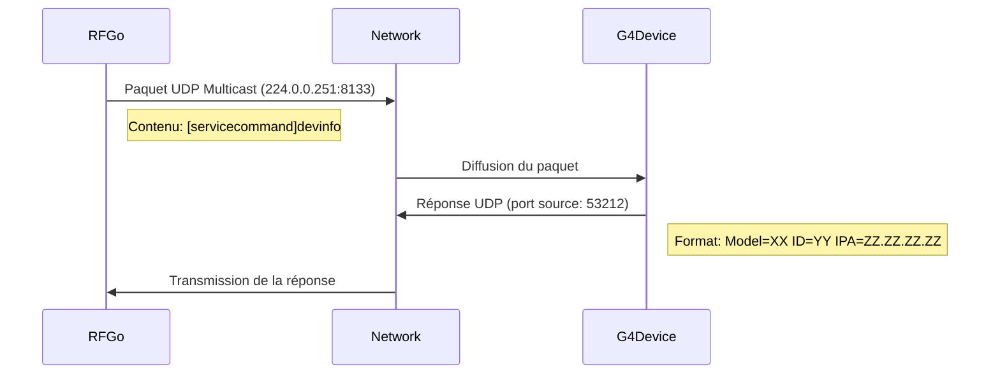

# Protocoles Spécifiques aux Appareils

RF Go prend en charge divers appareils audio sans fil provenant de différents fabricants, chacun avec ses propres protocoles de communication. Cette section détaille les protocoles spécifiques implémentés pour chaque type d'appareil.

## Sennheiser

### Sennheiser G4 IEM

Les appareils Sennheiser G4 IEM (In-Ear Monitoring) utilisent un protocole propriétaire qui diffère des autres appareils Sennheiser.

#### Découverte



#### Format du Paquet de Découverte

Le paquet de découverte G4 a une structure spécifique:

1. En-tête de 8 octets: `0x12, 0x07, 0x06, 0x20, 0x00, 0x00, 0x19, 0x00`
2. Commande: `[servicecommand]devinfo\r\n`
3. Remplissage jusqu'à 1032 octets
4. Pied de page de 3 octets: `0x01, 0x01, 0x01`

Taille totale: 1035 octets

#### Format de Réponse G4

Les réponses des appareils G4 contiennent les informations suivantes:

```
Model=SR-IEMG4
ID=1234567
IPA=192.168.1.100
...autres paramètres...
```

#### Communication

La communication avec les appareils G4 se fait via UDP sur le port 53212. Les commandes suivent ce format:

| Commande | Description | Exemple de Réponse |
|----------|-------------|-------------------|
| `FirmwareRevision\r` | Obtient la version du firmware | `1.2.3` |
| `RfConfig\r` | Obtient la configuration RF | `Range=516000-558000` |
| `Name\r` | Obtient le nom du canal | `Vocals` |
| `Frequency\r` | Obtient la fréquence actuelle | `518000` |
| `Frequency 518000\r` | Définit la fréquence | `OK` |
| `Name Vocals\r` | Définit le nom du canal | `OK` |
| `Mute 0\r` | Active le son (0 = non muet, 1 = muet) | `OK` |
| `Sensitivity 0\r` | Définit la sensibilité | `OK` |
| `Mode 1\r` | Définit le mode (0 = mono, 1 = stéréo) | `OK` |

#### Détection de la Bande de Fréquence

RF Go identifie automatiquement la bande de fréquence des appareils G4 en comparant les plages de fréquences reportées par l'appareil avec les définitions dans `Devices.cs`:

```json
"SR-IEMG4": {
  "A1": [ 470000, 516000, 1, 25, 400, 250, 0, 0, 150 ],
  "A": [ 516000, 558000, 1, 25, 400, 250, 0, 0, 150 ],
  "AS": [ 520000, 558000, 1, 25, 400, 250, 0, 0, 150 ],
  "G": [ 566000, 608000, 1, 25, 400, 250, 0, 0, 150 ],
  ...
}
```

### Sennheiser EWDX-EM2

Les récepteurs Sennheiser EWDX-EM2 utilisent un protocole différent basé sur mDNS et API REST.

#### Découverte

- Service mDNS: `_ewd._http.local`
- Port standard: variable (généralement 80)

#### Communication

La communication avec les appareils EWDX se fait via API REST/HTTP:

| Endpoint | Méthode | Description |
|----------|---------|-------------|
| `/api/device` | GET | Informations sur l'appareil |
| `/api/rf` | GET | Configuration RF actuelle |
| `/api/rf` | POST | Mise à jour de la configuration RF |
| `/api/channels/0` | GET | Informations sur le canal 1 |
| `/api/channels/1` | GET | Informations sur le canal 2 |
| `/api/channels/0/name` | POST | Définit le nom du canal 1 |

#### Format des Données

Les données sont échangées en format JSON:

```json
{
  "device": {
    "model": "EWDX-EM2",
    "serialNumber": "1234567",
    "firmwareVersion": "1.2.3"
  },
  "rf": {
    "frequency": 606200,
    "band": "S1-10",
    "power": "standard",
    "mode": "diversity"
  }
}
```

### Sennheiser Legacy (série 3000/5000)

Les appareils Sennheiser plus anciens utilisent généralement le protocole mDNS standard avec service `_ssc._udp.local` et communication UDP sur le port 45.

## Shure

### Shure AD4D, PSM1000, UR4D

Les appareils Shure utilisent un protocole propriétaire basé sur mDNS et communication UDP.

#### Découverte Shure

- Port standard: 2202

#### Communication Shure

La communication avec les appareils Shure se fait via leur protocole SSC (Shure System Control) sur UDP:

| Commande | Description | Format de Réponse |
|----------|-------------|-------------------|
| `{"schema":"device"}\n` | Informations sur l'appareil | JSON |
| `{"schema":"rx1"}\n` | Informations sur le récepteur 1 | JSON |
| `{"schema":"tx1"}\n` | Informations sur l'émetteur 1 | JSON |
| `{"tx1":{"freq":"577.000"}}\n` | Définit la fréquence de l'émetteur 1 | JSON confirmant le changement |

#### Format des Données

Les commandes et réponses sont en format JSON:

```json
{
  "device_id": "AD4D-1234567",
  "model": "AD4D",
  "band": "G56",
  "firmware": "1.2.3",
  "channels": 2
}
```

## Wisycom

Les appareils Wisycom comme MTP60, MTP61 et MCR54 utilisent leur propre protocole propriétaire basé sur UDP et des formats de commande spécifiques.

#### Découverte Wisycom

- Les appareils Wisycom sont généralement découverts via mDNS ou détection d'adresse IP directe

#### Communication Wisycom

La communication se fait via un protocole propriétaire avec des commandes spécifiques au modèle.

## Implémentation Modulaire

RF Go utilise une architecture modulaire pour gérer les différents protocoles:

### Gestionnaires d'Appareils

Chaque marque et modèle a son propre gestionnaire qui implémente l'interface `IDeviceHandler`:

```csharp
public interface IDeviceHandler
{
    string Brand { get; }
    bool CanHandle(string serviceName);
    Task HandleDevice(DeviceDiscoveredEventArgs deviceInfo);
    Task<(bool IsEqual, bool IsNotResponding)> IsDevicePendingSync(DeviceDiscoveredEventArgs deviceInfo);
}
```

### Ensembles de Commandes

Les commandes spécifiques à chaque appareil sont définies dans des classes qui implémentent `IDeviceCommandSet`:

```csharp
public interface IDeviceCommandSet
{
    string GetModelCommand();
    string GetFrequencyCodeCommand();
    string GetSerialCommand();
    string GetChannelNameCommand(int channel);
    string GetChannelFrequencyCommand(int channel);
    // ... autres commandes
}
```

### Services de Communication

Des services de communication spécialisés sont utilisés selon les besoins de chaque type d'appareil:

- `UDPCommunicationService` - Pour la plupart des appareils (avec méthodes spéciales pour G4)
- `RESTCommunicationService` - Pour les appareils avec API REST (EWDX)
- `TCPCommunicationService` - Pour les cas où TCP est nécessaire

## Résolution des Problèmes Communs

### Problèmes de Découverte G4

- Vérifier que les ports 8133 et 53212 sont ouverts
- S'assurer que le multicast est activé sur le réseau
- Vérifier que l'appareil est sur le même segment réseau

### Problèmes de Communication

- Vérifier la connectivité réseau avec l'appareil (ping)
- S'assurer que les bons ports sont accessibles
- Vérifier que l'appareil a une IP valide et unique
- Pour G4, vérifier que le port 53212 n'est pas en conflit avec d'autres applications
