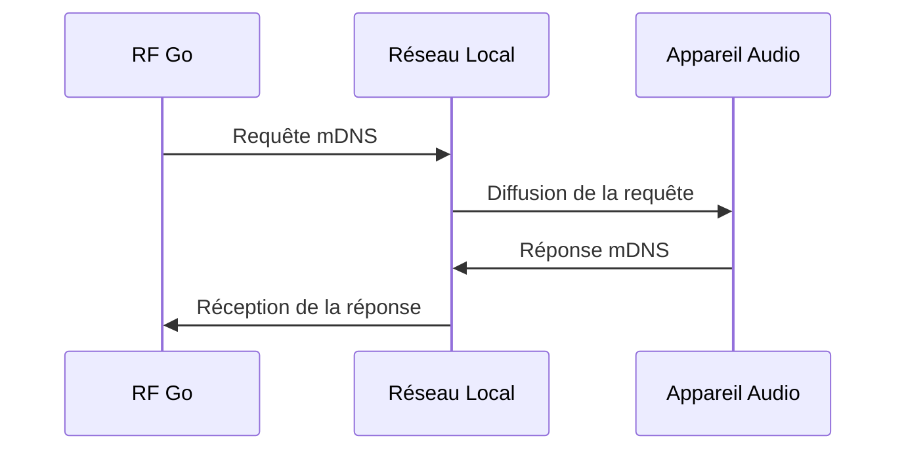

# Protocoles DNS et Découverte

## Vue d'ensemble

RF Go utilise plusieurs protocoles pour la découverte et la communication avec les appareils audio sans fil. Cette section décrit les protocoles de découverte basés sur DNS, notamment Bonjour (mDNS) et les protocoles spécifiques aux fabricants.

## Bonjour (mDNS)

### Principe de Fonctionnement

Bonjour est une implémentation d'Apple du protocole mDNS (Multicast DNS). Il permet la découverte automatique des appareils sur un réseau local sans nécessiter de serveur DNS dédié.



### Implémentation

RF Go utilise la bibliothèque `makaretu.Dns` pour implémenter la découverte mDNS :

```csharp
public class DiscoveryService
{
    private readonly MulticastService _mdns;
    private readonly ServiceDiscovery _sd;

    public DiscoveryService()
    {
        _mdns = new MulticastService();
        _sd = new ServiceDiscovery(_mdns);
    }

    public async Task DiscoverDevicesAsync()
    {
        _mdns.Start();
        _sd.QueryAllServices();
        // ... traitement des réponses
    }
}
```

## Protocoles Spécifiques aux Fabricants

### Sennheiser

#### Découverte

- Utilise mDNS avec le service `_sennheiser._tcp`
- Port par défaut : 8080
- Format des enregistrements TXT spécifiques

#### Communication

- API REST sur le port 8080
- Endpoints spécifiques pour :
  - Configuration des fréquences
  - Récupération des informations
  - Mise à jour du firmware

### Shure

#### Découverte

- Utilise mDNS avec le service `_shure._tcp`
- Port par défaut : 2202
- Enregistrements TXT pour l'identification

#### Communication

- Protocole propriétaire sur le port 2202
- Commandes binaires spécifiques
- Format de données structuré

## Configuration du Réseau

### Prérequis

- Réseau local avec multicast activé
- Pas de pare-feu bloquant les ports mDNS (5353/udp)
- Accès aux ports spécifiques des appareils

### Dépannage

1. Vérifier que le multicast est activé sur le réseau
2. Confirmer que les ports nécessaires sont ouverts
3. Vérifier les logs de découverte pour les erreurs
4. Tester la connectivité avec les appareils individuellement

## Sécurité

### Considérations

- La découverte mDNS est limitée au réseau local
- Les communications avec les appareils doivent être sécurisées
- Utilisation de TLS pour les API REST quand disponible

### Bonnes Pratiques

1. Limiter la découverte au réseau local
2. Valider les certificats des appareils
3. Utiliser des identifiants sécurisés
4. Journaliser les activités de découverte
