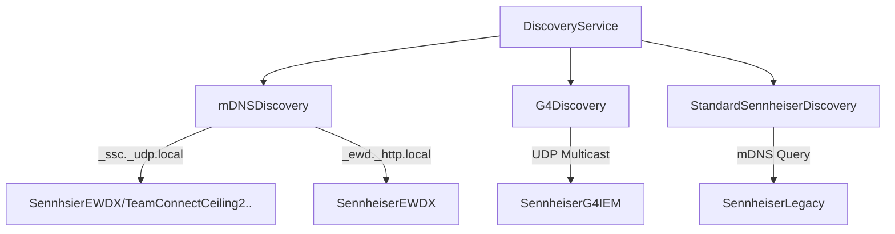
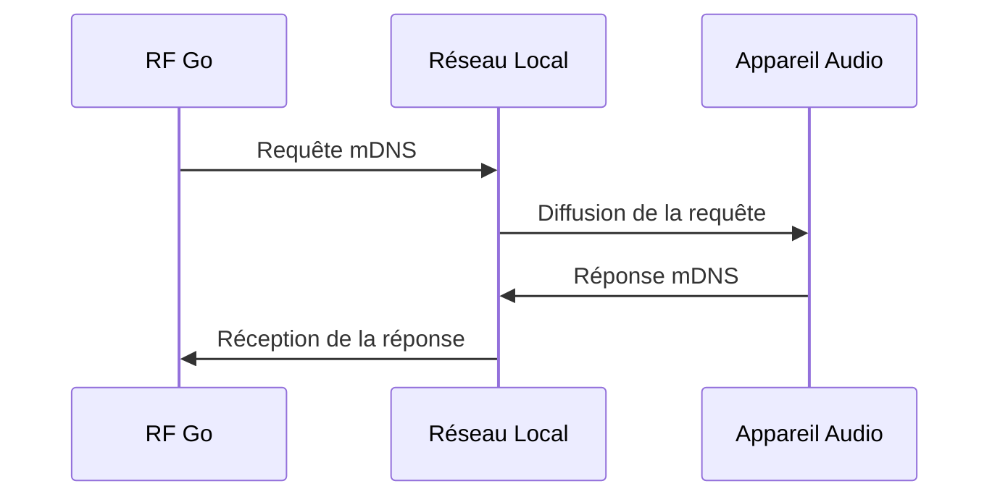
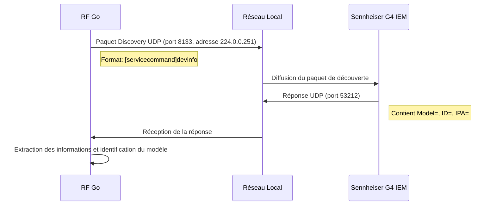
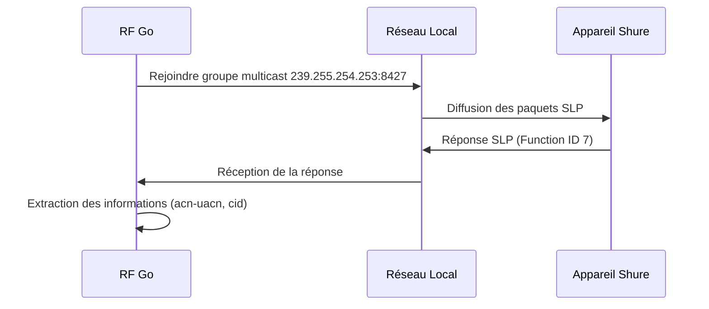

# Protocoles DNS et Découverte

## Vue d'ensemble

RF Go utilise plusieurs protocoles pour la découverte et la communication avec les appareils audio sans fil. Cette section décrit les protocoles de découverte basés sur DNS, notamment Bonjour (mDNS) et les protocoles spécifiques aux fabricants, ainsi que les protocoles propriétaires comme celui utilisé par Sennheiser G4.

## Architecture du Service de Découverte

RF Go implémente un service de découverte unifié qui combine plusieurs méthodes pour détecter tous les types d'appareils compatibles. L'architecture est conçue pour être extensible, permettant l'ajout de nouveaux protocoles de découverte.



## Bonjour (mDNS)

### Principe de Fonctionnement

Bonjour est une implémentation d'Apple du protocole mDNS (Multicast DNS). Il permet la découverte automatique des appareils sur un réseau local sans nécessiter de serveur DNS dédié.



### Implémentation

RF Go utilise la bibliothèque `Makaretu.Dns` pour implémenter la découverte mDNS :

```csharp
public class DiscoveryService
{
    private readonly MulticastService _multicastService;
    private readonly ServiceDiscovery _serviceDiscovery;

    public DiscoveryService(IEnumerable<IDeviceHandler> handlers, DevicesViewModel devicesViewModel)
    {
        _multicastService = new MulticastService();
        _serviceDiscovery = new ServiceDiscovery(_multicastService);
        _serviceDiscovery.ServiceDiscovered += OnServiceDiscovered;
        _serviceDiscovery.ServiceInstanceDiscovered += OnServiceInstanceDiscovered;
    }

    public void StartDiscovery()
    {
        _multicastService.Start();
        _serviceDiscovery.QueryServiceInstances("_ssc._udp.local");
        _serviceDiscovery.QueryServiceInstances("_ewd._http.local");
        // ... autres méthodes de découverte
    }
}
```

## Protocole de Découverte Sennheiser G4

### En résumé

Les appareils Sennheiser G4 IEM utilisent un protocole propriétaire basé sur UDP multicast qui diffère des méthodes mDNS standard. RF Go implémente un mécanisme spécifique pour découvrir ces appareils.

### Processus de Découverte G4



### Implémentations

RF Go implémente cette découverte via une méthode spécialisée dans le `DiscoveryService` :

```csharp
private async Task TriggerSennheiserG4DiscoveryAsync(CancellationToken cancellationToken)
{
    // Configuration du client UDP pour la découverte G4
    _g4UdpClient = new UdpClient();
    _g4UdpClient.Client.SetSocketOption(SocketOptionLevel.Socket, SocketOptionName.ReuseAddress, true);
    
    // Liaison au port 8133 et jointure au groupe multicast
    IPEndPoint localEndpoint = new IPEndPoint(IPAddress.Any, 8133);
    _g4UdpClient.Client.Bind(localEndpoint);
    _g4UdpClient.JoinMulticastGroup(IPAddress.Parse("224.0.0.251"));
    
    // Envoi de la commande de découverte
    string commandStr = "[servicecommand]devinfo\r\n";
    // ... construction et envoi du paquet
}
```

### Format des Paquets G4

1. **Paquet de découverte** :
   - Commence par un en-tête spécifique
   - Contient la commande `[servicecommand]devinfo`
   - Taille totale de 1035 octets avec un pied de page spécifique

2. **Réponse G4** :
   - Contient les champs `Model=`, `ID=` et `IPA=`
   - L'adresse IP source est utilisée si le champ `IPA=` n'est pas valide
   - Le format de la réponse est analysé pour extraire les informations de l'appareil

## Protocoles Spécifiques aux Fabricants

### Sennheiser

#### Découverte Standard

- Utilise mDNS avec la requête `_ssc._udp.local`
- Port par défaut : variable selon les modèles
- Format des enregistrements TXT spécifiques

#### Découverte EWDX

- Utilise mDNS avec la requête `_ewd._http.local`
- Communication via API REST HTTP
- Identification des modèles via les enregistrements DNS

### Shure

#### Découverte SLP (Service Location Protocol)

Les appareils Shure utilisent le protocole SLP (Service Location Protocol) pour la découverte sur le réseau :

- Adresse multicast : 239.255.254.253
- Port : 8427
- Format des paquets : Version 2 du protocole SLP



#### Format des Paquets SLP

1. **En-tête SLP** :
   - Version : 2
   - Function ID : 7 (Service Reply)
   - Contient les champs :
     - `acn-uacn` : Modèle et code de fréquence (ex: "ULXD4D H51 REV2")
     - `cid` : Identifiant unique de l'appareil

2. **Extraction des Informations** :
   - Modèle : Extrait du champ `acn-uacn`
   - ID Série : Extrait du champ `cid`
   - Adresse IP : Source du paquet ou champ `esta.dmp/`

#### Appareils Supportés

- ULXD4D (2 canaux)
- ULXD4Q (4 canaux)
- ULXD4 (1 canal)
- AD4D (2 canaux)
- AD4Q (4 canaux)
- AD610 (2 canaux)
- AXT400/600/610/630/900
- P10T
- SBRC
- SBC220/240/840/840M
- PSM1000
- UR4D

## Détection et Attribution des Gestionnaires d'Appareils

RF Go utilise une approche modulaire pour attribuer les gestionnaires appropriés à chaque appareil découvert :

```csharp
foreach (var handler in _handlers)
{
    if (handler.CanHandle(serviceName))
    {
        // Définir d'abord la marque pour pouvoir l'utiliser pour trouver le gestionnaire approprié
        deviceInfo.Brand = handler.Brand;
        
        // Trouver le meilleur gestionnaire (en cas de plusieurs gestionnaires pour la même marque)
        var bestHandler = handler;
        if (serviceName.Contains("G4") || serviceName.Contains("IEM"))
        {
            // Essayer d'obtenir un gestionnaire spécifique G4 si c'est un appareil G4
            var g4Handler = _handlers.FirstOrDefault(h => 
                h.Brand == handler.Brand && 
                h.GetType().Name.Contains("G4") && 
                h.CanHandle(serviceName));
                
            if (g4Handler != null)
            {
                bestHandler = g4Handler;
            }
        }
        
        await bestHandler.HandleDevice(deviceInfo);
        break;
    }
}
```

## Configuration du Réseau

### Prérequis

- Réseau local avec multicast activé
- Pas de pare-feu bloquant les ports mDNS (5353/udp)
- Ports spécifiques ouverts :
  - 8133/udp pour la découverte Sennheiser G4
  - 53212/udp pour la communication avec les appareils G4
  - Ports standards pour les autres appareils

### Dépannage

1. Vérifier que le multicast est activé sur le réseau
2. Confirmer que les ports nécessaires sont ouverts
3. Vérifier les logs de découverte pour les erreurs
4. Tester la connectivité avec les appareils individuellement

## Sécurité

### Considérations

- La découverte mDNS est limitée au réseau local
- Les communications avec les appareils doivent être sécurisées
- Utilisation de TLS pour les API REST quand disponible
- Protocoles propriétaires peuvent manquer de sécurité

### Bonnes Pratiques

1. Limiter la découverte au réseau local
2. Valider les certificats des appareils
3. Utiliser des identifiants sécurisés
4. Journaliser les activités de découverte
