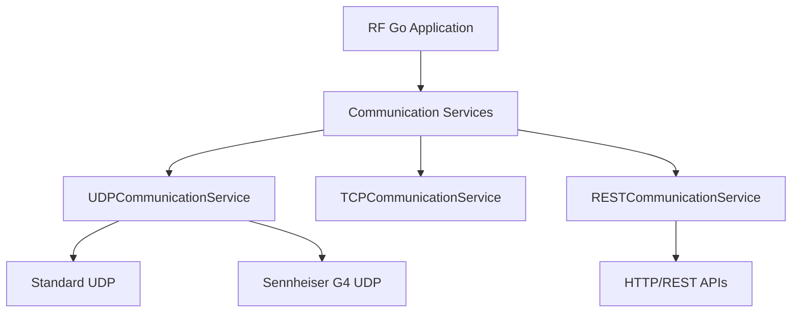

# Protocoles UDP/TCP

RF Go utilise plusieurs protocoles de communication réseau pour interagir avec les appareils audio sans fil. Cette section décrit en détail les protocoles UDP et TCP implémentés dans l'application.

## Architecture de Communication

RF Go implémente plusieurs services de communication pour prendre en charge divers appareils et protocoles. L'architecture est conçue pour être flexible et extensible.



## Communication UDP

### Vue d'ensemble

Le protocole UDP (User Datagram Protocol) est utilisé pour la communication avec de nombreux appareils audio sans fil en raison de sa légèreté et de sa rapidité. RF Go implémente un service UDP modulaire qui gère différents formats de communication selon le type d'appareil.

### Service de Communication UDP Standard

Le service principal de communication UDP gère la plupart des appareils standards:

```csharp
public class UDPCommunicationService
{
    private readonly UdpClient _standardUdpClient;
    private readonly ConcurrentDictionary<string, TaskCompletionSource<string>> _responseTasks;
    
    // ... initialisation et configuration

    public async Task<string> SendCommandAsync(string ip, int port, string command)
    {
        // Envoie une commande à l'appareil et attend la réponse
        var data = Encoding.UTF8.GetBytes(command);
        var tcs = new TaskCompletionSource<string>();
        string key = $"{ip}:{port}";
        _responseTasks[key] = tcs;

        await _standardUdpClient.SendAsync(data, data.Length, ip, port);
        // ... gestion de la réponse et du timeout
    }
    
    // ... autres méthodes
}
```

### Communication Sennheiser G4

Les appareils Sennheiser G4 IEM utilisent un protocole UDP spécifique qui nécessite une communication sur un port dédié (53212):

```csharp
// Extension du service UDP pour prendre en charge les appareils G4
public class UDPCommunicationService
{
    // ... autres champs et méthodes
    
    private UdpClient _g4UdpClient;
    private const int G4_PORT = 53212;
    
    // Méthode spécifique pour les appareils G4
    public async Task<string> SendG4CommandAsync(string ip, string command)
    {
        var g4Client = GetG4Client();
        var data = Encoding.UTF8.GetBytes(command);
        
        // Envoi au port spécifique G4
        await g4Client.SendAsync(data, data.Length, ip, G4_PORT);
        
        // ... gestion de la réponse
    }
    
    private UdpClient GetG4Client()
    {
        // Initialisation du client G4 à la demande
        if (_g4UdpClient == null)
        {
            _g4UdpClient = new UdpClient();
            // ... configuration spécifique
        }
        return _g4UdpClient;
    }
}
```

### Format des Commandes G4

Les commandes envoyées aux appareils Sennheiser G4 suivent un format spécifique défini dans `SennheiserG4CommandSet`:

```csharp
public class SennheiserG4CommandSet : IDeviceCommandSet
{
    public string GetModelCommand() => "FirmwareRevision\r";
    public string GetFrequencyCodeCommand() => "RfConfig\r";
    public string GetChannelNameCommand(int channel) => "Name\r";
    public string GetChannelFrequencyCommand(int channel) => "Frequency\r";
    // ... autres commandes
    
    public string SetChannelFrequencyCommand(int channel, int frequency) => $"Frequency {frequency}\r";
    public string SetChannelNameCommand(int channel, string name) => $"Name {name}\r";
    // ... autres commandes de configuration
}
```

### Gestion des Réponses

Le service UDP implémente un système d'écoute asynchrone qui associe les réponses reçues aux commandes envoyées:

```csharp
private async Task ListenForResponsesAsync()
{
    while (true)
    {
        var result = await _standardUdpClient.ReceiveAsync();
        var response = Encoding.UTF8.GetString(result.Buffer);
        var ip = result.RemoteEndPoint.Address.ToString();
        var port = result.RemoteEndPoint.Port;
        
        // Associer la réponse à la commande correspondante
        string key = $"{ip}:{port}";
        if (_responseTasks.TryRemove(key, out var tcs))
        {
            tcs.SetResult(response);
        }
        // ... gestion des cas alternatifs
    }
}
```

## Communication TCP

Bien que la plupart des appareils utilisent UDP, certains modèles nécessitent des connexions TCP pour des communications plus fiables:

### Cas d'utilisation TCP

- Transfert de données volumineuses (mises à jour de firmware)
- Communications nécessitant une fiabilité garantie
- Appareils avec API de contrôle complexes

### Implémentation TCP

```csharp
public class TCPCommunicationService
{
    public async Task<string> SendCommandAsync(string ip, int port, string command, int timeout = 5000)
    {
        using (var client = new TcpClient())
        {
            // Établissement de la connexion avec timeout
            var connectTask = client.ConnectAsync(ip, port);
            await Task.WhenAny(connectTask, Task.Delay(timeout));
            
            if (!client.Connected)
            {
                throw new TimeoutException($"Connection to {ip}:{port} timed out");
            }
            
            // Envoi de la commande
            var stream = client.GetStream();
            var data = Encoding.UTF8.GetBytes(command);
            await stream.WriteAsync(data, 0, data.Length);
            
            // Lecture de la réponse
            // ... code pour lire la réponse
        }
    }
}
```

## Communication HTTP/REST

Pour les appareils modernes qui exposent des API REST, RF Go utilise des services de communication HTTP:

### Modèles supportés

- Sennheiser EWDX-EM2
- Certains appareils Shure plus récents
- Systèmes avec interfaces de gestion web

### Implémentation

```csharp
public class RESTCommunicationService
{
    private readonly HttpClient _httpClient;
    
    public RESTCommunicationService()
    {
        _httpClient = new HttpClient();
        _httpClient.Timeout = TimeSpan.FromSeconds(5);
    }
    
    public async Task<string> GetAsync(string url)
    {
        var response = await _httpClient.GetAsync(url);
        response.EnsureSuccessStatusCode();
        return await response.Content.ReadAsStringAsync();
    }
    
    public async Task<bool> PostAsync(string url, string content)
    {
        var stringContent = new StringContent(content, Encoding.UTF8, "application/json");
        var response = await _httpClient.PostAsync(url, stringContent);
        return response.IsSuccessStatusCode;
    }
}
```

## Gestion des Appareils Hors Ligne

RF Go implémente un système de détection des appareils hors ligne et de reconnexion automatique:

```csharp
public async Task CheckDeviceSync(object state)
{
    try
    {
        var devicesCopy = _devicesViewModel.Devices.ToList();
        foreach (var device in devicesCopy)
        {
            if (!device.IsSynced)
            {
                continue;
            }

            var handler = GetAppropriateHandler(device);
            var deviceInfo = new DeviceDiscoveredEventArgs
            {
                // ... informations de l'appareil
            };

            var (IsEqual, IsNotResponding) = await handler.IsDevicePendingSync(deviceInfo);
            
            // Mise à jour de l'état de l'appareil
            if (IsNotResponding)
            {
                device.IsOnline = false;
            }
            else
            {
                device.IsOnline = true;
                device.PendingSync = !IsEqual;
            }
        }
    }
    catch (Exception ex)
    {
        Debug.WriteLine($"Error checking device sync: {ex.Message}");
    }
}
```

## Bonnes Pratiques

### Performance

- Utilisation de pools de connexions pour éviter la création répétée
- Timeouts appropriés pour éviter les blocages
- Reconnexion automatique en cas de déconnexion

### Sécurité

- Validation des données reçues
- Clôture appropriée des connexions
- Protection contre les attaques par déni de service

### Fiabilité

- Mécanismes de retry pour les communications échouées
- Gestion des cas de non-réponse
- Logging des erreurs de communication
