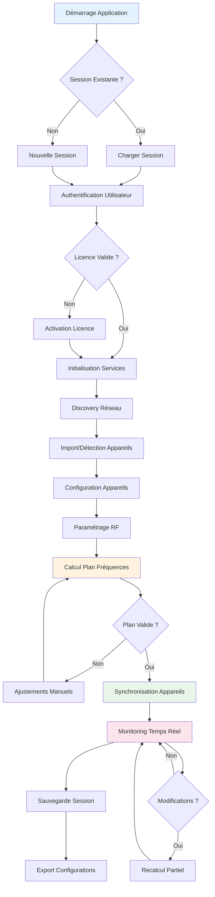
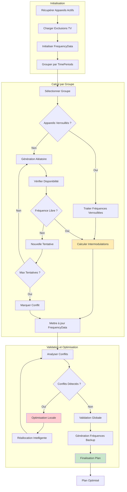
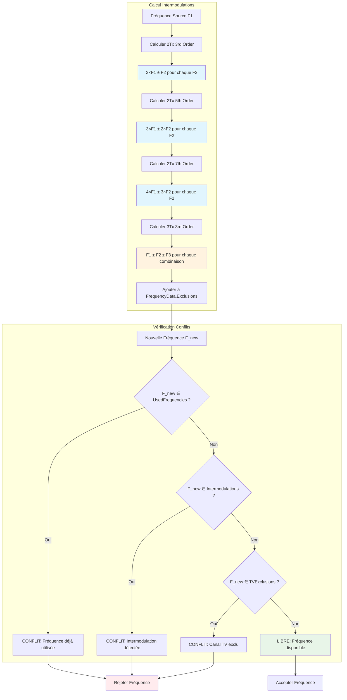
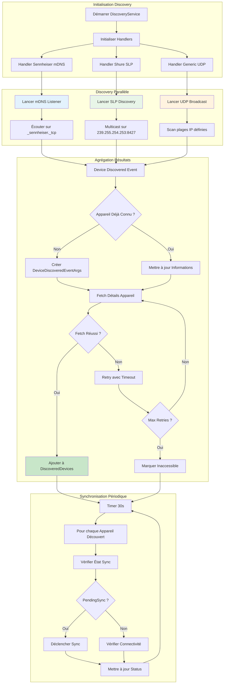
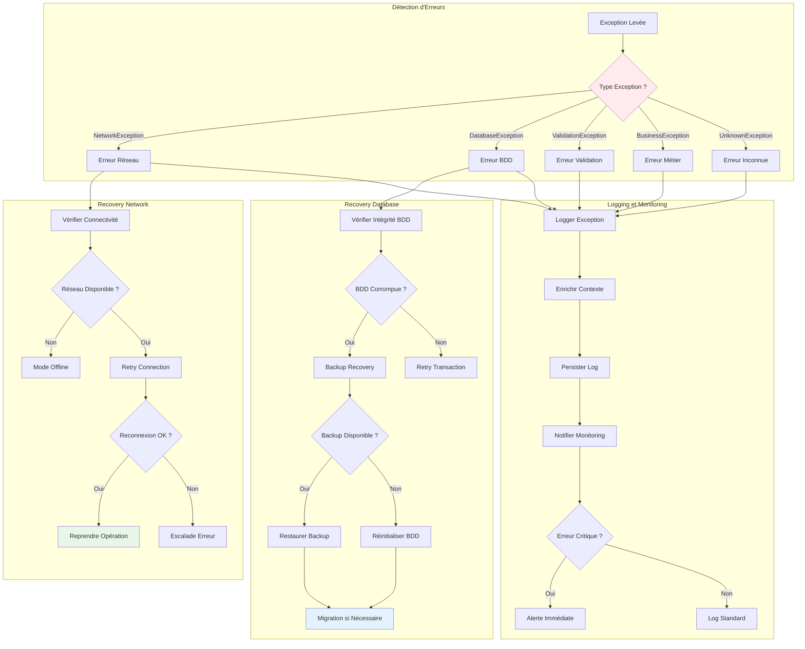

# Diagrammes d'Activités - Processus et Algorithmes

Les diagrammes d'activités de RF.Go modélisent les **processus métier complexes** et les **algorithmes RF avancés** qui constituent le cœur technique de l'application. Cette section détaille les workflows critiques depuis l'initialisation du système jusqu'aux calculs d'optimisation spectrale.

## 1. Processus Global de Gestion RF

### Vue d'Ensemble du Workflow Principal

## 2. Algorithme de Calcul des Fréquences RF

### Processus Central d'Optimisation Spectrale

### Détail de l'Algorithme d'Intermodulation

## 3. Processus de Découverte Réseau Multi-Protocoles

### Orchestration des Handlers de Découverte

## 4. Gestion des Sessions et Persistence

### Workflow de Sauvegarde/Chargement

```mermaid
graph TD
    subgraph "Sauvegarde Session"
        SV1[Trigger Save] --> SV2[Sérialiser RFDevices]
        SV2 --> SV3[Sérialiser RFGroups]
        SV3 --> SV4[Sérialiser ExclusionChannels]
        SV4 --> SV5[Sérialiser FrequencyData]
        SV5 --> SV6[Créer Session Entity]
        SV6 --> SV7[Transaction SQLite]
        SV7 --> SV8{Transaction OK ?}
        SV8 -->|Oui| SV9[Commit + Notification]
        SV8 -->|Non| SV10[Rollback + Erreur]
    end

    subgraph "Chargement Session"
        LD1[Sélectionner Session] --> LD2[Charger depuis SQLite]
        LD2 --> LD3{Session Valide ?}
        LD3 -->|Non| LD4[Erreur: Session Corrompue]
        LD3 -->|Oui| LD5[Désérialiser Entities]
        LD5 --> LD6[Reconstituer RFDevices]
        LD6 --> LD7[Reconstituer Relations]
        LD7 --> LD8[Valider Cohérence]
        LD8 --> LD9{Cohérence OK ?}
        LD9 -->|Non| LD10[Migration/Réparation]
        LD9 -->|Oui| LD11[Initialiser ViewModels]
        LD10 --> LD11
        LD11 --> LD12[Session Chargée]
    end

    subgraph "Auto-Save Intelligent"
        AS1[Détecter Modification] --> AS2[Debounce Timer 5s]
        AS2 --> AS3{Modifications Critiques ?}
        AS3 -->|Oui| AS4[Save Immédiat]
        AS3 -->|Non| AS5[Save Différé]
        AS4 --> AS6[Mettre à jour LastSaved]
        AS5 --> AS6
        AS6 --> AS7[Notification Status]
    end

    style SV7 fill:#fff3e0
    style LD8 fill:#e3f2fd
    style AS3 fill:#ffecb3
```

## 5. Synchronisation Bidirectionnelle des Appareils

### Processus Magic Sync

```mermaid
graph TD
    subgraph "Magic Sync To Device"
        MT1[Sélectionner Appareils] --> MT2[Valider Connectivité]
        MT2 --> MT3{Tous Connectés ?}
        MT3 -->|Non| MT4[Afficher Appareils Offline]
        MT3 -->|Oui| MT5[Pour chaque Appareil]
        MT5 --> MT6[Récupérer Handler Spécifique]
        MT6 --> MT7[Construire Commandes]
        MT7 --> MT8[Envoyer via TCP]
        MT8 --> MT9{ACK Reçu ?}
        MT9 -->|Oui| MT10[Marquer Synchronized]
        MT9 -->|Non| MT11[Retry avec Exponential Backoff]
        MT11 --> MT12{Max Retries ?}
        MT12 -->|Non| MT8
        MT12 -->|Oui| MT13[Marquer Failed]
        MT10 --> MT14[Suivant]
        MT13 --> MT14
        MT14 --> MT15{Tous Traités ?}
        MT15 -->|Non| MT5
        MT15 -->|Oui| MT16[Rapport Final]
    end

    subgraph "Magic Sync From Device"
        MF1[Détecter Changements] --> MF2[Pour chaque Appareil Modifié]
        MF2 --> MF3[Fetch État Actuel]
        MF3 --> MF4[Comparer avec Base Locale]
        MF4 --> MF5{Différences ?}
        MF5 -->|Oui| MF6[Proposer Synchronisation]
        MF5 -->|Non| MF7[Suivant]
        MF6 --> MF8{Accepter Sync ?}
        MF8 -->|Oui| MF9[Mettre à jour Base]
        MF8 -->|Non| MF10[Ignorer Changements]
        MF9 --> MF7
        MF10 --> MF7
        MF7 --> MF11{Tous Traités ?}
        MF11 -->|Non| MF2
        MF11 -->|Oui| MF12[Synchronisation Terminée]
    end

    style MT8 fill:#e3f2fd
    style MF4 fill:#fff3e0
    style MT16 fill:#c8e6c9
```

## 6. Gestion des Erreurs et Recovery

### Stratégies de Récupération

## Métriques et Performance

### Indicateurs de Performance des Processus

| Processus | Temps Moyen | Complexité | Optimisations |
|-----------|-------------|------------|---------------|
| **Calcul RF Global** | 2-5 secondes | O(n²×m) | Parallelisation |
| **Discovery Réseau** | 10-30 secondes | O(n) | Cache DNS |
| **Sync Appareils** | 1-3 secondes | O(n) | Batch Operations |
| **Sauvegarde Session** | 100-500ms | O(n) | Transactions |
| **Chargement Session** | 200-800ms | O(n) | Lazy Loading |

Ces diagrammes d'activités détaillent les processus critiques de RF.Go et démontrent la complexité algorithmique nécessaire pour gérer efficacement les fréquences RF dans un environnement professionnel multi-marques. 