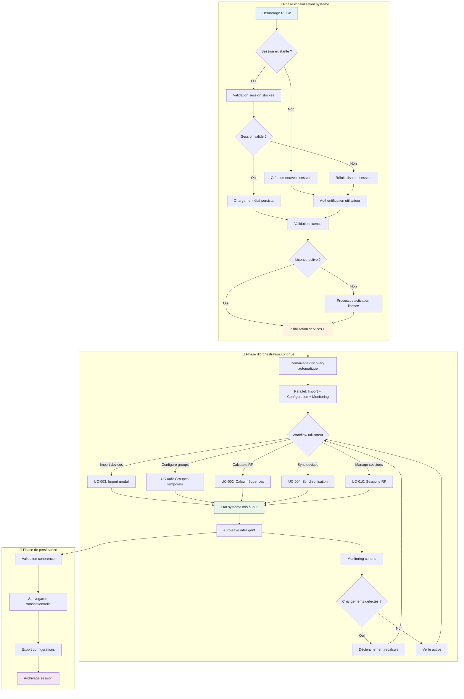

# Diagramme d'activité complémentaires

Les diagrammes d'activité présentés ici complètent ceux des use-cases en se concentrant sur les **processus cross-fonctionnels de haut niveau**, les **patterns algorithmiques système** et les **flux d'orchestration complexes**.

> **Note** : Les diagrammes d'activité spécifiques à chaque fonctionnalité sont détaillés dans leurs use-cases respectifs (UC-001 à UC-010). Cette section se concentre sur l'orchestration système et les algorithmes de haut niveau.

## 1. Architecture de workflow : orchestration globale de bout en bout

### Processus maître : de l'initialisation à la production

