# Diagramme d'activité complémentaires

Les diagrammes d'activité présentés ici complètent ceux des use-cases en se concentrant sur les **processus cross-fonctionnels de haut niveau**, les **patterns algorithmiques système** et les **flux d'orchestration complexes**.

> **Note** : Les diagrammes d'activité spécifiques à chaque fonctionnalité sont détaillés dans leurs use-cases respectifs (UC-001 à UC-010). Cette section se concentre sur l'orchestration système et les algorithmes de haut niveau.

## 1. Architecture de workflow : orchestration globale de bout en bout

### Processus maître : de l'initialisation à la production

```mermaid
flowchart TD
    subgraph "🚀 Phase d'initialisation système"
        A[Démarrage RF.Go] --> B{Session existante ?}
        B -->|Oui| C[Validation session stockée]
        B -->|Non| D[Création nouvelle session]
        C --> E{Session valide ?}
        E -->|Non| F[Réinitialisation session]
        E -->|Oui| G[Chargement état persista]
        D --> H[Authentification utilisateur]
        F --> H
        G --> I[Validation licence]
        H --> I
        I --> J{Licence active ?}
        J -->|Non| K[Processus activation licence]
        J -->|Oui| L[Initialisation services DI]
        K --> L
    end
    
    subgraph "🔄 Phase d'orchestration continue"
        L --> M[Démarrage discovery automatique]
        M --> N[Parallel: Import + Configuration + Monitoring]
        
        N --> O{Workflow utilisateur}
        O -->|Import devices| P[UC-003: Import modal]
        O -->|Configure groups| Q[UC-005: Groupes temporels]
        O -->|Calculate RF| R[UC-002: Calcul fréquences]
        O -->|Sync devices| S[UC-004: Synchronisation]
        O -->|Manage sessions| T[UC-010: Sessions RF]
        
        P --> U[État système mis à jour]
        Q --> U
        R --> U
        S --> U
        T --> U
        
        U --> V[Auto-save intelligent]
        V --> W[Monitoring continu]
        W --> X{Changements détectés ?}
        X -->|Oui| Y[Déclenchement recalculs]
        X -->|Non| Z[Veille active]
        Y --> O
        Z --> O
    end
    
    subgraph "💾 Phase de persistance"
        V --> AA[Validation cohérence]
        AA --> BB[Sauvegarde transactionnelle]
        BB --> CC[Export configurations]
        CC --> DD[Archivage session]
    end
    
    style A fill:#e3f2fd
    style L fill:#fff3e0
    style U fill:#e8f5e8
    style DD fill:#f3e5f5
```

