# Diagrammes de classes

Les diagrammes de classes de RF.Go illustrent l'**architecture orientée objet** complète du système. Cette modélisation détaille la structure statique, les relations entre classes, et les patterns de conception utilisés pour créer une architecture robuste et extensible basée sur l'analyse du code source réel.

## Vue d'ensemble de l'application

## 1. Vue d'ensemble de l'architecture

### Architecture en couches avec séparation des responsabilités

## 2. Modèles métier (domain layer) - code réel

### Entités principales RF

### Modèles de calcul RF et fréquences

## 3. Services de domaine (application layer) - implémentation réelle

### Services RF et gestion des appareils

### Services de synchronisation et mapping

## 4. Handlers et adaptateurs (infrastructure layer) - patterns réels

### Handlers de protocoles réseau

```mermaid
classDiagram
    class IDeviceHandler {
        <<interface>>
        +string Brand
        +bool CanHandle(string serviceName)
        +Task HandleDevice(DeviceDiscoveredEventArgs deviceInfo)
        +Task~(bool IsEqual, bool IsNotResponding)~ IsDevicePendingSync(DeviceDiscoveredEventArgs deviceInfo)
        +Task~List~string~~ SyncToDevice(DeviceDiscoveredEventArgs deviceInfo)
    }
    
    class SennheiserDeviceHandler {
        -UDPCommunicationService _communicationService
        -SennheiserCommandSet _commandSet
        -int Port = 45
        
        +string Brand = "Sennheiser"
        +bool CanHandle(string serviceName)
        +Task HandleDevice(DeviceDiscoveredEventArgs deviceInfo)
        +Task~(bool IsEqual, bool IsNotResponding)~ IsDevicePendingSync(DeviceDiscoveredEventArgs deviceInfo)
        +Task~List~string~~ SyncToDevice(DeviceDiscoveredEventArgs deviceInfo)
        +Task~string~ SendCommandAndExtractValueAsync(string ip, int port, string command, params string[] jsonPath)
    }
    
    class SennheiserG4DeviceHandler {
        -UDPCommunicationService _communicationService
        -SennheiserG4CommandSet _commandSet
        -DeviceData _deviceData
        -int Port = 53212
        
        +string Brand = "Sennheiser"
        +bool CanHandle(string serviceName)
        +Task HandleDevice(DeviceDiscoveredEventArgs deviceInfo)
        +Task~(bool IsEqual, bool IsNotResponding)~ IsDevicePendingSync(DeviceDiscoveredEventArgs deviceInfo)
        +Task~List~string~~ SyncToDevice(DeviceDiscoveredEventArgs deviceInfo)
        -string DetermineFrequencyBand(int minFreq, int maxFreq)
    }
    
    class ShureDeviceHandler {
        -TCPCommunicationService _communicationService
        -ShureCommandSet _commandSet
        -int Port = 2202
        
        +string Brand = "Shure"
        +bool CanHandle(string serviceName)
        +Task HandleDevice(DeviceDiscoveredEventArgs deviceInfo)
        +Task~(bool IsEqual, bool IsNotResponding)~ IsDevicePendingSync(DeviceDiscoveredEventArgs deviceInfo)
        +Task~List~string~~ SyncToDevice(DeviceDiscoveredEventArgs deviceInfo)
        +Task~string~ SendCommandAndExtractValueAsync(string ip, string command)
    }
    
    IDeviceHandler <|.. SennheiserDeviceHandler
    IDeviceHandler <|.. SennheiserG4DeviceHandler
    IDeviceHandler <|.. ShureDeviceHandler
```

### Command sets et patterns de commande

## 5. ViewModels et presentation layer - MVVM réel

### ViewModels architecture

## 6. Data access layer - repository pattern réel

### Database context et repository pattern

## 7. Communication services - network layer

### Network protocols et communication

## 8. Patterns de conception utilisés - implémentation réelle

### Design patterns identifiés dans le code

```mermaid
classDiagram
    class ObserverPattern {
        <<pattern>>
        +INotifyPropertyChanged
        +PropertyChanged Events
        +DevicesChanged Events
        +DeviceDiscovered Events
    }
    
    class StrategyPattern {
        <<pattern>>
        +IDeviceHandler Strategy
        +IDeviceCommandSet Strategy
        +Handler Selection Logic
    }
    
    class FactoryPattern {
        <<pattern>>
        +Handler Creation
        +CommandSet Creation
        +Service Registration
    }
    
    class RepositoryPattern {
        <<pattern>>
        +DatabaseContext
        +Generic CRUD Operations
        +Expression-based Filtering
    }
    
    class MVVMPattern {
        <<pattern>>
        +ViewModels
        +ObservableCollections
        +Property Binding
        +Command Pattern
    }
    
    class SingletonPattern {
        <<pattern>>
        +Service Registration
        +DI Container
        +Shared Instances
    }
    
    class AdapterPattern {
        <<pattern>>
        +DeviceDiscoveredEventArgs → RFDevice
        +Network Protocol Adapters
        +Command Set Adapters
    }
```

## 9. Relations et dépendances - injection de dépendances

### Diagramme de dépendances DI

