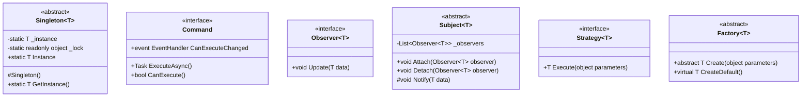

# Diagrammes de Classes - Architecture Orientée Objet

Les diagrammes de classes de RF.Go illustrent l'**architecture orientée objet** complète du système. Cette modélisation détaille la structure statique, les relations entre classes, et les patterns de conception utilisés pour créer une architecture robuste et extensible.

## 1. Vue d'Ensemble de l'Architecture OO

### Architecture en Couches avec Séparation des Responsabilités


## 2. Modèles Métier (Domain Layer)

### Entités Principales RF

```mermaid
classDiagram
    class RFDevice {
        +int ID
        +string Name
        +string IPAddress
        +DeviceBrand Brand
        +DeviceModel Model
        +string SerialNumber
        +DeviceStatus Status
        +DateTime LastSync
        +int GroupID
        +List~RFChannel~ Channels
        +Dictionary~string,object~ Properties
        
        +bool IsOnline()
        +void UpdateStatus(DeviceStatus status)
        +void AddChannel(RFChannel channel)
        +RFChannel GetChannel(int index)
        +bool CanSync()
        +Dictionary~string,object~ GetConfiguration()
    }
    
    class RFChannel {
        +int ID
        +int DeviceID
        +int ChannelNumber
        +int Frequency
        +string ChannelName
        +bool IsLocked
        +int Power
        +int Sensitivity
        +ChannelType Type
        +DateTime LastUpdate
        
        +bool IsValidFrequency(int frequency)
        +void Lock()
        +void Unlock()
        +void SetFrequency(int frequency)
        +bool HasConflict()
        +List~int~ GetIntermodulations()
    }
    
    class RFGroup {
        +int ID
        +string Name
        +string Description
        +Color GroupColor
        +List~TimePeriod~ TimePeriods
        +List~RFDevice~ Devices
        +GroupStatus Status
        +DateTime CreatedAt
        +DateTime UpdatedAt
        
        +void AddDevice(RFDevice device)
        +void RemoveDevice(RFDevice device)
        +void AddTimePeriod(TimePeriod period)
        +bool HasTemporalConflict()
        +List~RFDevice~ GetActiveDevices(DateTime time)
        +int GetTotalChannels()
    }
    
    class TimePeriod {
        +int ID
        +string Name
        +DateTime StartTime
        +DateTime EndTime
        +TimeSpan StartTimeSpan
        +TimeSpan EndTimeSpan
        +RecurrenceType Recurrence
        +bool IsActive
        
        +bool IsActiveAt(DateTime time)
        +bool OverlapsWith(TimePeriod other)
        +TimeSpan Duration()
        +DateTime GetNextOccurrence()
        +bool Contains(DateTime time)
    }
    
    class ExclusionChannel {
        +int ID
        +int Frequency
        +string Reason
        +ExclusionType Type
        +DateTime ValidFrom
        +DateTime ValidTo
        +string Region
        +bool IsActive
        
        +bool IsExcludedAt(DateTime time)
        +bool Conflicts(int frequency)
        +bool IsInRegion(string region)
    }
    
    RFDevice ||--o{ RFChannel : contains
    RFGroup ||--o{ RFDevice : contains
    RFGroup ||--o{ TimePeriod : contains
    RFDevice }o--|| RFGroup : belongs to
```

### Modèles de Calcul RF


## 3. Services de Domaine

### Services RF et Gestion des Appareils


### Services de Synchronisation et Mapping


## 4. Handlers et Adaptateurs

### Handlers de Protocoles Réseau


### Factory Patterns pour Extensibilité


## 5. ViewModels et Presentation Layer

### ViewModels MVVM


## 6. Data Access Layer

### Repository Pattern et EF Core


## 7. Patterns de Conception Utilisés

### Design Patterns Implémentés



### Métriques de Complexité

| Classe | Responsabilités | Couplage | Cohésion | Complexité Cyclomatique |
|--------|----------------|----------|----------|-------------------------|
| **RFDevice** | Entité métier | Faible | Élevée | 8 |
| **FrequencyCalculationService** | Service métier | Moyen | Élevée | 15 |
| **DiscoveryService** | Service technique | Moyen | Moyenne | 12 |
| **DevicesViewModel** | Présentation | Élevé | Moyenne | 18 |
| **SennheiserHandler** | Adaptateur | Faible | Élevée | 10 |

## 8. Relations et Dépendances

### Diagramme de Packages

```mermaid
classDiagram
    package RF.Go.Domain {
        class RFDevice
        class RFChannel
        class RFGroup
    }
    
    package RF.Go.Application {
        class IFrequencyCalculationService
        class FrequencyCalculationService
        class DevicesViewModel
    }
    
    package RF.Go.Infrastructure {
        class RFDeviceRepository
        class SennheiserHandler
        class DiscoveryService
    }
    
    package RF.Go.Presentation {
        class DevicesView
        class FrequencyView
    }
    
    RF.Go.Application ..> RF.Go.Domain : Uses
    RF.Go.Infrastructure ..> RF.Go.Domain : Implements
    RF.Go.Infrastructure ..> RF.Go.Application : Implements
    RF.Go.Presentation ..> RF.Go.Application : Uses
```

Cette architecture orientée objet démontre une structure bien organisée avec une séparation claire des responsabilités, une extensibilité par design patterns, et une robustesse assurée par les principes SOLID. 