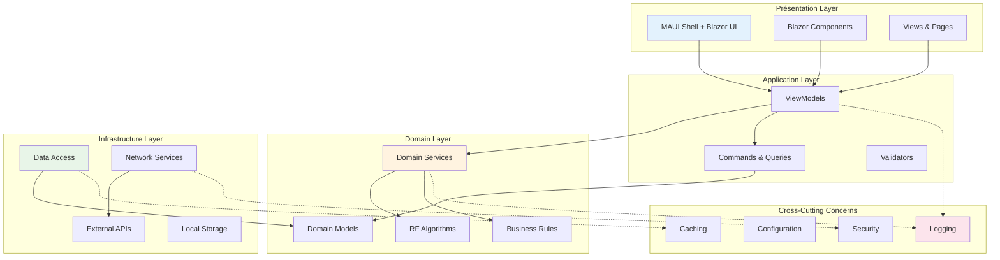
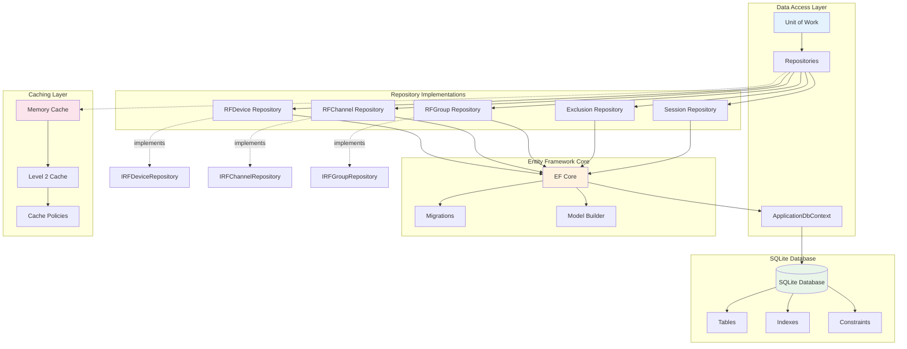
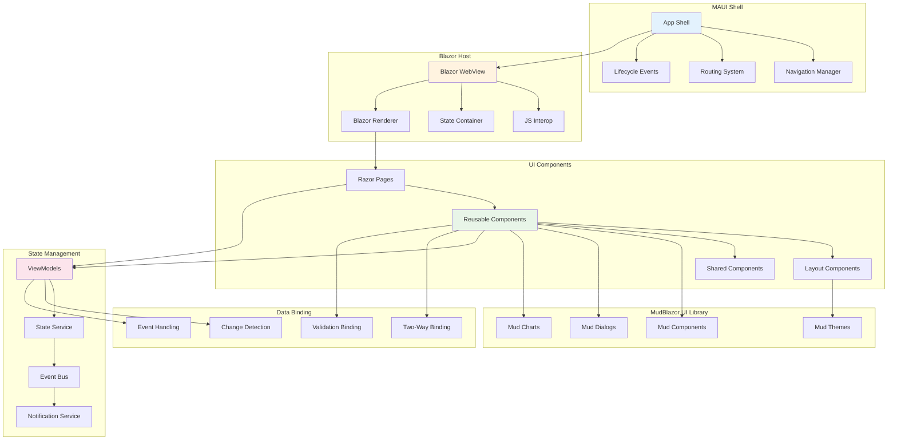
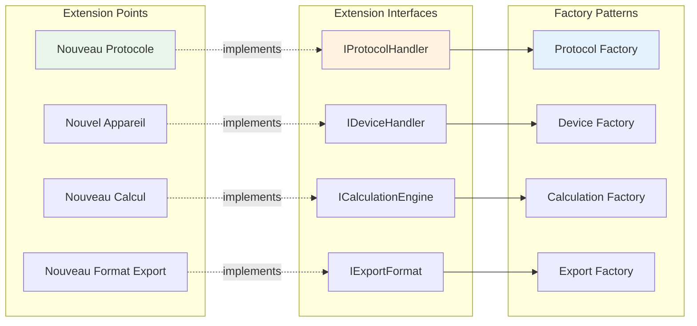

# Diagrammes de Composants - Architecture Modulaire

Les diagrammes de composants de RF.Go illustrent **l'architecture modulaire** du système et les **dépendances entre composants**. Cette modélisation révèle la structure technique organisée en couches et l'extensibilité du système par l'ajout de nouveaux handlers et protocoles.

## 1. Vue d'Ensemble de l'Architecture

### Architecture en Couches avec Séparation des Responsabilités

## 2. Composants Métier Centraux

### Services RF et Gestion des Appareils

```mermaid
graph TB
    subgraph "RF Core Components"
        RFC[RF Calculator]
        FDS[Frequency Data Service]
        IMS[Intermodulation Service]
        OPT[Optimization Engine]
    end
    
    subgraph "Device Management"
        DS[Discovery Service]
        DMS[Device Mapping Service]
        SS[Synchronization Service]
        VS[Validation Service]
    end
    
    subgraph "Protocol Handlers"
        SH[Sennheiser Handler]
        SHU[Shure Handler]
        GH[Generic Handler]
        WH[Wisycom Handler]
    end
    
    subgraph "Network Protocols"
        MDNS[mDNS Protocol]
        SLP[SLP Protocol]
        UDP[UDP Protocol]
        TCP[TCP Protocol]
    end
    
    subgraph "Data Models"
        RFD[RFDevice]
        RFC_Model[RFChannel]
        RFG[RFGroup]
        TP[TimePeriod]
        EC[ExclusionChannel]
    end
    
    %% Component relationships
    RFC --> FDS
    RFC --> IMS
    RFC --> OPT
    FDS --> RFD
    FDS --> RFC_Model
    
    DS --> SH
    DS --> SHU
    DS --> GH
    DS --> WH
    
    SH --> MDNS
    SH --> TCP
    SHU --> SLP
    SHU --> TCP
    GH --> UDP
    
    DMS --> RFD
    DMS --> RFG
    SS --> TCP
    SS --> VS
    
    %% Interfaces
    SH -.->|implements| IDeviceHandler
    SHU -.->|implements| IDeviceHandler
    GH -.->|implements| IDeviceHandler
    WH -.->|implements| IDeviceHandler
    
    style RFC fill:#ffecb3
    style DS fill:#e1f5fe
    style SH fill:#e8f5e8
    style MDNS fill:#f3e5f5
```

## 3. Composants de Persistence et Données

### Architecture de Données avec Repository Pattern

## 4. Composants Réseau et Communication

### Architecture Réseau Multi-Protocoles

```mermaid
graph TB
    subgraph "Network Layer"
        NM[Network Manager]
        CM[Connection Manager]
        PM[Protocol Manager]
        EM[Event Manager]
    end
    
    subgraph "Discovery Protocols"
        mDNS_Comp[mDNS Component]
        SLP_Comp[SLP Component]
        UDP_Comp[UDP Component]
        Bonjour[Bonjour Service]
    end
    
    subgraph "Communication Protocols"
        TCP_Comp[TCP Component]
        HTTP_Comp[HTTP Component]
        WebSocket[WebSocket Component]
        HTTPS[HTTPS Component]
    end
    
    subgraph "Protocol Adapters"
        SennAdapter[Sennheiser Adapter]
        ShureAdapter[Shure Adapter]
        GenericAdapter[Generic Adapter]
        WisycomAdapter[Wisycom Adapter]
    end
    
    subgraph "Security & Auth"
        TLS[TLS Handler]
        JWT[JWT Service]
        OAuth[OAuth Provider]
        Crypto[Cryptography]
    end
    
    subgraph "External APIs"
        LicenseAPI[License API]
        UpdateAPI[Update API]
        TelemetryAPI[Telemetry API]
        SupportAPI[Support API]
    end
    
    %% Network management
    NM --> CM
    NM --> PM
    NM --> EM
    
    %% Discovery
    PM --> mDNS_Comp
    PM --> SLP_Comp
    PM --> UDP_Comp
    mDNS_Comp --> Bonjour
    
    %% Communication
    CM --> TCP_Comp
    CM --> HTTP_Comp
    CM --> WebSocket
    CM --> HTTPS
    
    %% Adapters
    SennAdapter --> mDNS_Comp
    SennAdapter --> TCP_Comp
    ShureAdapter --> SLP_Comp
    ShureAdapter --> TCP_Comp
    GenericAdapter --> UDP_Comp
    WisycomAdapter --> TCP_Comp
    
    %% Security
    HTTPS --> TLS
    JWT --> Crypto
    OAuth --> JWT
    
    %% External APIs
    LicenseAPI --> HTTPS
    UpdateAPI --> HTTPS
    TelemetryAPI --> HTTPS
    SupportAPI --> HTTPS
    
    %% Interfaces
    SennAdapter -.->|implements| IProtocolAdapter
    ShureAdapter -.->|implements| IProtocolAdapter
    GenericAdapter -.->|implements| IProtocolAdapter
    
    style NM fill:#e3f2fd
    style mDNS_Comp fill:#fff3e0
    style TCP_Comp fill:#e8f5e8
    style TLS fill:#ffcdd2
```

## 5. Composants Interface Utilisateur

### Architecture UI avec Blazor + MAUI

## 6. Composants de Sécurité et Licences

### Architecture Sécurisée et Gestion des Licences

```mermaid
graph TB
    subgraph "Authentication"
        AuthService[Auth Service]
        UserManager[User Manager]
        SessionManager[Session Manager]
        TokenManager[Token Manager]
    end
    
    subgraph "Authorization"
        PolicyEngine[Policy Engine]
        RoleManager[Role Manager]
        PermissionCheck[Permission Checker]
        AccessControl[Access Control]
    end
    
    subgraph "License Management"
        LicenseService[License Service]
        LicenseValidator[License Validator]
        FeatureFlags[Feature Flags]
        UsageTracker[Usage Tracker]
    end
    
    subgraph "Cryptography"
        Encryption[Encryption Service]
        Hashing[Hashing Service]
        KeyManager[Key Manager]
        CertManager[Certificate Manager]
    end
    
    subgraph "Secure Storage"
        SecureStore[Secure Storage]
        KeyChain[Platform KeyChain]
        CredentialVault[Credential Vault]
        SecurePrefs[Secure Preferences]
    end
    
    subgraph "Security Monitoring"
        AuditLogger[Audit Logger]
        ThreatDetector[Threat Detector]
        SecurityEvents[Security Events]
        ComplianceChecker[Compliance Checker]
    end
    
    %% Authentication flow
    AuthService --> UserManager
    AuthService --> SessionManager
    AuthService --> TokenManager
    
    %% Authorization
    PolicyEngine --> RoleManager
    PolicyEngine --> PermissionCheck
    PolicyEngine --> AccessControl
    
    %% License Management
    LicenseService --> LicenseValidator
    LicenseService --> FeatureFlags
    LicenseService --> UsageTracker
    
    %% Cryptography
    AuthService --> Encryption
    TokenManager --> Hashing
    LicenseValidator --> KeyManager
    Encryption --> CertManager
    
    %% Secure Storage
    UserManager --> SecureStore
    SecureStore --> KeyChain
    SecureStore --> CredentialVault
    SecureStore --> SecurePrefs
    
    %% Security Monitoring
    AuthService --> AuditLogger
    PolicyEngine --> ThreatDetector
    ThreatDetector --> SecurityEvents
    SecurityEvents --> ComplianceChecker
    
    %% Cross-cutting concerns
    AuthService -.-> AuditLogger
    LicenseService -.-> AuditLogger
    
    style AuthService fill:#ffebee
    style LicenseService fill:#e8f5e8
    style Encryption fill:#fff3e0
    style AuditLogger fill:#fce4ec
```

## 7. Matrice des Dépendances

### Analyse des Couplages et Interfaces

| Composant Source | Composant Cible | Type Dépendance | Interface | Niveau Couplage |
|------------------|-----------------|-----------------|-----------|-----------------|
| **DevicesViewModel** | **DiscoveryService** | Forte | IDiscoveryService | Faible |
| **DiscoveryService** | **Device Handlers** | Composition | IDeviceHandler | Moyen |
| **RF Calculator** | **Frequency Data** | Agrégation | IFrequencyDataService | Faible |
| **Device Handlers** | **Network Protocols** | Utilisation | - | Moyen |
| **ViewModels** | **Domain Services** | Forte | Interface Métier | Faible |
| **Data Repositories** | **Entity Framework** | Forte | DbContext | Élevé |
| **UI Components** | **ViewModels** | Data Binding | INotifyPropertyChanged | Faible |

### Stratégies de Découplage

1. **Injection de Dépendances** : Tous les services via DI Container
2. **Interfaces Métier** : Séparation claire entre contrats et implémentations
3. **Event-Driven Architecture** : Communication asynchrone via événements
4. **Plugin Architecture** : Handlers extensibles via factory pattern
5. **Repository Pattern** : Abstraction de la persistence

## 8. Points d'Extension et Évolutivité

### Architecture Extensible

Cette architecture modulaire démontre la robustesse et l'extensibilité de RF.Go, avec une séparation claire des responsabilités et des mécanismes d'extension bien définis pour supporter l'évolution future du système. 