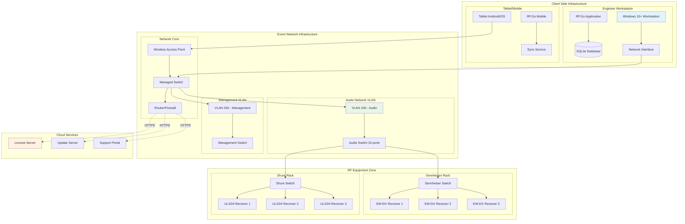
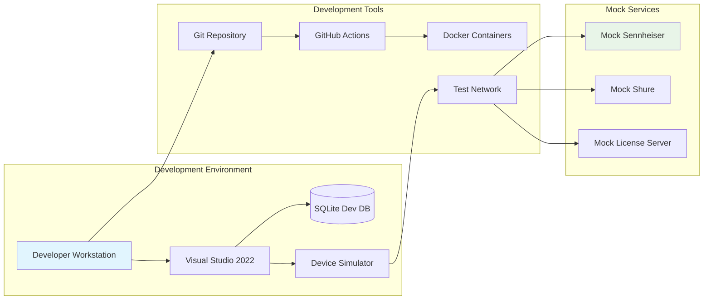
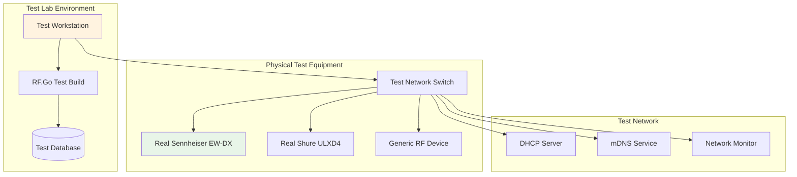
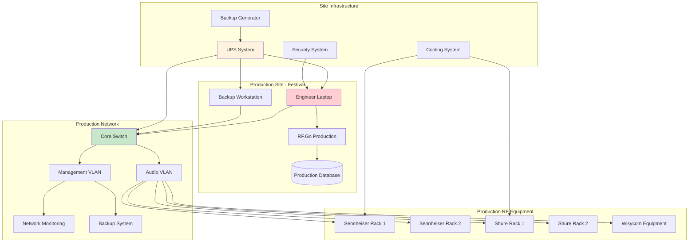
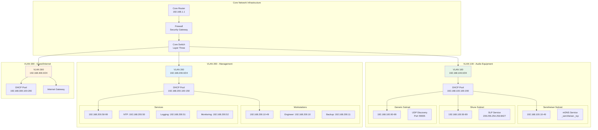
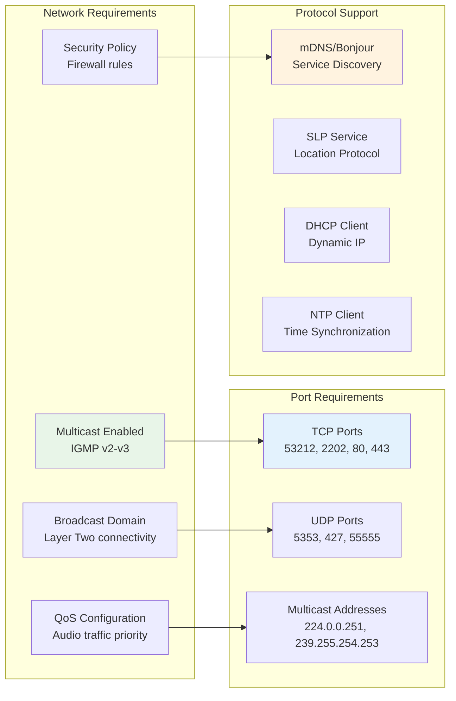
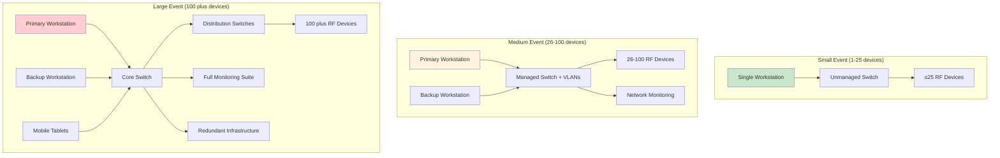

# Diagrammes de Déploiement - Infrastructure et Déploiement

Les diagrammes de déploiement de RF.Go illustrent l'**architecture d'infrastructure** et les **environnements de déploiement** du système. Cette modélisation détaille la distribution des composants logiciels sur l'infrastructure matérielle et les contraintes de déploiement.

## 1. Architecture de Déploiement Global

### Vue d'Ensemble de l'Infrastructure



## 2. Environnements de Déploiement

### Environnement de Développement



### Environnement de Test



### Environnement de Production



## 3. Topologie Réseau Détaillée

### Segmentation Réseau et VLANs



## 4. Distribution des Composants Logiciels

### Mapping Composants/Machines

```mermaid
graph TB
    subgraph "Engineer Workstation - Windows 11"
        subgraph "RF.Go Application"
            UI_LAYER[Presentation Layer<br/>Blazor + MAUI]
            APP_LAYER[Application Layer<br/>ViewModels + Services]
            DOMAIN_LAYER[Domain Layer<br/>Business Logic + RF Algorithms]
            INFRA_LAYER[Infrastructure Layer<br/>Repositories + Network]
        end
        
        subgraph "Local Services"
            SQLITE_DB[(SQLite Database<br/>Local Storage)]
            LOG_FILES[Log Files<br/>Local Logging)]
            CONFIG_FILES[Configuration Files<br/>Settings)]
            CACHE_SRV[Cache Service<br/>Memory Cache)]
        end
        
        subgraph "Network Components"
            DISCOVERY_SRV[Discovery Service<br/>mDNS/SLP/UDP)]
            SYNC_SRV[Sync Service<br/>TCP Communication)]
            HTTP_CLIENT[HTTP Client<br/>API Communication)]
        end
    end
    
    subgraph "Network Infrastructure"
        SWITCH_MGMT[Managed Switch<br/>VLAN Support)]
        DHCP_SRV[DHCP Server<br/>IP Assignment)]
        DNS_SRV[DNS Server<br/>Name Resolution)]
        NTP_SRV_NET[NTP Server<br/>Time Sync)]
    end
    
    subgraph "RF Equipment Nodes"
        subgraph "Sennheiser Node"
            SENN_FW[Device Firmware<br/>Embedded Linux)]
            SENN_TCP[TCP Server<br/>Port 53212)]
            SENN_mDNS_SRV[mDNS Service<br/>_sennheiser._tcp)]
            SENN_WEB[Web Interface<br/>HTTP Server)]
        end
        
        subgraph "Shure Node"
            SHURE_FW[Device Firmware<br/>Real-time OS)]
            SHURE_TCP[TCP Server<br/>Port 2202)]
            SHURE_SLP_SRV[SLP Service<br/>239.255.254.253)]
            SHURE_WEB[Web Interface<br/>HTTPS Server)]
        end
    end
    
    subgraph "Cloud Services"
        LICENSE_API[License API<br/>HTTPS REST)]
        UPDATE_API[Update API<br/>HTTPS REST)]
        TELEMETRY_API[Telemetry API<br/>HTTPS REST)]
    end
    
    %% Connections
    UI_LAYER --> APP_LAYER
    APP_LAYER --> DOMAIN_LAYER
    APP_LAYER --> INFRA_LAYER
    INFRA_LAYER --> SQLITE_DB
    INFRA_LAYER --> LOG_FILES
    INFRA_LAYER --> CONFIG_FILES
    INFRA_LAYER --> CACHE_SRV
    
    DISCOVERY_SRV --> SWITCH_MGMT
    SYNC_SRV --> SWITCH_MGMT
    HTTP_CLIENT --> SWITCH_MGMT
    
    SWITCH_MGMT --> DHCP_SRV
    SWITCH_MGMT --> DNS_SRV
    SWITCH_MGMT --> NTP_SRV_NET
    
    DISCOVERY_SRV -.->|mDNS| SENN_mDNS_SRV
    DISCOVERY_SRV -.->|SLP| SHURE_SLP_SRV
    SYNC_SRV -.->|TCP| SENN_TCP
    SYNC_SRV -.->|TCP| SHURE_TCP
    
    HTTP_CLIENT -.->|HTTPS| LICENSE_API
    HTTP_CLIENT -.->|HTTPS| UPDATE_API
    HTTP_CLIENT -.->|HTTPS| TELEMETRY_API
    
    style UI_LAYER fill:#e3f2fd
    style SQLITE_DB fill:#c8e6c9
    style SENN_FW fill:#e8f5e8
    style LICENSE_API fill:#fff3e0
```

## 5. Contraintes et Exigences de Déploiement

### Exigences Système

| Composant | Exigence Minimale | Exigence Recommandée | Contraintes |
|-----------|-------------------|---------------------|-------------|
| **OS Client** | Windows 10 1903+ | Windows 11 22H2+ | .NET 8.0 Runtime |
| **RAM** | 4 GB | 8 GB | 16 GB pour >100 appareils |
| **Stockage** | 1 GB libre | 5 GB libre | SSD recommandé |
| **Réseau** | 100 Mbps | 1 Gbps | Multicast support |
| **Processeur** | x64 compatible | i5/Ryzen 5+ | AVX2 pour calculs RF |

### Configuration Réseau Requise



## 6. Scalabilité et Performance

### Architecture Scalable



### Métriques de Performance

| Métrique | Small Event | Medium Event | Large Event |
|----------|-------------|--------------|-------------|
| **Devices Max** | 25 | 100 | 500 plus |
| **Discovery Time** | 10-30s | 30-60s | 60-120s |
| **Calculation Time** | 2s | 5s | 15s |
| **Sync Time** | 10s | 30s | 60s |
| **Memory Usage** | 1GB | 2GB | 4GB |
| **Network Bandwidth** | 10Mbps | 50Mbps | 200Mbps |

## 7. Sécurité et Monitoring

### Sécurité du Déploiement

```mermaid
graph TB
    subgraph "Security Layers"
        PERIMETER[Perimeter Security<br/>Firewall + IDS]
        NETWORK[Network Security<br/>VLANs + ACLs]
        APP[Application Security<br/>Authentication + Encryption]
        DATA[Data Security<br/>Encryption at Rest]
    end
    
    subgraph "Monitoring Components"
        NET_MON[Network Monitoring<br/>SNMP + Flow Analysis]
        APP_MON[Application Monitoring<br/>Logs + Metrics]
        SEC_MON[Security Monitoring<br/>SIEM + Alerts]
        PERF_MON[Performance Monitoring<br/>Resource Usage]
    end
    
    subgraph "Backup and Recovery"
        CONFIG_BACKUP[Configuration Backup<br/>Automated + Manual]
        DATA_BACKUP[Data Backup<br/>Database + Files]
        DISASTER_RECOVERY[Disaster Recovery<br/>Site Replication]
        ROLLBACK[Rollback Procedures<br/>Quick Recovery]
    end
    
    PERIMETER --> NETWORK
    NETWORK --> APP
    APP --> DATA
    
    NET_MON --> APP_MON
    APP_MON --> SEC_MON
    SEC_MON --> PERF_MON
    
    CONFIG_BACKUP --> DATA_BACKUP
    DATA_BACKUP --> DISASTER_RECOVERY
    DISASTER_RECOVERY --> ROLLBACK
    
    style PERIMETER fill:#ffcdd2
    style NET_MON fill:#e3f2fd
    style CONFIG_BACKUP fill:#c8e6c9
```



Cette architecture de déploiement garantit une infrastructure robuste, scalable et sécurisée pour RF.Go, adaptée aux exigences variables des événements de petite à grande envergure.
