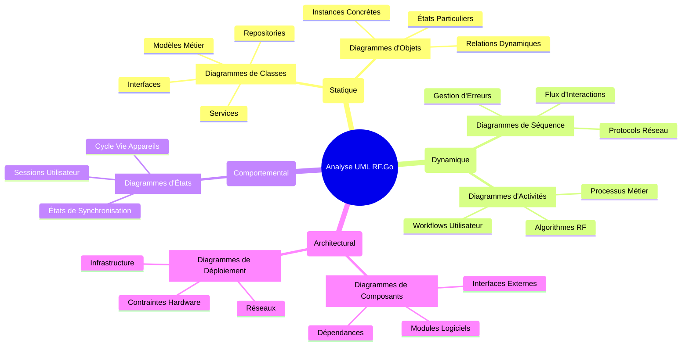
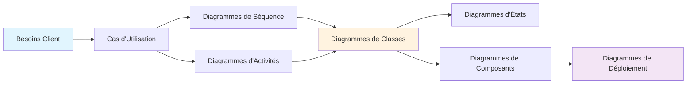

# Vue d'Ensemble

Cette section présente l'analyse UML approfondie de RF.Go, élaborée selon les standards de modélisation orientée objet. L'analyse couvre tous les aspects du système depuis la capture des besoins jusqu'à l'architecture technique détaillée.

## Méthodologie d'Analyse

L'analyse UML de RF.Go suit une approche **orientée objet** :

### 1. **Analyse des Besoins**

- Interviews approfondies avec les ingénieurs du son professionnels
- Étude comparative des solutions existantes (Workbench, WSM, SiFM)
- Identification des gaps fonctionnels du marché

### 2. **Modélisation Progressive**

- **Phase statique** : Diagrammes de classes et d'objets
- **Phase dynamique** : Diagrammes de séquence et d'activités
- **Phase comportementale** : Diagrammes d'états-transitions
- **Phase architecturale** : Diagrammes de composants et de déploiement

### 3. **Validation Itérative**

- Reviews avec le client (Greg Maloche - WaveCoord)
- Prototypage rapide pour validation des concepts
- Tests utilisateur sur des événements réels

## Structure de l'Analyse UML

## Niveaux d'Abstraction

### 🎯 **Niveau Métier**

Focus sur les **processus métier** de l'ingénierie du son :

- Planification des fréquences RF
- Coordination des équipements multi-marques
- Gestion des interférences et intermodulations
- Workflows événementiels, c'est à dire un workflow le plus simple possible

### ⚙️ **Niveau Application**

Focus sur les **fonctionnalités logicielles** :

- Interface utilisateur Blazor
- Services de calcul RF
- Gestion des sessions et persistence
- Synchronisation réseau

### 🔧 **Niveau Technique**

Focus sur l'**implémentation technique** :

- Architecture .NET MAUI avec Blazor Hybrid
- MudBlazor en framework UI
- Protocoles réseau (mDNS, TCP/UDP)
- Base de données SQLite
- Patterns MVVM et DI

## Modèles UML Utilisés

| Type de Diagramme | Objectif Principal
|-------------------|-------------------
| **[Cas d'Utilisation](./use-cases.md)** | Capture des besoins fonctionnels
| **[Séquence](./sequence-diagrams.md)** | Flux d'interactions temporelles
| **[Activités](./activity-diagrams.md)** | Processus et algorithmes métier
| **[Classes](./class-diagrams.md)** | Structure orientée objet
| **[États](./state-diagrams.md)** | Comportements dynamiques
| **[Composants](./component-diagrams.md)** | Architecture modulaire
| **[Déploiement](./deployment-diagrams.md)** | Infrastructure technique

## Spécificités RF.Go

### Complexités Métier Modélisées

1. **Calculs d'Intermodulation**
   - Algorithmes jusqu'au 7ème ordre
   - Gestion des intermodulations à 3 émetteurs
   - Optimisation du spectre disponible

2. **Gestion Multi-Protocoles**
   - Handlers spécialisés par marque
   - Discovery réseau hétérogène
   - Synchronisation bidirectionnelle

3. **Architecture Temporelle**
   - Planification par créneaux horaires
   - Réutilisation dynamique des fréquences
   - Gestion des conflits temporels

## Outils et Standards

### Outils de Modélisation Utilisés

- **StarUML** : Diagrammes de classes complexes
- **Draw.io** : Diagrammes de workflow
- **Mermaid** : Intégration documentation
- **PlantUML** : Génération automatique

Cette analyse UML complète démontre une maîtrise approfondie de la modélisation orientée objet et constitue un élément différenciant majeur pour l'évaluation académique du TFE.
