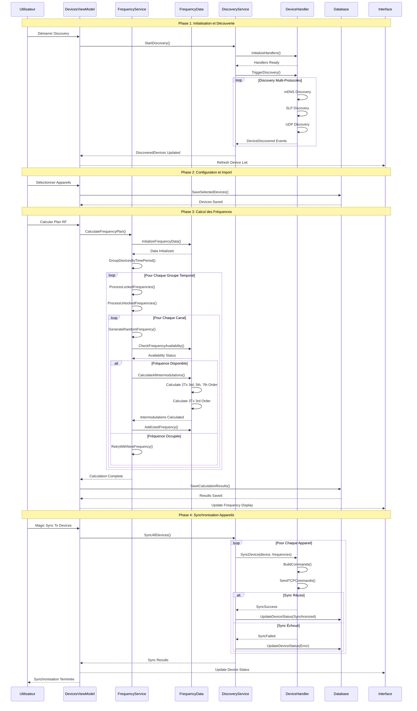
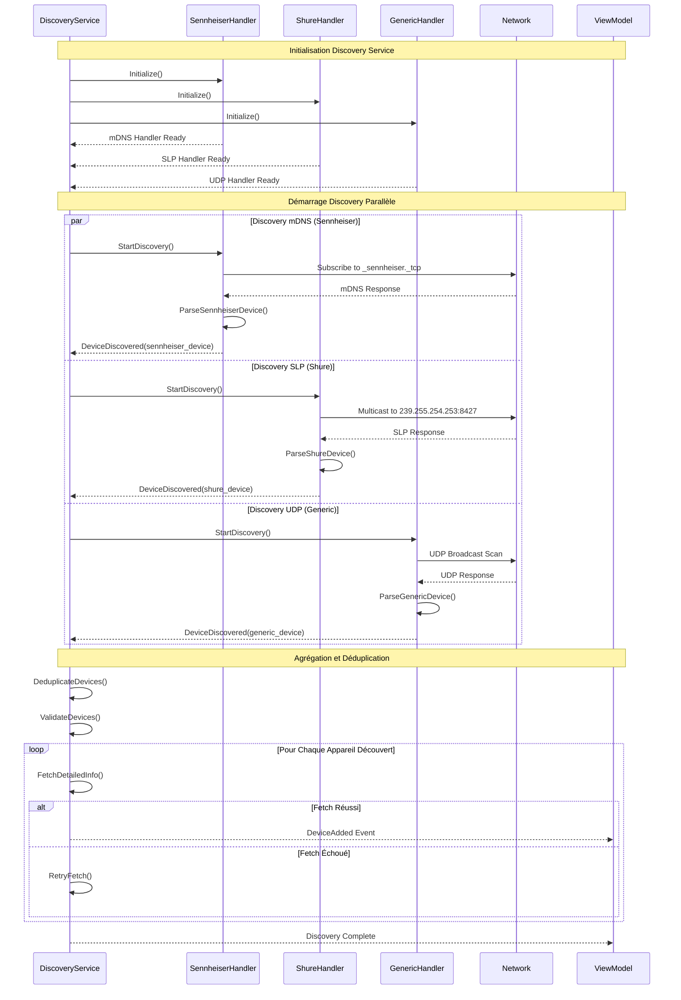
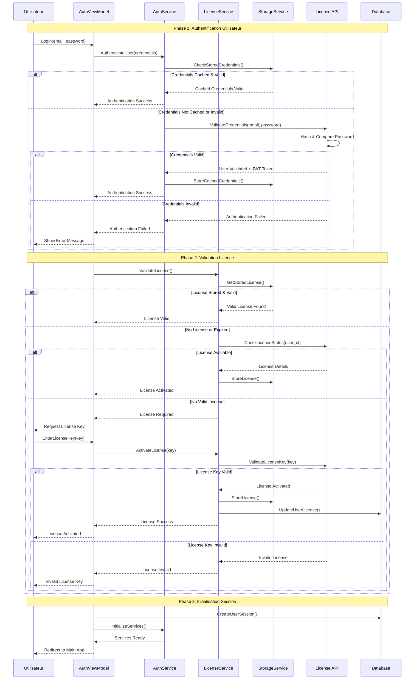
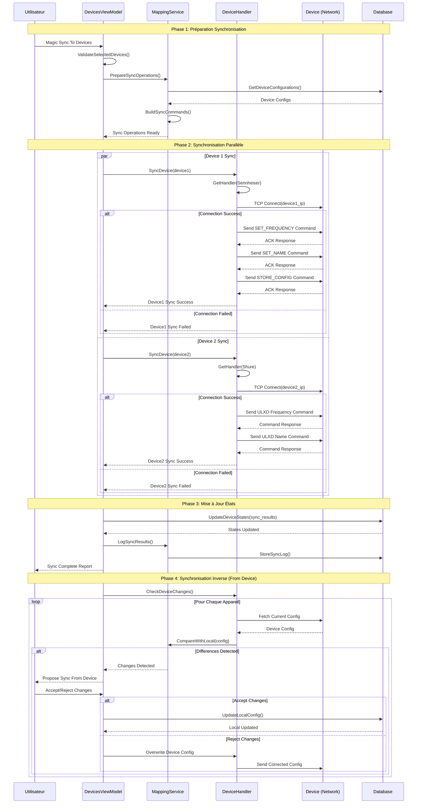
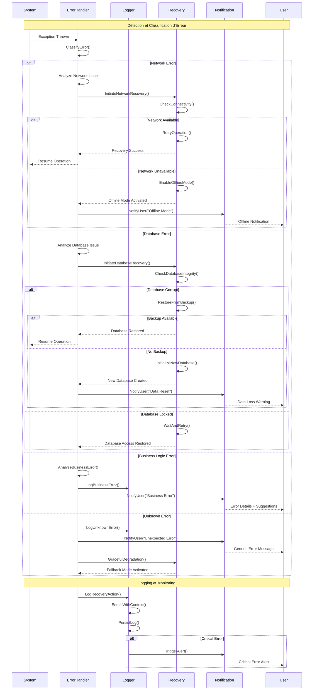

# Diagrammes de Séquence - Interactions Système

Les diagrammes de séquence de RF.Go illustrent les **interactions temporelles complexes** entre les différents composants du système. Cette modélisation détaille les flux de communication critiques, depuis la découverte des appareils jusqu'à la synchronisation finale.

## 1. Séquence Complète : Calcul et Synchronisation RF

### Scénario Principal de Calcul des Fréquences

## 2. Discovery Réseau Multi-Protocoles

### Orchestration des Handlers de Découverte

## 3. Authentification et Gestion des Licences

### Processus Complet d'Authentification

## 4. Synchronisation Bidirectionnelle des Appareils

### Magic Sync - Synchronisation Complexe

## 5. Gestion des Erreurs et Recovery

### Stratégies de Récupération Automatique

## 6. Performance et Optimisation

### Métriques des Interactions

| Séquence | Acteurs | Temps Moyen | Temps Critique | Points d'Optimisation |
|----------|---------|-------------|----------------|----------------------|
| **Discovery Complète** | 5-8 composants | 15-30s | 60s | Cache DNS, Timeouts |
| **Calcul RF Global** | 3-4 composants | 3-8s | 15s | Algorithmes parallèles |
| **Sync Single Device** | 2-3 composants | 1-2s | 5s | Batch commands |
| **Auth + License** | 4-6 composants | 2-5s | 10s | Token caching |
| **Error Recovery** | 3-5 composants | 1-3s | 8s | Predictive recovery |

### Patterns d'Interaction Identifiés

1. **Request-Response Asynchrone** : Utilisé pour les commandes réseau
2. **Observer Pattern** : Pour les notifications d'état
3. **Command Pattern** : Pour les opérations de synchronisation
4. **Circuit Breaker** : Pour la gestion des pannes réseau
5. **Saga Pattern** : Pour les transactions complexes multi-étapes

Ces diagrammes de séquence révèlent la sophistication des interactions dans RF.Go et démontrent une architecture robuste capable de gérer des scénarios complexes avec une gestion d'erreur appropriée. 