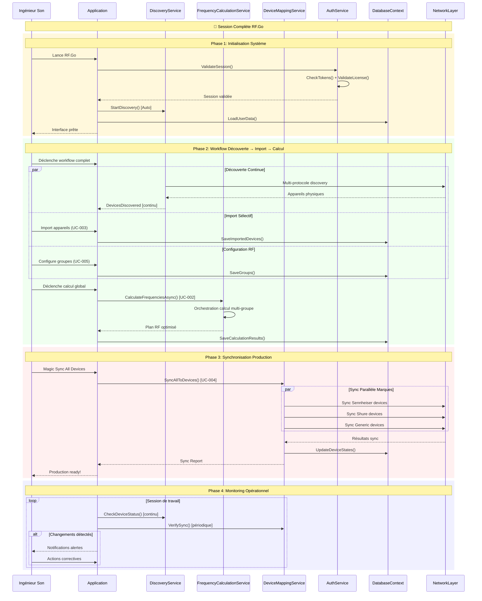
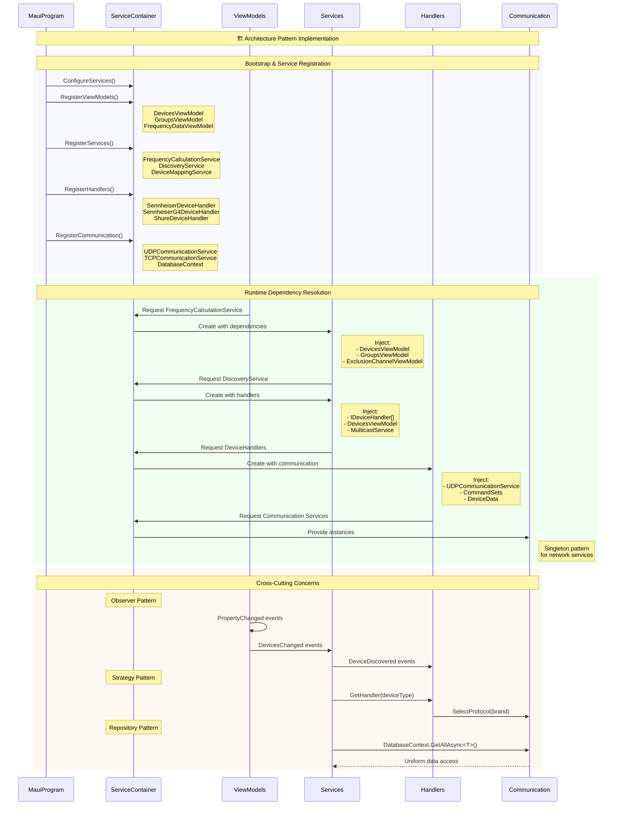
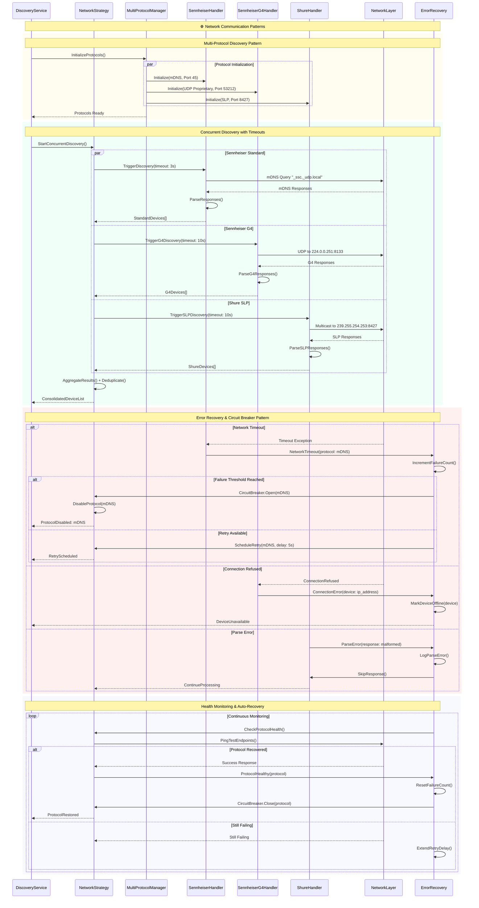
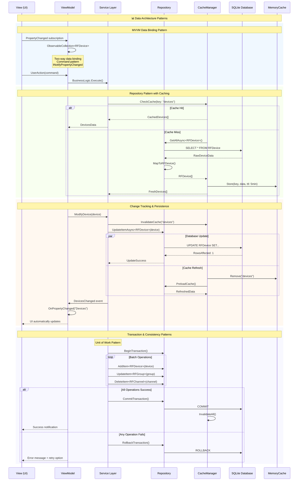

# Diagramme de séquence complémentaires

Les diagrammes de séquence présentés ici complètent ceux des use-cases en se concentrant sur les **interactions cross-fonctionnelles**, les **patterns d'architecture système** et les **flux d'intégration complexes** qui transcendent les fonctionnalités individuelles.

> **Note** : Les diagrammes de séquence spécifiques à chaque fonctionnalité sont détaillés dans leurs use-cases respectifs (UC-001 à UC-010). Cette section se concentre sur les interactions système de haut niveau.

## 1. Architecture cross-fonctionnelle : flux de bout en bout

### Orchestration complète : de la découverte à la production

## 2. Patterns d'architecture : injection de dépendances & services

### Orchestration des services via dependency injection

## 3. Patterns de communication : multi-protocole & recovery

### Orchestration network avec fallback strategy

## 4. Data flow architecture : MVVM + repository + cache

### Pattern d'architecture des données

## 5. Métriques & performance : monitoring des interactions

### Dashboard des performances système

| Pattern d'Interaction | Complexité | Performance Moyenne | SLA Cible | Points Critiques |
|------------------------|------------|---------------------|-----------|------------------|
| **Cross-UC Discovery→Calc→Sync** | Très Haute | 45-120s | 180s | Network latency, Algo optimization |
| **DI Container Resolution** | Moyenne | 50-200ms | 500ms | Service graph complexity |
| **Multi-Protocol Network** | Haute | 10-30s | 60s | Timeout management, Circuit breakers |
| **MVVM Data Binding** | Faible | 10-50ms | 100ms | Collection size, PropertyChanged frequency |
| **Repository + Cache** | Moyenne | 5-20ms | 50ms | Cache hit ratio, SQLite performance |

### Optimization patterns appliqués

1. **Async/Await Pattern** : Toutes les opérations I/O sont asynchrones
2. **Observer Pattern** : Évite les polling inutiles
3. **Circuit Breaker** : Prevent cascade failures
4. **Cache-Aside** : Réduction des accès base
5. **Command Pattern** : Undo/Redo et transactionnalité
6. **Strategy Pattern** : Handlers interchangeables par marque

## 6. Architecture de resilience : fault tolerance

### Patterns de résilience cross-fonctionnels

```mermaid
sequenceDiagram
    participant APP as Application
    participant RM as ResilienceManager
    participant CB as CircuitBreaker
    participant RT as RetryManager
    participant FB as FallbackService
    participant LOG as LoggingService

    Note over APP,LOG: 🛡️ Resilience Architecture Patterns
    
    rect rgb(255, 248, 248)
        Note over APP,LOG: Circuit Breaker Pattern
        APP->>RM: ExecuteWithResilience(operation)
        RM->>CB: CheckCircuitState()
        
        alt Circuit Closed (Healthy)
            CB-->>RM: Allow execution
            RM->>APP: Execute(operation)
            
            alt Operation Success
                APP-->>RM: Success result
                RM->>CB: RecordSuccess()
            else Operation Fails
                APP-->>RM: Exception
                RM->>CB: RecordFailure()
                CB->>CB: IncrementFailureCount()
                
                alt Threshold Reached
                    CB->>CB: OpenCircuit(timeout: 30s)
                    CB-->>RM: Circuit OPEN
                end
            end
            
        else Circuit Open (Failing)
            CB-->>RM: Reject execution
            RM->>FB: ExecuteFallback(operation)
            FB-->>RM: Fallback result
            
        else Circuit Half-Open (Testing)
            CB-->>RM: Allow single test
            RM->>APP: Execute(test_operation)
            
            alt Test Success
                CB->>CB: CloseCircuit()
            else Test Fails
                CB->>CB: ReOpenCircuit()
            end
        end
    end
    
    rect rgb(248, 255, 248)
        Note over APP,LOG: Retry Pattern with Exponential Backoff
        RM->>RT: ConfigureRetry(maxAttempts: 3, backoff: exponential)
        
        RM->>APP: AttemptOperation() [Attempt 1]
        
        alt Success on First Try
            APP-->>RM: Success
            RM-->>LOG: Operation Completed
        else Transient Failure
            APP-->>RM: TransientException
            RM->>RT: CalculateDelay(attempt: 1)
            RT-->>RM: Delay: 1 second
            RM->>RM: Wait(1s)
            
            RM->>APP: AttemptOperation() [Attempt 2]
            
            alt Success on Second Try
                APP-->>RM: Success
                RM-->>LOG: Operation Completed After Retry
            else Still Failing
                APP-->>RM: TransientException
                RM->>RT: CalculateDelay(attempt: 2)
                RT-->>RM: Delay: 2 seconds
                RM->>RM: Wait(2s)
                
                RM->>APP: AttemptOperation() [Attempt 3]
                
                alt Success on Third Try
                    APP-->>RM: Success
                    RM-->>LOG: Operation Completed After Multiple Retries
                else Max Retries Reached
                    APP-->>RM: Still Failing
                    RM->>LOG: Operation Failed After Max Retries
                    RM->>FB: ExecuteFallback()
                end
            end
        else Permanent Failure
            APP-->>RM: PermanentException
            RM->>LOG: Permanent Failure - No Retry
            RM->>FB: ExecuteFallback()
        end
    end
    
    rect rgb(248, 248, 255)
        Note over APP,LOG: Bulkhead Pattern (Isolation)
        
        Note over RM: Resource Isolation
        par Discovery Thread Pool
            RM->>APP: DiscoveryOperations (Pool: 2 threads)
        and Calculation Thread Pool  
            RM->>APP: CalculationOperations (Pool: 1 thread)
        and Sync Thread Pool
            RM->>APP: SyncOperations (Pool: 3 threads)
        end
        
        Note over RM: Prevents resource starvation<br/>Isolates failure domains
    end
    
    rect rgb(255, 255, 240)
        Note over APP,LOG: Comprehensive Monitoring
        RM->>LOG: LogResilienceMetrics()
        
        Note right of LOG: Metrics collected:<br/>- Circuit breaker states<br/>- Retry attempts<br/>- Fallback usage<br/>- Thread pool utilization<br/>- Error rates by operation
        
        LOG->>LOG: AggregateMetrics()
        LOG->>LOG: TriggerAlertsIfNeeded()
    end
```

Cette architecture cross-fonctionnelle démontre comment RF.Go utilise des patterns architecturaux sophistiqués pour créer un système robuste, performant et résilient qui transcende les fonctionnalités individuelles documentées dans les use-cases.
