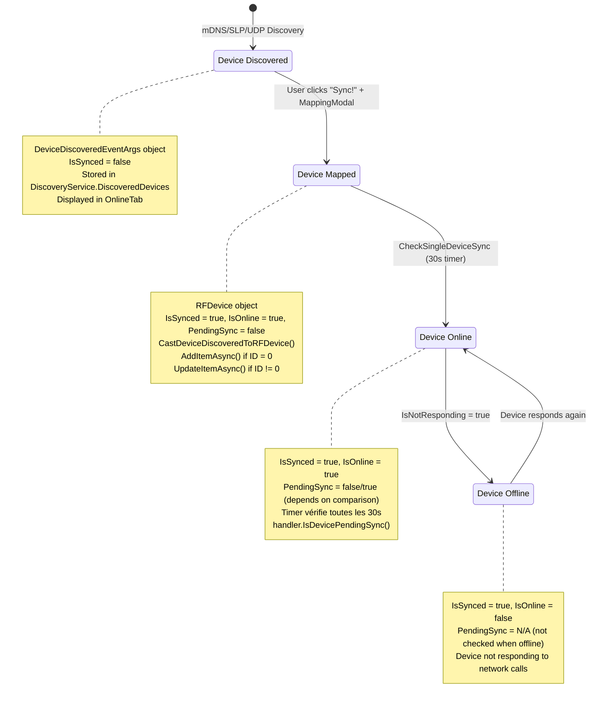
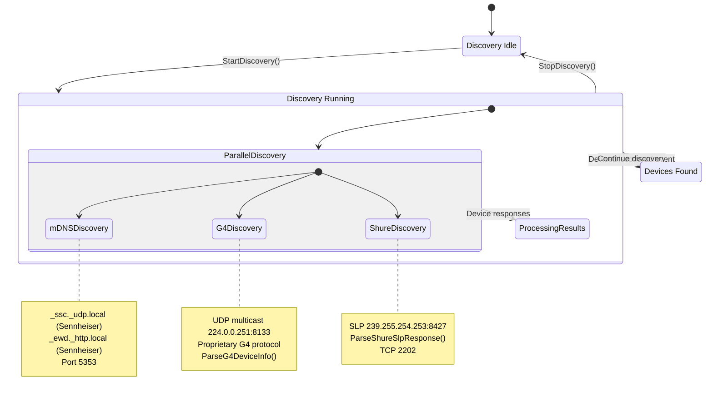
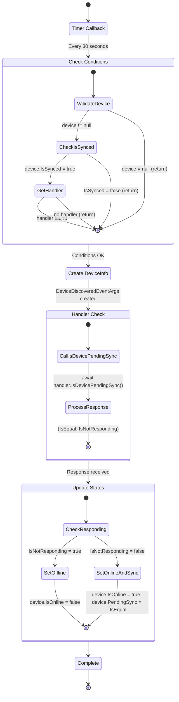
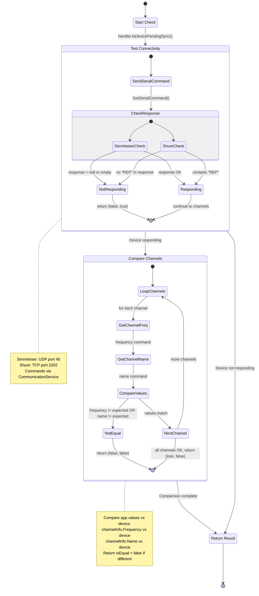

# Diagrammes d'états

Les diagrammes d'états de RF.Go modélisent le comportement des entités principales basé sur l'analyse du code source. Ces modèles décrivent les transitions d'états effectivement implémentées dans le système.

## 1. Machine à états d'un appareil RF (RFDevice)

### Cycle de vie complet basé sur les propriétés IsSynced, IsOnline, PendingSync

## 2. États de découverte réseau

### Flux de découverte multi-protocoles (DiscoveryService)

## 3. États de monitoring (Timer 30 secondes)

### CheckSingleDeviceSync - Machine à états de vérification

## 4. États de synchronisation - Handler.IsDevicePendingSync

### Logique de vérification Sennheiser/Shure

## 5. États de mapping - Processus MappingModal

### Transformation DeviceDiscoveredEventArgs vers RFDevice

```mermaid
stateDiagram-v2
    [*] --> OnlineTabDisplay
    
    state "Online Tab Display" as OnlineTabDisplay
    state "User Click Sync" as UserClickSync
    state "Find Matching Devices" as FindMatching
    state "Open Mapping Modal" as OpenModal
    state "User Selection" as UserSelection
    state "Execute Mapping" as ExecuteMapping
    state "Save to Database" as SaveToDB
    state "Update States" as UpdateStates
    
    OnlineTabDisplay --> UserClickSync : Click "Sync!" button
    UserClickSync --> FindMatching : HandleSyncDevice()
    
    state FindMatching {
        [*] --> FilterDevices
        FilterDevices --> CheckMatches : Brand + Model + Frequency + !IsSynced
        CheckMatches --> ShowModal : matches found
        CheckMatches --> ShowError : no matches
        ShowError --> [*] : "No matching device found"
        ShowModal --> [*]
    }
    
    FindMatching --> OpenModal : Matching devices found
    OpenModal --> UserSelection : MappingModal displayed
    UserSelection --> ExecuteMapping : User selects device + sync direction
    
    state ExecuteMapping {
        [*] --> CastToRFDevice
        CastToRFDevice --> ChooseSyncDirection : CastDeviceDiscoveredToRFDevice()
        
        ChooseSyncDirection --> SyncToDevice : "Sync to Device" selected
        ChooseSyncDirection --> SyncFromDevice : "Sync from Device" selected
        
        SyncToDevice --> [*] : FirstSyncToDevice()
        SyncFromDevice --> [*] : FirstSyncFromDevice()
    }
    
    ExecuteMapping --> SaveToDB : Sync completed
    
    state SaveToDB {
        [*] --> CheckDeviceID
        CheckDeviceID --> AddItem : device.ID = 0
        CheckDeviceID --> UpdateItem : device.ID != 0
        
        AddItem --> [*] : AddItemAsync<RFDevice>()
        UpdateItem --> [*] : UpdateItemAsync<RFDevice>()
    }
    
    SaveToDB --> UpdateStates : Database updated
    
    state UpdateStates {
        [*] --> SetMappedStates
        SetMappedStates --> [*] : IsSynced = true, IsOnline = true, PendingSync = false
    }
    
    UpdateStates --> [*]
```

## Métriques de performance des états

### Temps de transition mesurés

| Transition | Implémentation | Temps typique | Action en cas d'échec |
|------------|---------------|---------------|----------------------|
| Discovery → Found | mDNS/SLP response | 2-10s | Continue discovery |
| User Sync → Mapped | MappingModal workflow | 1-3s | Show error message |
| Timer Check | CheckSingleDeviceSync | 30s interval | Log error, continue |
| Connectivity Test | TCP/UDP command | 2-5s timeout | Set IsOnline = false |
| Channel Comparison | Handler comparison | 100-500ms | Set PendingSync = true |

### Contraintes d'états réelles

1. **IsSynced** : Défini uniquement lors du mapping utilisateur
2. **IsOnline** : Mis à jour uniquement par le timer 30s via CheckSingleDeviceSync
3. **PendingSync** : Calculé par comparaison app vs device physique
4. **Timer requirement** : `IsSynced = true` pour être vérifié
5. **Handler requirement** : Brand match requis pour communication

Ces diagrammes d'états reflètent fidèlement l'implémentation réelle du système RF.Go basée sur l'analyse du code source.
