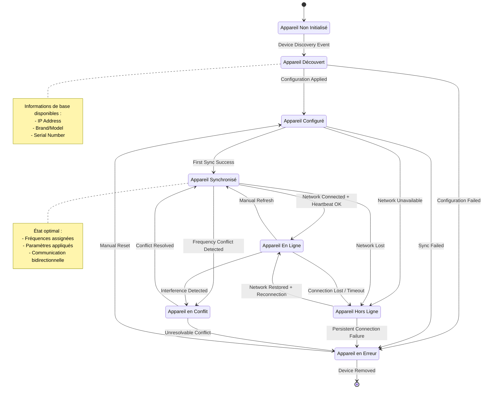
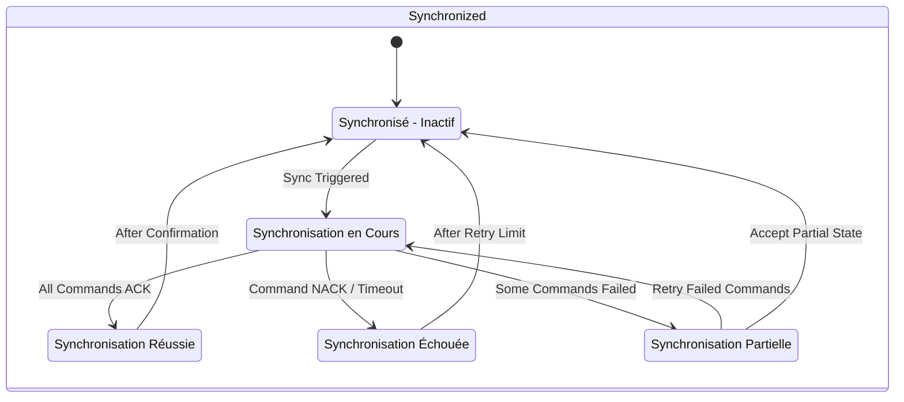
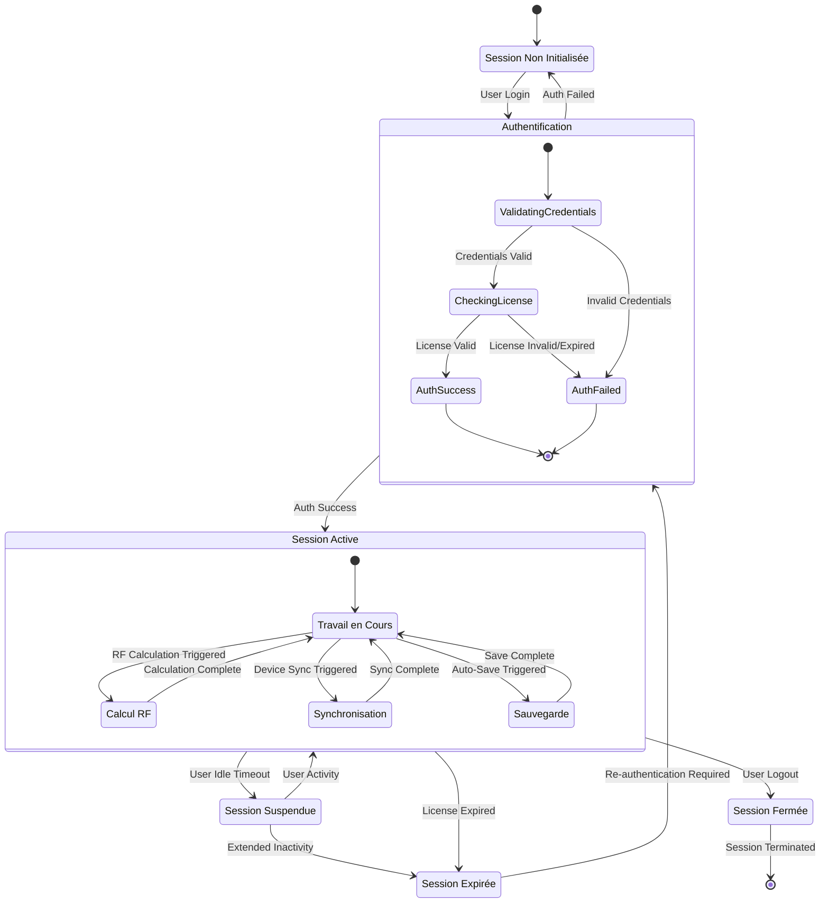
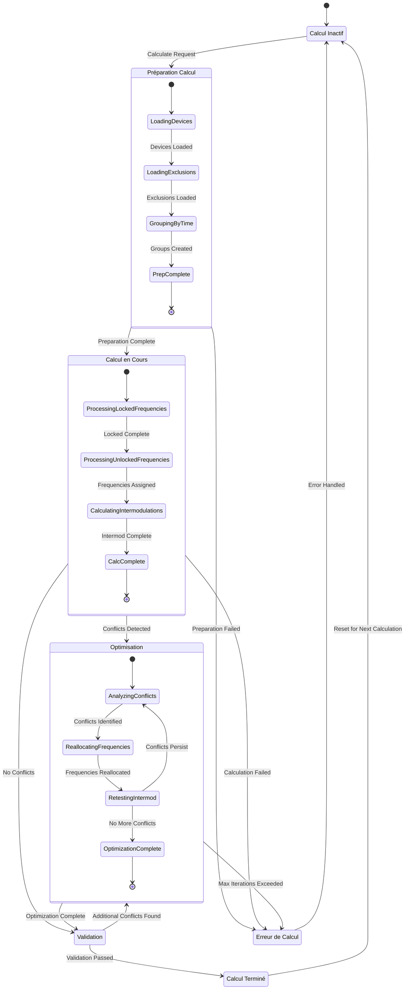
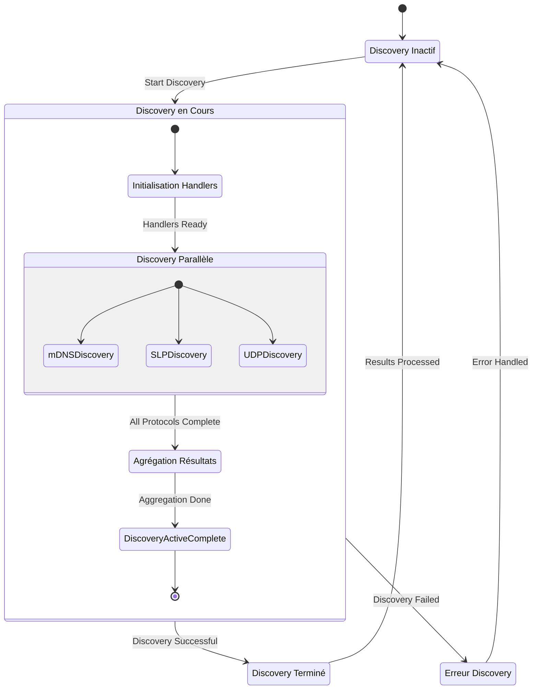
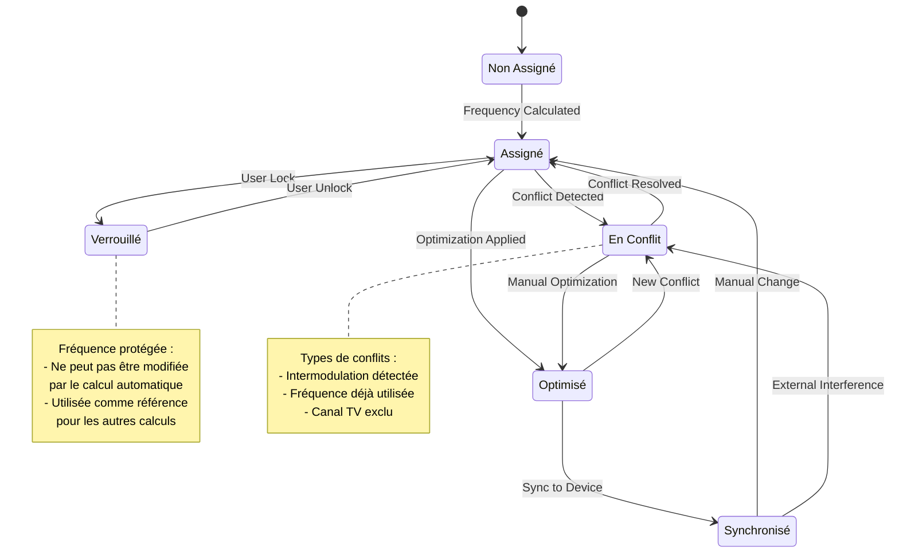
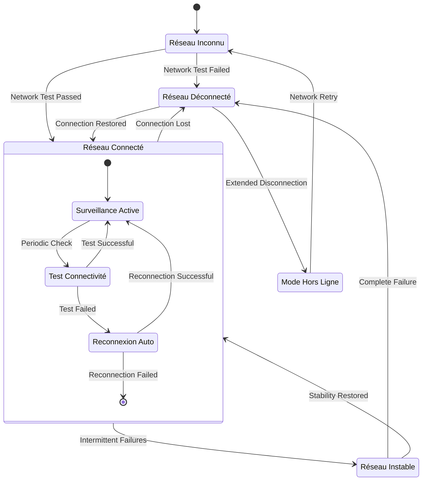

# Diagrammes d'États - Cycles de Vie et Comportements

Les diagrammes d'états de RF.Go modélisent le **comportement dynamique** des entités principales du système. Ces modèles décrivent les transitions d'états complexes qui régissent le fonctionnement des appareils RF, des sessions utilisateur et des processus de synchronisation.

## 1. Machine à États d'un Appareil RF (RFDevice)

### Cycle de Vie Complet d'un Appareil

### États Internes de Synchronisation

## 2. États d'une Session Utilisateur

### Gestion du Cycle de Vie des Sessions

## 3. États du Processus de Calcul RF

### Machine à États du Moteur de Calcul

## 4. États de Découverte Réseau

### Processus de Discovery Multi-Protocoles

## 5. États d'un Canal RF (RFChannel)

### Gestion des États de Fréquence

## 6. États de Connectivité Réseau

### Gestion de la Connectivité Multi-Appareils

## 7. Transitions Inter-États et Événements

### Matrice des Événements Déclencheurs

| État Source | Événement | État Destination | Condition |
|-------------|-----------|------------------|-----------|
| **Uninitialized** | DeviceDiscovered | Discovered | Valid Device Info |
| **Discovered** | ConfigurationApplied | Configured | Valid Configuration |
| **Configured** | SyncSuccess | Synchronized | Network Available |
| **Synchronized** | HeartbeatOK | Online | Continuous Communication |
| **Online** | ConnectionLost | Offline | Network Timeout |
| **Offline** | NetworkRestored | Online | Reconnection Success |
| **Conflicted** | ConflictResolved | Synchronized | Frequency Reallocation |

### Invariants et Contraintes d'États

1. **Contrainte de Cohérence** : Un appareil ne peut être `Online` que s'il est d'abord `Synchronized`
2. **Contrainte Temporelle** : La transition `Offline` → `Online` nécessite une validation de la connectivité
3. **Contrainte Métier** : Un canal `Locked` ne peut pas passer en état `InConflict` via le calcul automatique
4. **Contrainte de Ressources** : Maximum 50 appareils en état `Calculating` simultanément

## Métriques de Performance des États

### Temps de Transition Moyens

| Transition | Temps Moyen | Temps Max Acceptable | Action si Dépassement |
|------------|-------------|---------------------|----------------------|
| `Uninitialized` → `Discovered` | 2-10s | 30s | Timeout Discovery |
| `Configured` → `Synchronized` | 1-3s | 10s | Retry Sync |
| `Synchronized` → `Online` | 500ms | 2s | Check Network |
| `Calculating` → `Complete` | 2-5s | 15s | Interrupt Calculation |

Ces diagrammes d'états fournissent une modélisation précise du comportement dynamique de RF.Go et constituent un guide essentiel pour l'implémentation des transitions d'états complexes du système. 