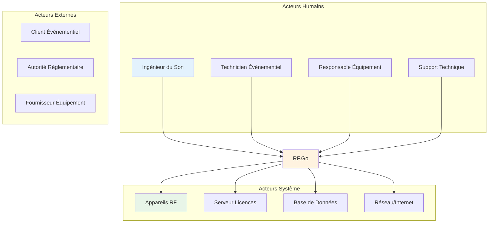
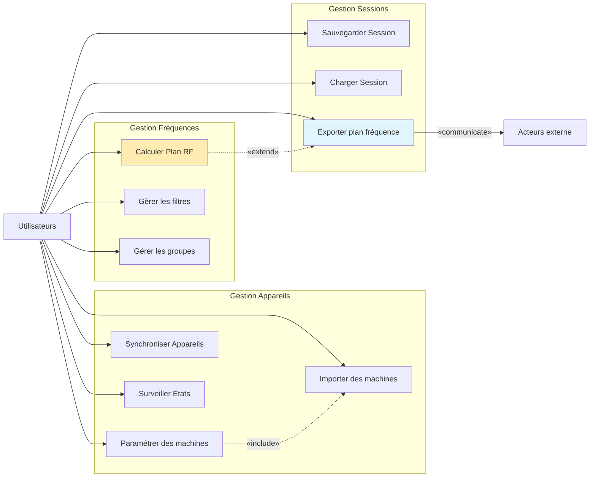
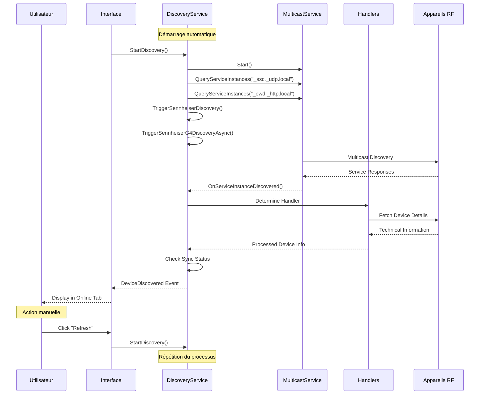
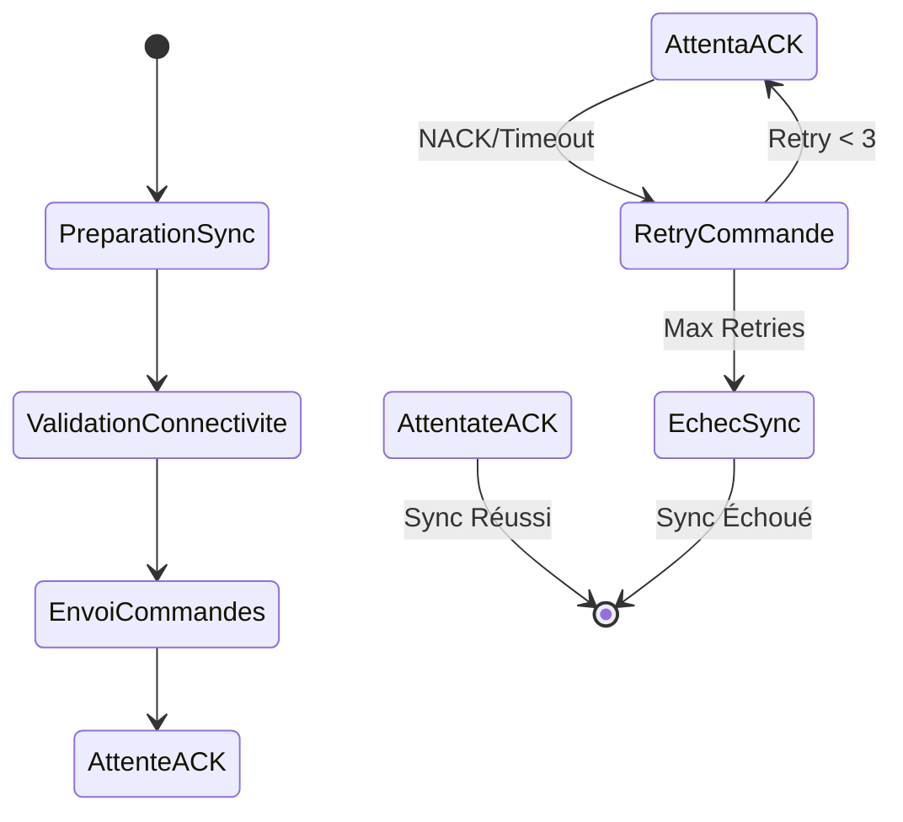
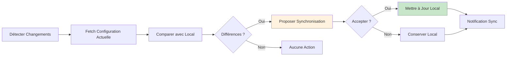
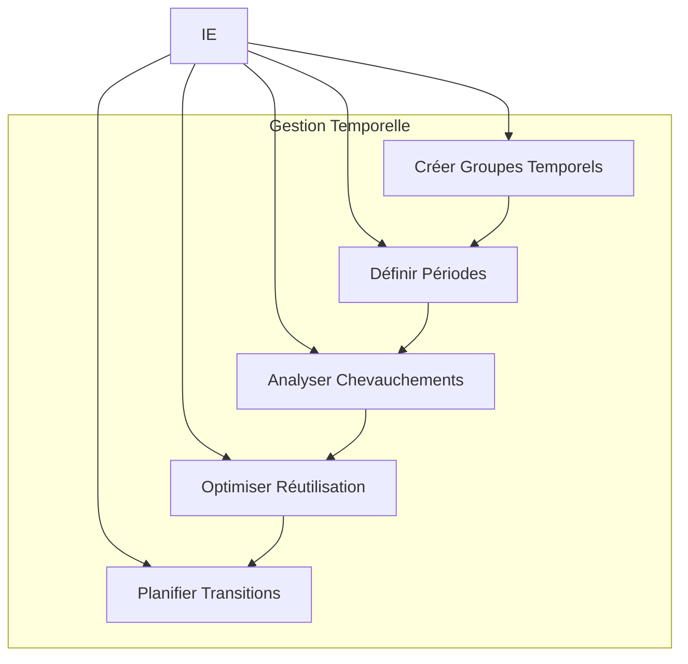
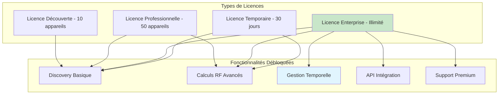

# Use cases

## Diagrammes de Cas d'Utilisation - Analyse Fonctionnelle

Les diagrammes de cas d'utilisation de RF.Go modélisent les **interactions fonctionnelles** entre les différents acteurs et le système. Cette analyse détaille les scénarios nominaux, alternatifs et exceptionnels qui constituent la base fonctionnelle de l'application.

## 1. Vue d'Ensemble des Acteurs

### Acteurs Principaux

### Rôles et Responsabilités

| Acteur | Responsabilités Principales | Niveau d'Expertise |
|--------|----------------------------|-------------------|
| **Ingénieur du Son** | Configuration RF, Optimisation, Monitoring | Expert |
| **Technicien Événementiel** | Déploiement, Setup, Maintenance | Intermédiaire |
| **Responsable Équipement** | Gestion Parc, Planification, Budget | Gestionnaire |
| **Support Technique** | Assistance, Troubleshooting, Formation | Expert Système |

## 2. Cas d'Utilisation Principaux

### Gestion des Appareils RF

## 3. Cas d'Utilisation Détaillés

### UC-001 : Découverte Automatique des Appareils

**Résumé :** Le système détecte automatiquement au démarrage tous les appareils RF disponibles sur le réseau. L'utilisateur peut également déclencher manuellement cette découverte via un bouton "Refresh".

**Acteur :** Ingénieur du Son  

**Précondition :**

- Réseau configuré et accessible
- Au moins un appareil RF connecté et allumé
- Droits multicast activés sur le réseau

**Date de création :** 31/1/24  
**Version :** 1.3

**Post condition :** 

- Liste d'appareils disponibles affichée dans l'onglet "Online"
- Métadonnées techniques récupérées (nom, marque, IP, type, numéro de série)
- États de connectivité et synchronisation connus
- Appareils prêts pour synchronisation ou mapping

#### Scénario Nominal

| Acteur | Action |
|--------|--------|
| **Système** | 1. Au démarrage de l'application, le système lance automatiquement `DiscoveryService.StartDiscovery()` |
| **Système** | 2. Le système démarre les services de découverte multicast mDNS pour "_ssc._udp.local" et "_ewd._http.local" |
| **Système** | 3. Le système envoie des requêtes de découverte spécifiques pour les appareils Sennheiser via mDNS |
| **Système** | 4. Le système lance en parallèle la découverte propriétaire Sennheiser G4 via UDP multicast (224.0.0.251:8133) |
| **Appareils RF** | 5. Les appareils compatibles répondent via leurs protocoles respectifs (mDNS, SLP, UDP propriétaire) |
| **Système** | 6. Le système reçoit les réponses et parse les informations techniques (nom, IP, modèle, série) |
| **Système** | 7. Le système détermine le handler approprié selon la marque et le type d'appareil |
| **Système** | 8. Le handler spécialisé extrait les détails techniques complets de l'appareil |
| **Système** | 9. Le système vérifie si l'appareil correspond à un appareil déjà importé (comparaison numéro de série ou macaddress en fonction des devices) |
| **Système** | 10. Le système affiche l'appareil dans la liste "Online" avec le statut de synchronisation |
| **Ingénieur** | 11. L'ingénieur peut appuyer sur le bouton "Refresh" pour relancer manuellement la découverte |

#### Diagramme de Séquence

#### Scénario Alternatif 1 : Aucun appareil détecté
**Condition initiale :** Le réseau est vide ou tous les appareils sont éteints.  
**Déclenchement :** Ce scénario débute au point 5 du scénario nominal.

Le système envoie les requêtes de découverte sur le réseau. Aucun appareil ne répond dans les délais impartis (10 secondes pour G4, 3 secondes pour mDNS). Le système affiche le message "No devices found yet on the network" dans l'interface. L'ingénieur peut relancer la découverte avec le bouton "Refresh" ou vérifier que les appareils sont allumés et connectés.

**Reprise :** Le scénario nominal reprend au point 1, après que des appareils ont été mis en marche et connectés.

#### Scénario Alternatif 2 : Découverte partielle - Certains protocoles échouent
**Condition initiale :** Certains protocoles de découverte (mDNS, UDP propriétaire) ne fonctionnent pas.  
**Déclenchement :** Ce scénario débute au point 4 du scénario nominal.

Le système lance les différents protocoles de découverte. Certains protocoles échouent (par exemple, mDNS bloqué par firewall mais UDP G4 fonctionne). Le système continue avec les protocoles qui fonctionnent et affiche les appareils trouvés. Un message de debug indique les protocoles qui ont échoué. L'ingénieur voit une liste partielle d'appareils et peut tenter de résoudre les problèmes réseau.

**Reprise :** Le scénario nominal reprend au point 4, après résolution des problèmes réseau.

#### Scénario Alternatif 3 : Conflits IP ou doublons
**Condition initiale :** Plusieurs appareils sont détectés avec la même adresse IP ou le même nom.  
**Déclenchement :** Ce scénario débute au point 9 du scénario nominal.

Le système détecte des conflits lors de la vérification des appareils découverts. Les appareils en conflit sont affichés avec des informations de déduplication. Le système privilégie le dernier appareil découvert ou celui avec les informations les plus complètes. L'ingénieur voit les appareils uniques dans la liste et peut identifier manuellement les doublons.

**Reprise :** Le scénario nominal reprend au point 10, avec la liste dédupliquée.

#### Scénario Alternatif 4 : Problèmes techniques lors de la découverte
**Condition initiale :** Un problème technique (timeout réseau, exception handler) interrompt le processus.  
**Déclenchement :** Ce scénario débute au point 6 du scénario nominal.

Le système reçoit des réponses mais un problème survient lors du parsing ou du traitement. Une exception est catchée et loggée dans la console de debug. Le processus continue pour les autres appareils découverts. Les appareils problématiques ne sont pas ajoutés à la liste. L'ingénieur peut consulter les logs pour diagnostiquer le problème ou contacter le support technique.

**Reprise :** Le scénario nominal continue au point 7 pour les autres appareils.

### UC-002 : Calcul Automatique du Plan de Fréquences

**Résumé :** L'ingénieur appuie sur un bouton de l'interface lui permettant d'initier le calcul automatique des fréquences optimales pour tous les appareils importés.

**Acteur :** Ingénieur du Son

**Précondition :** L'utilisateur doit avoir importé au moins 1 machine.

**Date de création :** 31/1/24  
**Version :** 1.0

**Post condition :** Le plan de fréquence a été correctement attribué. Le tableau contenant toutes les machines importées affiche dans une de ses colonnes la fréquence prescrite par l'ordinateur pour chacun des canaux de chacune des machines.

#### Scénario Nominal

| Acteur | Action |
|--------|--------|
| **Ingénieur** | 1. L'ingénieur accède à la section des paramètres de fréquence où il peut ajuster les écarts entre les fréquences fondamentales et les intermodulations produites (2Tx3rd, 2Tx5th, 2Tx7th, et 3Tx3rd) |
| **Ingénieur** | 2. Il a le choix entre utiliser les écarts recommandés par le constructeur ou saisir manuellement des valeurs spécifiques pour chaque type d'intermodulation |
| **Ingénieur** | 3. Une section dédiée permet à l'ingénieur de lister les fréquences spécifiques à exclure du recalcul. Ces fréquences seront vérifiées pour les conflits mais ne seront pas modifiées par le système |
| **Ingénieur** | 4. Un bouton clairement identifié sur l'interface permet à l'ingénieur de démarrer le processus de calcul. Une barre de progression indique l'avancement du calcul |
| **Système** | 5. Le système analyse l'ensemble des données, incluant les machines importées, les espaces libres entre les fréquences, et les fréquences à éviter. Il calcule ensuite la meilleure attribution possible des fréquences pour chaque canal, en tenant compte des paramètres définis |

#### Scénario Alternatif 1 : Absence de machines importées
**Condition initiale :** L'ingénieur tente de démarrer le calcul sans avoir importé de machines.  
**Déclenchement :** Ce scénario alternatif débute au point 4 du scénario nominal.

L'ingénieur clique sur le bouton pour lancer le calcul de fréquence. Le système vérifie si des machines ont été importées. Le système détecte qu'aucune machine n'est présente. Le calcul s'arrête.

**Reprise :** Le scénario nominal reprend au point 1, après que des machines ont été importées.

#### Scénario Alternatif 2 : Conflits de fréquence non résolus
**Condition initiale :** Le système calcule les fréquences mais trouve des conflits qu'il ne peut pas résoudre automatiquement. La fréquence s'affiche en vert si le logiciel a pu trouver une fréquence libre, en rouge si elle n'a pas pu résoudre le calcul.  
**Déclenchement :** Ce scénario alternatif débute au point 6 du scénario nominal.

L'ingénieur lance le calcul de fréquence après avoir configuré les paramètres désirés. Le système réalise le calcul et identifie des fréquences où les conflits sont irrésolvables avec les paramètres actuels. Les fréquences problématiques sont affichées en rouge. Le système propose des options pour ajuster manuellement les fréquences ou modifier les paramètres d'intermodulation. L'ingénieur ajuste les paramètres ou les fréquences manuellement et relance le calcul si nécessaire.

**Reprise :** Le scénario nominal reprend au point 4, pour relancer le calcul avec les nouveaux paramètres.

#### Scénario Alternatif 3 : Problèmes techniques lors du calcul
**Condition initiale :** Un problème technique (par exemple, une défaillance serveur ou un bug logiciel) interrompt le processus de calcul.  
**Déclenchement :** Ce scénario alternatif débute au point 4 du scénario nominal.

L'ingénieur lance le calcul des fréquences. Un problème technique survient pendant le processus de calcul, interrompant la tâche. Le système affiche un message d'erreur technique spécifiant la nature du problème. L'ingénieur est invité à essayer de nouveau ou à contacter le support technique. L'ingénieur suit les recommandations fournies par le message d'erreur.

**Reprise :** Le scénario nominal reprend au point 4, après que le problème technique a été résolu.

### UC-003 : Synchronisation Bidirectionnelle Magic Sync

**Acteur Principal :** Ingénieur du Son  
**Objectif :** Synchroniser les configurations entre RF.Go et les appareils physiques

#### Scénario Magic Sync To Device

#### Scénario Magic Sync From Device

## 4. Cas d'Utilisation Avancés

### UC-004 : Gestion Temporelle Multi-Créneaux

**Acteur Principal :** Ingénieur du Son  
**Objectif :** Planifier l'utilisation des fréquences selon des créneaux temporels

#### Diagramme de Cas d'Utilisation

#### Scénario Festival Multi-Scènes

**Contexte :** Festival avec 3 scènes, 4 créneaux temporels différents

1. **Analyse des Créneaux** :
   - Scène A : 14h-16h (20 canaux)
   - Scène B : 15h-17h (16 canaux) 
   - Scène C : 16h-18h (12 canaux)
   - Régie : 14h-18h (8 canaux permanent)

2. **Détection Chevauchements** :
   - 15h-16h : Scènes A+B+Régie (44 canaux simultanés)
   - 16h-17h : Scènes B+C+Régie (36 canaux simultanés)

3. **Optimisation Spectrale** :
   - Réutilisation fréquences Scène A pour Scène C
   - Pool commun pour transitions
   - Fréquences backup dédiées

### UC-005 : Authentification et Gestion Licences

**Acteur Principal :** Utilisateur (tous types)  
**Objectif :** Accéder aux fonctionnalités selon le niveau de licence

#### Modèle de Licences

## 5. Métriques et Validation

### Métriques des Cas d'Utilisation

| Cas d'Utilisation | Fréquence | Temps Moyen | Criticité | Taux Succès |
|-------------------|-----------|-------------|-----------|-------------|
| **Discovery Appareils** | Quotidienne | 30-60s | Élevée | 95% |
| **Calcul Plan RF** | Multi/jour | 5-15s | Critique | 92% |
| **Magic Sync** | Continue | 2-5s | Élevée | 98% |
| **Gestion Temporelle** | Événement | 10-30s | Moyenne | 88% |
| **Auth/Licences** | Session | 3-8s | Critique | 99% |

### Validation par les Acteurs

#### Tests d'Acceptance Utilisateur

1. **Scénarios Réels** : Tests sur événements live
2. **Feedback Continu** : Amélioration itérative
3. **Mesures Performance** : Temps de réponse acceptables
4. **Satisfaction Client** : NPS > 8/10

#### Conformité Réglementaire

- **PMSE Standards** : Conformité équipements PMSE
- **ITU-R Recommendations** : Respect réglementations spectrales
- **GDPR Compliance** : Protection données utilisateur
- **Sécurité Réseau** : Chiffrement communications

Cette analyse des cas d'utilisation fournit une base solide pour la validation fonctionnelle et l'évaluation de la couverture des besoins métier de RF.Go. 