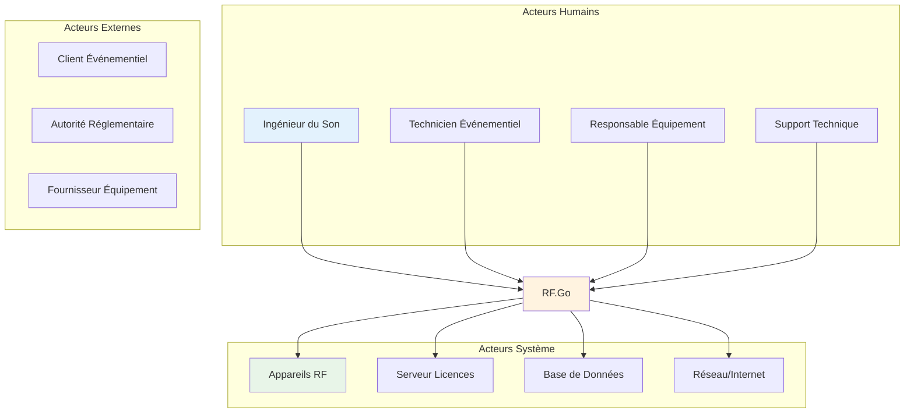
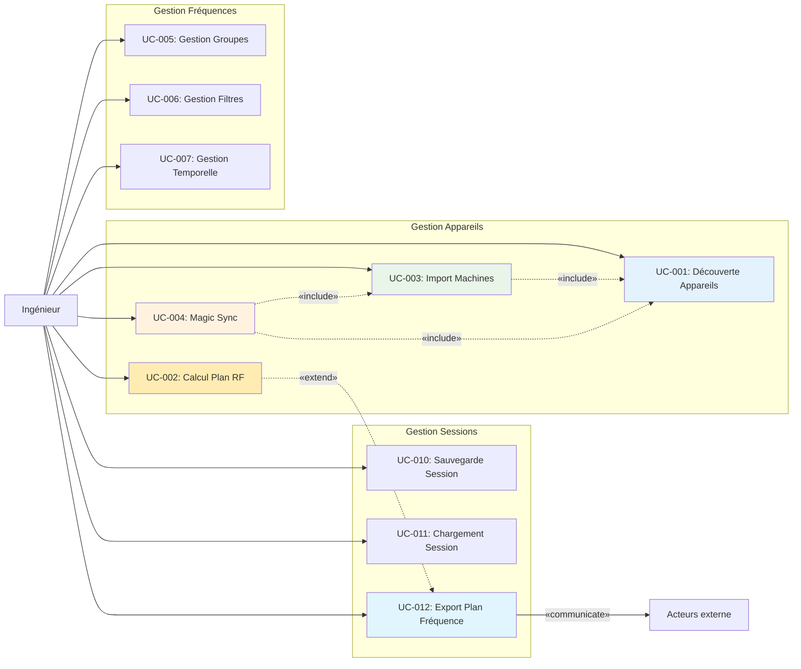

# Vue d'ensemble

## Diagrammes de cas d'utilisation - Analyse fonctionnelle

Les diagrammes de cas d'utilisation de RF.Go modélisent les **interactions fonctionnelles** entre les différents acteurs et le système. Cette analyse détaille les scénarios nominaux, alternatifs et exceptionnels qui constituent la base fonctionnelle de l'application.

## 1. Vue d'ensemble des acteurs

### Acteurs principaux

### Rôles et responsabilités

| Acteur | Responsabilités Principales | Niveau d'Expertise |
|--------|----------------------------|-------------------|
| **Ingénieur du Son** | Configuration RF, Optimisation, Monitoring | Expert |
| **Technicien Événementiel** | Déploiement, Setup, Maintenance | Intermédiaire |
| **Responsable Équipement** | Gestion Parc, Planification, Budget | Gestionnaire |
| **Support Technique** | Assistance, Troubleshooting, Formation | Expert Système |

## 2. Cas d'utilisation principaux

### Gestion des appareils RF

## 3. Navigation des Use Cases

### Use Cases de base

- **[UC-001: Découverte automatique des appareils](../uc-001)** - Détection réseau multi-protocole
- **[UC-002: Calcul du plan fréquences](../uc-002)** - Optimisation automatique RF  
- **[UC-003: Import des machines](../uc-003)** - Gestion inventaire et configuration
- **[UC-004: Magic sync - synchronisation bidirectionnelle](../uc-004)** - Synchronisation bidirectionnelle
- **[UC-008: Authentification et validation de licence](../uc-008)** - Création de compte, connexion et activation de licence

### Use Cases avancés

- **[UC-005: Gestion des groupes temporels](../uc-005)** - Planning multi-créneaux et optimisation temporelle
- **[UC-006: Gestion des filtres RF](../uc-006)** - Exclusions de canaux TV et contraintes personnalisées
- **[UC-007: Gestion temporelle avancée](../uc-007)** - Réutilisation intelligente des fréquences
- **[UC-010: Gestion des sessions RF](../uc-010)** - Sauvegarde, restauration et export/import

### Use Cases futurs (À développer)

- **UC-012: Export et reporting** - Communication externe et génération de rapports
