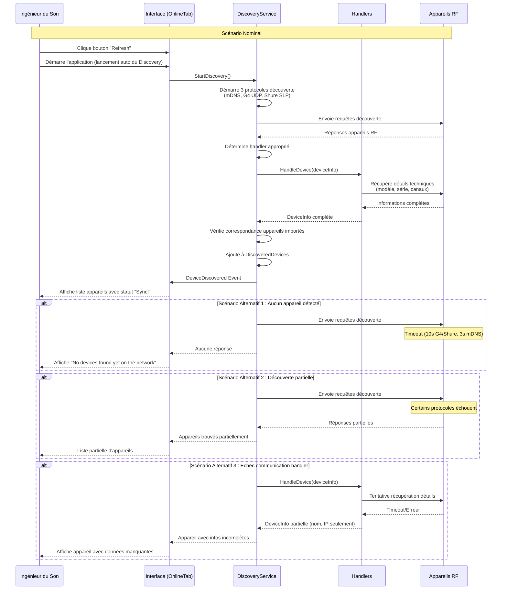
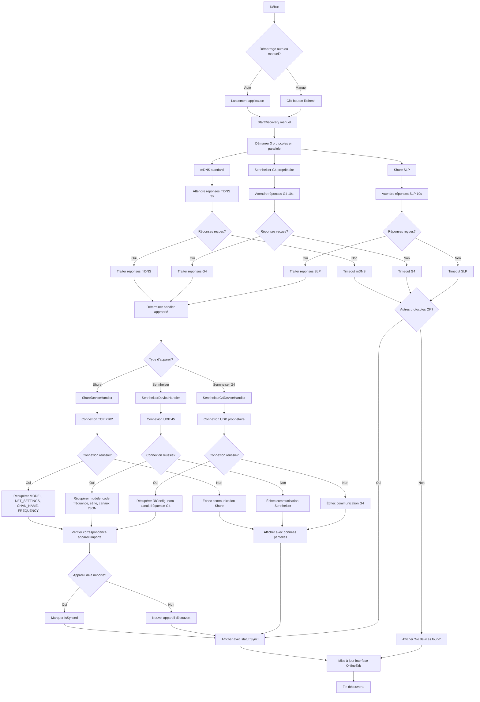

# UC-001 : Découverte automatique des appareils

**Résumé :** Le système détecte automatiquement au démarrage tous les appareils RF disponibles sur le réseau. L'utilisateur peut également déclencher manuellement cette découverte via un bouton "Refresh".

**Acteur :** Ingénieur du Son  

**Précondition :**

- Réseau configuré et accessible
- Au moins un appareil RF connecté et allumé
- Droits multicast activés sur le réseau

**Date de création :** 31/1/24  
**Version :** 1.3

**Post condition :**

- Liste d'appareils disponibles affichée dans l'onglet "Online"
- Métadonnées techniques récupérées (nom, marque, IP, type, numéro de série)
- États de connectivité et synchronisation connus
- Appareils prêts pour synchronisation ou mapping

## Scénario nominal

| Acteur | Action |
|--------|--------|
| **Système** | 1. Au démarrage de l'application, le système lance automatiquement `DiscoveryService.StartDiscovery()` |
| **Système** | 2. Le système démarre les services de découverte multicast mDNS pour "_ssc._udp.local" (Sennheiser) et "_ewd._http.local" |
| **Système** | 3. Le système lance en parallèle trois processus de découverte spécialisés : mDNS standard, Sennheiser G4 propriétaire (224.0.0.251:8133), et Shure SLP (239.255.254.253:8427) |
| **Appareils RF** | 4. Les appareils compatibles répondent via leurs protocoles respectifs selon leur marque |
| **Système** | 5. Pour chaque réponse reçue, le système détermine le handler approprié selon la marque et le type d'appareil (ShureDeviceHandler, SennheiserDeviceHandler, SennheiserG4DeviceHandler) |
| **Système** | 6. Le handler spécialisé se connecte à l'appareil et extrait les informations techniques détaillées |
| **Système** | 7. **Shure** : Via TCP port 2202, récupère modèle (commande MODEL), numéro de série via MAC address (commande NET_SETTINGS), nom et fréquence de chaque canal (commandes CHAN_NAME et FREQUENCY) |
| **Système** | 8. **Sennheiser standard** : Via UDP port 45, récupère modèle, code de fréquence, numéro de série, et pour chaque canal (rx1, rx2) le nom et la fréquence via commandes JSON |
| **Système** | 9. **Sennheiser G4** : Via UDP propriétaire, récupère la bande de fréquence (RfConfig min/max), nom du canal et fréquence via commandes spécifiques G4 |
| **Système** | 10. Le système vérifie si l'appareil correspond à un appareil déjà importé (comparaison numéro de série ou macaddress en fonction des devices) |
| **Système** | 11. Le système affiche l'appareil dans la liste "Online" avec le statut de synchronisation "Sync!" |
| **Ingénieur** | 12. L'ingénieur peut appuyer sur le bouton "Refresh" dans l'onglet Online pour relancer manuellement la découverte |

## Diagramme de séquence

## Diagramme d'activité

---

## Scénario alternatif 1 : Aucun appareil détecté

**Condition initiale :** Le réseau est vide ou tous les appareils sont éteints.  
**Déclenchement :** Ce scénario débute au point 4 du scénario nominal.

Le système envoie les requêtes de découverte sur les trois protocoles (mDNS, G4 UDP, Shure SLP). Aucun appareil ne répond dans les délais impartis (10 secondes pour G4 et Shure, 3 secondes pour mDNS). Le système affiche le message "No devices found yet on the network" dans l'interface OnlineTab. L'ingénieur peut relancer la découverte avec le bouton "Refresh" ou vérifier que les appareils sont allumés et connectés.

**Reprise :** Le scénario nominal reprend au point 1, après que des appareils ont été mis en marche et connectés.

---

## Scénario alternatif 2 : Découverte partielle - Certains protocoles échouent

**Condition initiale :** Certains protocoles de découverte ne fonctionnent pas (pare-feu, configuration réseau).  
**Déclenchement :** Ce scénario débute au point 3 du scénario nominal.

Le système lance les trois processus de découverte en parallèle. Un ou plusieurs protocoles échouent (par exemple, mDNS bloqué par firewall mais UDP G4 et SLP Shure fonctionnent). Le système continue avec les protocoles qui fonctionnent et affiche les appareils trouvés. Les messages de debug indiquent les protocoles qui ont échoué dans la console. L'ingénieur voit une liste partielle d'appareils et peut tenter de résoudre les problèmes réseau.

**Reprise :** Le scénario nominal reprend au point 3, après résolution des problèmes réseau.

---

## Scénario alternatif 3 : Échec communication avec handler

**Condition initiale :** L'appareil est détecté mais le handler ne peut pas récupérer les informations détaillées.  
**Déclenchement :** Ce scénario débute au point 6 du scénario nominal.

Le système détecte un appareil et détermine le handler approprié. Le handler tente de se connecter (TCP:2202 pour Shure, UDP:45 pour Sennheiser, UDP propriétaire pour G4) mais échoue ou reçoit des réponses invalides. L'appareil est tout de même ajouté à la liste avec les informations partielles disponibles (nom, IP, marque). Les informations manquantes (modèle, série, canaux) restent vides. L'ingénieur peut tenter une nouvelle synchronisation ou vérifier la connectivité de l'appareil.

**Reprise :** Le scénario nominal reprend au point 7, si la connectivité est restaurée.
