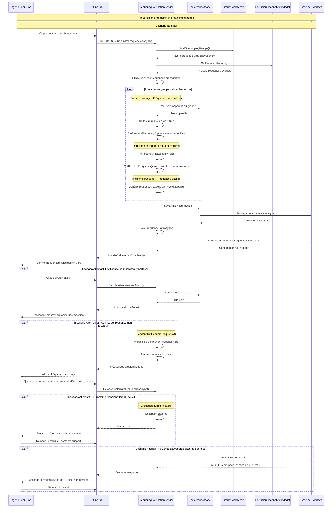
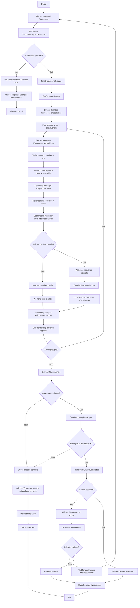

# UC-002 : Calcul du plan fréquences

**Résumé :** L'ingénieur appuie sur un bouton de l'interface lui permettant d'initier le calcul automatique des fréquences pour tous les appareils importés.

**Acteur :** Ingénieur du Son

**Précondition :** L'Ingénieur du son doit avoir importé au moins 1 machine.

**Date de création :** 31/1/24  
**Version :** 1.2

**Post condition :** Le plan de fréquence a été correctement attribué. Le tableau contenant toutes les machines importées affiche dans une de ses colonnes la fréquence prescrite par l'ordinateur pour chacun des canaux de chacune des machines.

## Scénario nominal

| Acteur | Action |
|--------|--------|
| **Ingénieur** | 1. L'ingénieur clique sur le bouton de calcul de fréquences dans l'interface |
| **Système** | 2. Le système appelle la méthode RFCalcul() qui déclenche CalculateFrequenciesAsync() |
| **Système** | 3. Le système analyse les groupes temporels et identifie ceux qui se chevauchent (FindOverlappingGroups) |
| **Système** | 4. Le système récupère les plages de fréquences à exclure du calcul (GetExcludedRanges) |
| **Système** | 5. Le système efface les données de fréquences précédentes (UsedFrequencies, intermodulations) |
| **Système** | 6. **Premier passage** : Le système verrouille et assigne les fréquences des canaux marqués comme "IsLocked" |
| **Système** | 7. **Deuxième passage** : Le système calcule et assigne les fréquences optimales pour tous les canaux non-verrouillés |
| **Système** | 8. Le système calcule les intermodulations (2Tx 3rd/5th/7th/9th order, 3Tx 3rd order) et évite les conflits |
| **Système** | 9. **Troisième passage** : Le système calcule les fréquences de backup pour chaque type d'appareil (s'il y en a)  |
| **Système** | 10. Le système sauvegarde tous les appareils et les données de fréquences |
| **Système** | 11. Le système signale la réussite de l'opération (HandleCalculationCompleted) |
| **Système** | 12. Le système affiche les fréquences calculées en vert dans l'interface |

## Diagramme de séquence

## Diagramme d'activité

---

## Scénario alternatif 1 : Absence de machines importées
**Condition initiale :** L'ingénieur tente de démarrer le calcul sans avoir importé de machines.  
**Déclenchement :** Ce scénario débute au point 2 du scénario nominal.

L'ingénieur clique sur le bouton pour lancer le calcul de fréquence. Le système appelle CalculateFrequenciesAsync() mais ne trouve aucun appareil dans DevicesViewModel.Devices. Le système ne peut pas procéder au calcul et retourne sans traitement. L'interface affiche un message "Importer au moins une machine".

**Reprise :** Le scénario nominal reprend au point 1, après que des machines ont été importées.

---

## Scénario alternatif 2 : Conflits de fréquence non résolus
**Condition initiale :** Le système calcule les fréquences mais trouve des conflits qu'il ne peut pas résoudre automatiquement.  
**Déclenchement :** Ce scénario débute au point 7 du scénario nominal.

L'ingénieur lance le calcul après avoir configuré les paramètres. Le système exécute SetRandomFrequency() mais ne trouve pas de fréquence libre respectant tous les critères (intermodulations, exclusions, espacements). Les canaux problématiques gardent leur fréquence actuelle ou sont marqués en conflit. Le système affiche les fréquences problématiques en rouge. L'ingénieur peut ajuster les paramètres d'intermodulation, déverrouiller certains canaux, ou modifier les exclusions et relancer le calcul.

**Reprise :** Le scénario nominal reprend au point 2, pour relancer le calcul avec les nouveaux paramètres.

---

## Scénario alternatif 3 : Problème technique lors du calcul
**Condition initiale :** Un problème technique (exception, corruption données) interrompt le processus de calcul.  
**Déclenchement :** Ce scénario débute pendant l'exécution du point 3 à 10 du scénario nominal.

Le système rencontre une exception durant FindOverlappingGroups(), SetRandomFrequency(), ou les opérations de sauvegarde. L'exception est catchée et un message d'erreur technique s'affiche. Les données restent dans leur état précédent (pas de modification partielle). L'ingénieur peut réessayer le calcul.

**Reprise :** Le scénario nominal reprend au point 1, après résolution du problème technique.

---

## Scénario alternatif 4 : Échec sauvegarde base de données
**Condition initiale :** Le calcul réussit mais la sauvegarde en base de données échoue.  
**Déclenchement :** Ce scénario débute au point 10 du scénario nominal.

Le système a terminé tous les calculs avec succès mais rencontre une erreur lors de la sauvegarde (corruption DB, espace disque insuffisant, permissions). Les nouvelles fréquences sont calculées en mémoire mais ne sont pas persistées. Le système affiche un message "Erreur sauvegarde - Calcul non persisté". L'ingénieur peut relancer le calcul une fois le problème de base de données résolu.

**Reprise :** Le scénario nominal reprend au point 1, après résolution du problème de base de données. 