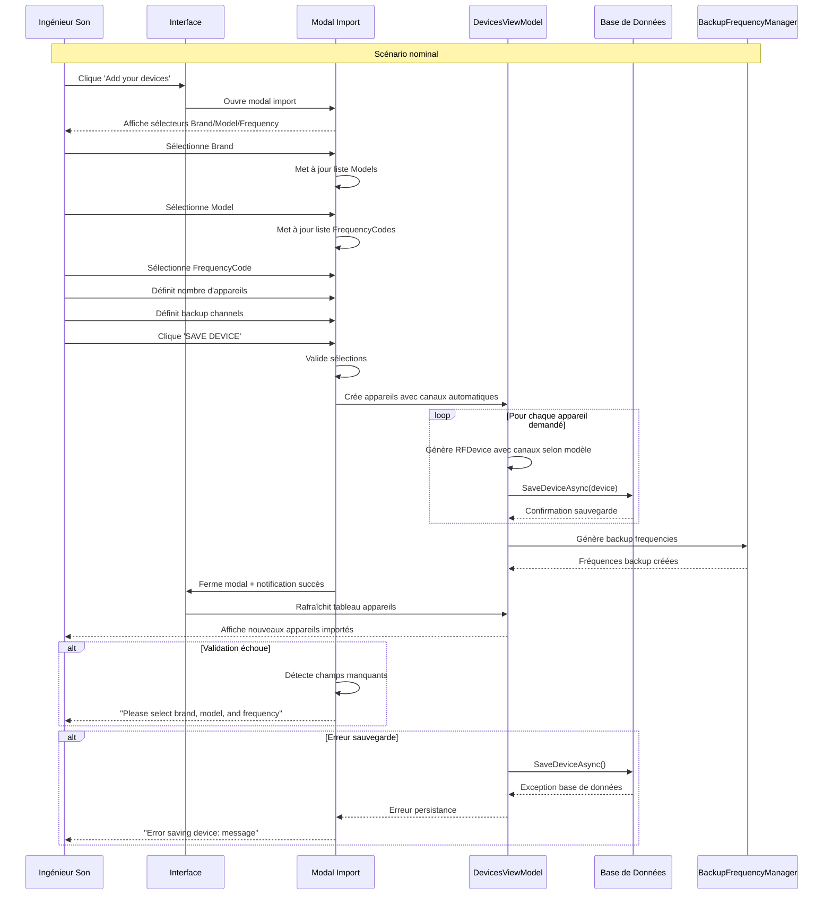
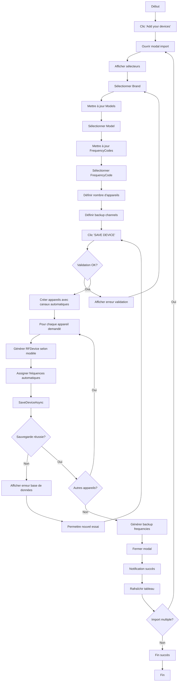

# UC-003: Import des machines

**Résumé :** L'ingénieur du son importe des machines dans le logiciel via un modal de sélection simple permettant de choisir la marque, le modèle, la bande de fréquence et le nombre d'appareils à créer.

**Acteur :** Ingénieur du Son

**Précondition :**

- Aucune

**Date de création :** 31/1/24  
**Version :** 1.3

**Post condition :**

- Les machines sont importées dans la base de données
- Les machines sont visibles et modifiables dans le tableau d'appareils
- Les canaux sont automatiquement configurés selon le modèle
- Fréquences de backup générées selon la configuration

## Scénario nominal

| Acteur | Action |
|--------|--------|
| **Ingénieur** | 1. L'ingénieur clique sur le bouton 'Add your devices' |
| **Système** | 2. Le système ouvre le modal d'import des appareils |
| **Système** | 3. Le système affiche la liste déroulante 'Choose device brand' |
| **Ingénieur** | 4. L'ingénieur sélectionne une marque (Shure, Sennheiser, etc.) |
| **Système** | 5. Le système met à jour la liste 'Choose device model' selon la marque |
| **Ingénieur** | 6. L'ingénieur sélectionne un modèle (ex: EWDX2CH) |
| **Système** | 7. Le système met à jour la liste 'Choose device frequency' avec les bandes disponibles |
| **Ingénieur** | 8. L'ingénieur sélectionne la bande de fréquence (ex: Q1-9 470000-550000) |
| **Ingénieur** | 9. L'ingénieur définit le nombre d'appareils à importer via le dropdown |
| **Ingénieur** | 10. L'ingénieur définit le nombre de canaux de backup (0-5) |
| **Ingénieur** | 11. L'ingénieur clique sur 'SAVE DEVICE' |
| **Système** | 12. Le système valide que tous les champs obligatoires sont renseignés |
| **Système** | 13. Le système crée le nombre d'appareils demandé avec leurs canaux automatiques |
| **Système** | 14. Le système assigne automatiquement les fréquences selon le modèle |
| **Système** | 15. Le système sauvegarde chaque appareil via SaveDeviceAsync() |
| **Système** | 16. Le système génère les fréquences de backup selon la configuration |
| **Système** | 17. Le système ferme le modal et affiche notification de succès |
| **Système** | 18. Le système met à jour le tableau des appareils importés |

## Scénarios alternatifs

### Scénario alternatif 1: Validation échoue - champs manquants

**Condition initiale** : L'ingénieur tente de sauvegarder avec des champs vides
**Déclenchement** : Clic sur "SAVE DEVICE" avec sélections incomplètes
**Actions** :

| Acteur | Action |
|--------|--------|
| Système | Vérifie la présence de Brand, Model et FrequencyCode |
| Système | Détecte champs manquants |
| Système | Affiche message "Please select a brand, model, and frequency" |
| Ingénieur | Complète les sélections manquantes |
| Ingénieur | Clique à nouveau "SAVE DEVICE" |

**Reprise** : Retour au scénario nominal point 12

### Scénario alternatif 2: Erreur de sauvegarde base de données

**Condition initiale** : Validation réussit mais erreur lors de la persistance
**Déclenchement** : Exception lors de SaveDeviceAsync()
**Actions** :

| Acteur | Action |
|--------|--------|
| Système | Crée les appareils en mémoire |
| Système | Tente SaveDeviceAsync() |
| Système | Détecte erreur base de données |
| Système | Affiche "Error saving device: [message]" |
| Système | Annule la création (rollback) |
| Ingénieur | Peut réessayer ou résoudre le problème |

**Reprise** : Retour au scénario nominal point 1

### Scénario alternatif 3: Import multiple d'appareils

**Condition initiale** : L'ingénieur veut importer plusieurs types d'appareils
**Déclenchement** : Après succès du premier import
**Actions** :

| Acteur | Action |
|--------|--------|
| Système | Affiche notification de succès |
| Système | Garde le modal ouvert |
| Ingénieur | Modifie les sélections pour nouvel appareil |
| Ingénieur | Clique à nouveau "SAVE DEVICE" |
| Système | Répète le processus d'import |

**Reprise** : Le processus continue jusqu'à fermeture manuelle du modal

## Diagramme de séquence

## Diagramme d'activité

---

## Points d'extension

- **Templates d'appareils** : Sauvegarde de configurations fréquentes pour import rapide
- **Auto-nommage** : Génération automatique de noms selon conventions
- **Création de groupe automatique** : Rajouter une possibilité de dire à quel groupe appartiennent les devices
