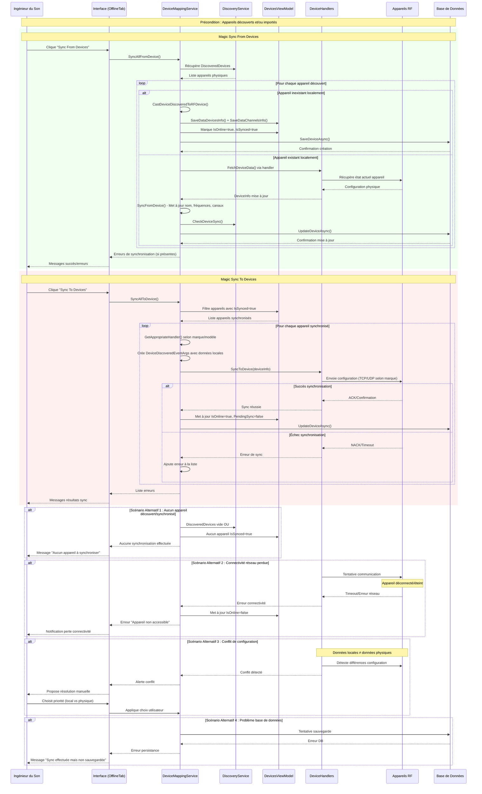
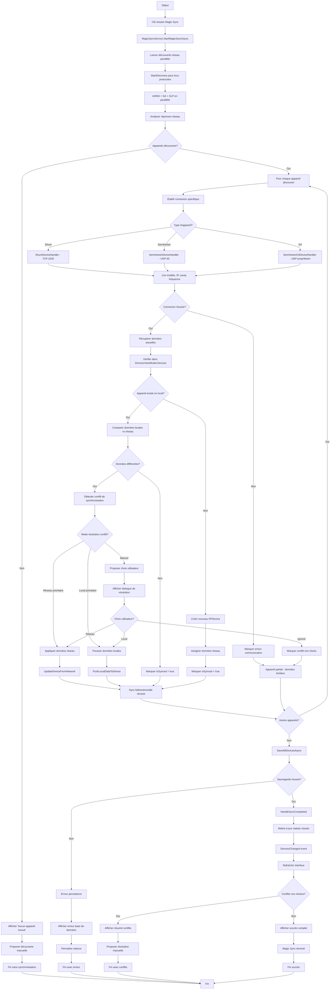

# UC-004 : Magic sync - synchronisation bidirectionnelle

**Résumé :** L'ingénieur déclenche une synchronisation bidirectionnelle automatique entre tous les appareils physiques du réseau et leur représentation logique dans RF.Go. Le système peut synchroniser "vers les appareils" (ToDevices) ou "depuis les appareils" (FromDevices).

**Acteur :** Ingénieur du Son

**Précondition :**

- Au moins un appareil détecté via Discovery (UC-001)  
- Au moins un appareil importé dans l'inventaire local
- Connectivité réseau active avec les appareils cibles

**Date de création :** 7/7/24  
**Version :** 1.4

**Post condition :**

- Tous les appareils compatibles sont synchronisés (IsSynced = true)
- Les configurations physiques et logiques sont cohérentes
- Les erreurs de synchronisation sont signalées à l'utilisateur
- L'état de connectivité est mis à jour (IsOnline, PendingSync)

## Scénario nominal - Magic sync from devices

| Acteur | Action |
|--------|--------|
| **Ingénieur** | 1. L'ingénieur clique sur "Sync From Devices" dans le menu Sync |
| **Système** | 2. Le système appelle `DeviceMappingService.SyncAllFromDevice()` |
| **Système** | 3. Le système récupère la liste des appareils découverts via `DiscoveryService.DiscoveredDevices` |
| **Système** | 4. Le système charge les données de référence depuis `DeviceDataJson.GetDeviceData()` |
| **Système** | 5. Pour chaque appareil découvert, le système vérifie s'il existe un appareil logique correspondant |
| **Système** | 6. **Cas appareil inexistant dans le json des appareils** : Le système crée un nouvel appareil RF basé sur les données physiques |
| **Système** | 7. Le système initialise les métadonnées via `SaveDataDevicesInfo()` et `SaveDataChannelsInfo()` |
| **Système** | 8. Le système marque l'appareil comme `IsOnline = true` et `IsSynced = true` |
| **Système** | 9. Le système sauvegarde l'appareil en base de données via `SaveDeviceAsync()` |
| **Système** | 10. **Cas appareil existant dans le json des appareils** : Le système synchronise les données depuis l'appareil physique via `SyncFromDevice()` |
| **Système** | 11. Le système met à jour le nom, fréquence, adresse IP et numéro de série (ou mac address en fonction des devices) |
| **Système** | 12. Le système synchronise les canaux (nom et fréquence de chaque canal) |
| **Système** | 13. Le système vérifie l'état de synchronisation via `CheckDeviceSync()` |
| **Système** | 14. Le système sauvegarde les modifications via `UpdateDeviceAsync()` |
| **Système** | 15. Le système rafraîchit l'interface et signale les erreurs éventuelles |

## Scénario nominal - Magic sync to devices

| Acteur | Action |
|--------|--------|
| **Ingénieur** | 1. L'ingénieur clique sur "Sync To Devices" dans le menu Sync |
| **Système** | 2. Le système appelle `DeviceMappingService.SyncAllToDevice()` |
| **Système** | 3. Le système filtre les appareils avec `IsSynced = true` dans `DevicesViewModel.Devices` |
| **Système** | 4. Pour chaque appareil synchronisé, le système détermine le handler approprié selon la marque |
| **Système** | 5. Le système crée un objet `DeviceDiscoveredEventArgs` avec les données locales |
| **Système** | 6. Le système appelle `handler.SyncToDevice()` pour envoyer la configuration à l'appareil physique |
| **Système** | 7. **Shure** : Le système envoie les commandes TCP (SET CHANNEL_NAME, SET FREQUENCY) |
| **Système** | 8. **Sennheiser** : Le système envoie les commandes JSON UDP pour configurer rx1/rx2 |
| **Système** | 9. **Sennheiser G4** : Le système utilise le protocole propriétaire pour la configuration |
| **Système** | 10. Le système attend la confirmation de l'appareil physique |
| **Système** | 11. Le système met à jour `IsOnline = true` et `PendingSync = false` |
| **Système** | 12. Le système sauvegarde l'état via `UpdateDeviceAsync()` |
| **Système** | 13. Le système affiche les succès et erreurs dans l'interface |

## Diagramme de séquence

## Diagramme d'activité

---

## Scénario alternatif 1 : Aucun appareil à synchroniser

**Condition initiale :** L'ingénieur lance Magic Sync mais aucun appareil n'est disponible.  
**Déclenchement :** Ce scénario débute au point 3 du scénario nominal.

Pour "Sync From Devices" : Le système vérifie `DiscoveryService.DiscoveredDevices` et trouve une liste vide. Pour "Sync To Devices" : Le système filtre les appareils avec `IsSynced = true` et ne trouve aucun résultat. Le système affiche un message informatif "Aucun appareil à synchroniser" et termine l'opération sans action.

**Reprise :** Le scénario nominal reprend au point 1, après découverte ou import d'appareils.

---

## Scénario alternatif 2 : Perte de connectivité réseau

**Condition initiale :** Les appareils étaient connectés mais perdent la connectivité pendant la synchronisation.  
**Déclenchement :** Ce scénario débute au point 10 (From Devices) ou 6 (To Devices) du scénario nominal.

Le système tente de communiquer avec l'appareil physique via le handler approprié. L'appareil ne répond pas dans le délai imparti (timeout TCP/UDP). Le handler retourne une erreur de connectivité. Le système marque l'appareil comme `IsOnline = false` et ajoute l'erreur à la liste. L'ingénieur reçoit une notification de perte de connectivité pour les appareils concernés.

**Reprise :** Le scénario nominal reprend au point 1, après rétablissement de la connectivité réseau.

---

## Scénario alternatif 3 : Conflit de configuration détecté

**Condition initiale :** Les données locales ne correspondent pas aux données physiques de l'appareil.  
**Déclenchement :** Ce scénario débute au point 11 (From Devices) ou 7 (To Devices) du scénario nominal.

Le handler détecte des différences entre la configuration locale et la configuration physique (fréquences, noms de canaux différents). Le système propose à l'ingénieur de choisir la priorité : garder les données locales ou adopter les données physiques. L'ingénieur fait son choix via l'interface. Le système applique la configuration choisie et continue la synchronisation.

**Reprise :** Le scénario nominal reprend au point 12, avec la configuration résolue.

---

## Scénario alternatif 4 : Problème de base de données

**Condition initiale :** La synchronisation réussit mais la sauvegarde en base échoue.  
**Déclenchement :** Ce scénario débute aux points 9 et 14 du scénario nominal.

La communication avec l'appareil physique réussit et les données sont synchronisées en mémoire. Lors de la sauvegarde via `SaveDeviceAsync()` ou `UpdateDeviceAsync()`, une erreur de base de données survient (corruption, espace disque, permissions). Le système affiche un message "Synchronisation effectuée mais non sauvegardée - Redémarrer l'application recommandé". Les données restent cohérentes en mémoire mais ne sont pas persistées.

**Reprise :** Le scénario nominal reprend au point 1, après résolution du problème de base de données.
