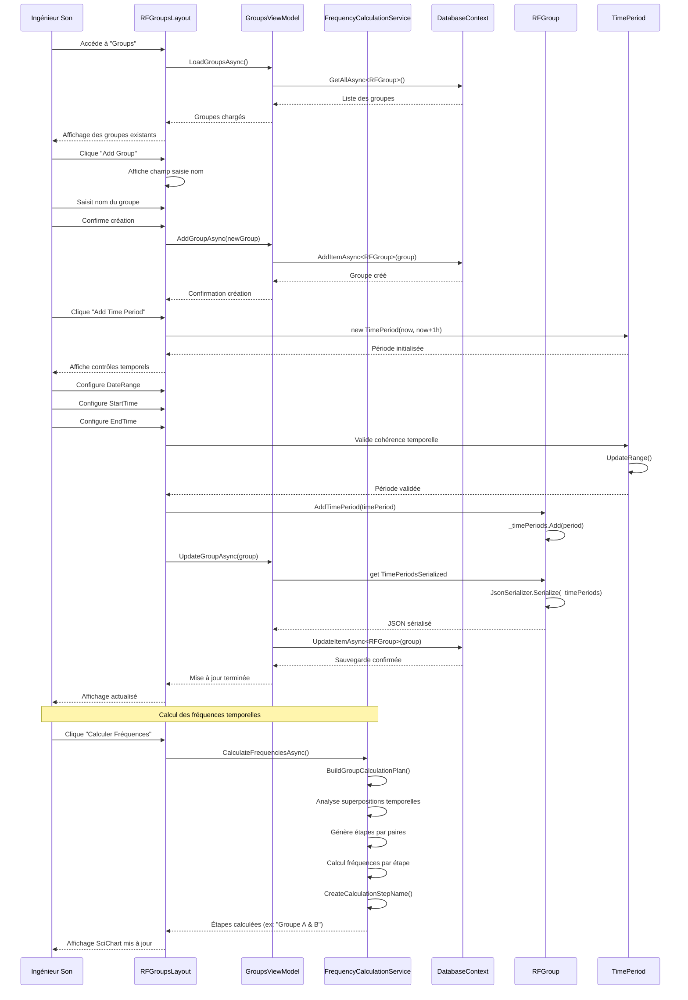
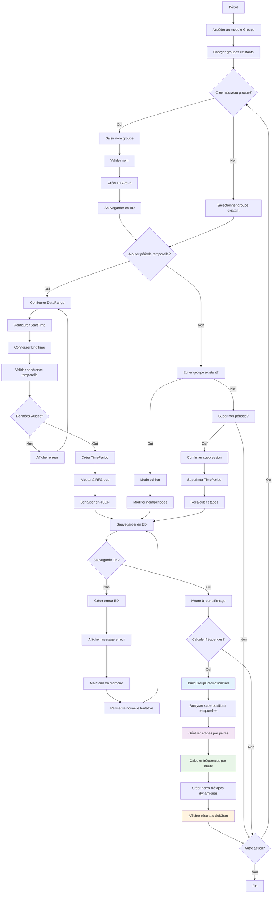

# UC-005: Gestion des groupes temporels

**Résumé :** Ce cas d'utilisation décrit la gestion des groupes d'équipements RF avec planification temporelle multi-créneaux, permettant l'optimisation du spectre par calcul séquentiel d'étapes de fréquences selon les superpositions temporelles réelles.

**Acteur :** Ingénieur Son/RF

**Précondition :**

- Aucune

**Date de création :** 15 janvier 2025  
**Version :** 2.0

**Post condition :**

- Les groupes temporels sont créés/modifiés avec leurs créneaux horaires
- Les périodes temporelles sont correctement configurées et validées
- Le système génère automatiquement les étapes de calcul par paires selon les superpositions
- Les données sont persistées en base de données SQLite
- Les plans de fréquences optimisés sont calculés pour chaque étape temporelle

## Acteurs secondaires

- **Système de base de données** : Stockage et récupération des groupes et périodes
- **Service de calcul fréquentiel** : Génération des étapes de calcul et optimisation du spectre

## Scénario nominal

| Acteur | Action |
|--------|--------|
| Ingénieur Son | Accède au module/page "Groups" via l'interface principale |
| Système | Affiche la liste des groupes existants avec leurs périodes temporelles |
| Ingénieur Son | Clique sur "Add Group" et saisit le nom du nouveau groupe |
| Système | Crée un nouveau groupe RFGroup avec le nom spécifié |
| Ingénieur Son | Clique sur "Add Time Period" pour ajouter un créneau horaire |
| Système | Affiche les contrôles de sélection temporelle (DateRangePicker, TimePicker) |
| Ingénieur Son | Configure la plage de dates (début/fin) via le DateRangePicker |
| Ingénieur Son | Définit l'heure de début via le TimePicker (format AM/PM) |
| Ingénieur Son | Définit l'heure de fin via le TimePicker (format AM/PM) |
| Système | Valide la cohérence temporelle (début < fin) |
| Système | Crée un objet TimePeriod avec les paramètres saisis |
| Ingénieur Son | Clique sur "Save" pour confirmer la période |
| Système | Ajoute la TimePeriod au groupe via RFGroup.AddTimePeriod() |
| Système | **Analyse automatiquement les superpositions temporelles avec autres groupes** |
| Système | **Génère les étapes de calcul par paires (ex: "Groupe A & B", "Groupe B & C")** |
| Système | Sérialise les périodes temporelles en JSON pour le stockage |
| Système | Persiste le groupe en base de données SQLite |
| Système | Met à jour l'affichage avec la nouvelle configuration temporelle |

## Scénarios alternatifs

### Scénario alternatif 1: Calcul automatique des étapes de superposition

**Condition initiale** : L'utilisateur lance le calcul des fréquences avec des groupes temporels configurés
**Déclenchement** : Clic sur "Calculer Fréquences"
**Actions** :

| Acteur | Action |
|--------|--------|
| Système | Exécute BuildGroupCalculationPlan() pour analyser les superpositions |
| Système | Génère les étapes de calcul chronologiques par paires |
| Système | Calcule les fréquences pour chaque étape (ex: "AC/DC & Katie Melua") |
| Système | Affiche dans SciChart les résultats par étapes de calcul |
| Système | Permet la visualisation distincte de chaque combinaison temporelle |

**Reprise** : Le système présente les résultats optimisés dans l'interface graphique

### Scénario alternatif 2: Chevauchement temporel complexe détecté

**Condition initiale** : Trois groupes ou plus ont des superpositions temporelles multiples
**Déclenchement** : Lors de l'analyse des périodes temporelles
**Actions** :

| Acteur | Action |
|--------|--------|
| Système | Détecte les superpositions multiples via DoGroupsOverlap() |
| Système | Génère plusieurs étapes de calcul pour optimiser la réutilisation |
| Système | Exemple: Group1&2 (18h-19h), Group2&3 (19h-20h), Group3&4 (20h-21h) |
| Système | Calcule chaque étape avec les bonnes intermodulations |
| Système | Affiche les résultats séparés par étape temporelle |

**Reprise** : Chaque étape de calcul est traitée indépendamment pour optimisation maximale

### Scénario alternatif 3: Données temporelles incohérentes

**Condition initiale** : L'utilisateur saisit des données temporelles invalides
**Déclenchement** : Lors de la validation des paramètres temporels
**Actions** :

| Acteur | Action |
|--------|--------|
| Système | Valide les contraintes temporelles (StartTime < EndTime) |
| Système | Détecte l'incohérence via TimePeriod.Range setter |
| Système | Affiche un message d'erreur explicite |
| Système | Réinitialise les champs avec des valeurs par défaut |
| Ingénieur Son | Corrige les données saisies |

**Reprise** : Retour au scénario nominal après correction

### Scénario alternatif 4: Échec de sauvegarde base de données

**Condition initiale** : Problème d'accès à la base de données SQLite
**Déclenchement** : Lors de l'exécution de GroupsViewModel.UpdateGroupAsync()
**Actions** :

| Acteur | Action |
|--------|--------|
| Système | Tente la sauvegarde via DatabaseContext.UpdateItemAsync() |
| Système | Détecte l'échec de la transaction SQLite |
| Système | Log l'erreur dans le système de debug |
| Système | Affiche un message d'erreur à l'utilisateur |
| Système | Maintient les données en mémoire (non persistées) |
| Ingénieur Son | Peut réessayer la sauvegarde ou annuler l'opération |

**Reprise** : Retour au scénario nominal après résolution du problème

### Scénario alternatif 5: Suppression de période temporelle

**Condition initiale** : L'utilisateur souhaite supprimer une période existante
**Déclenchement** : Clic sur "Delete Time Periods"
**Actions** :

| Acteur | Action |
|--------|--------|
| Ingénieur Son | Clique sur "Delete Time Periods" pour une période spécifique |
| Système | Affiche une demande de confirmation |
| Ingénieur Son | Confirme la suppression |
| Système | Supprime la période via RFGroup.DeleteTimePeriod() |
| Système | **Recalcule automatiquement les étapes de calcul modifiées** |
| Système | Met à jour la sérialisation JSON des périodes |
| Système | Sauvegarde les modifications en base |
| Système | Rafraîchit l'affichage de la liste |

**Reprise** : Le système retourne à l'état d'affichage normal des groupes

## Diagramme de séquence



## Diagramme d'activité



## Points d'extension

- **Optimisation avancée des transitions** : Minimiser les changements de fréquences entre étapes consécutives
- **Analyse prédictive des conflits** : Détecter les problèmes potentiels avant le calcul
- **Templates d'événements** : Sauvegarder des configurations temporelles réutilisables
- **Synchronisation avec systèmes externes** : Intégration calendriers et timecode

## Contraintes techniques

- Les périodes temporelles sont stockées en JSON sérialisé dans SQLite
- La détection des superpositions utilise l'algorithme DoGroupsOverlap() optimisé
- Le calcul séquentiel par paires garantit l'optimisation du spectre disponible
- Les noms d'étapes sont générés dynamiquement selon la logique "Groupe A & B"
- Les contrôles MudBlazor (DateRangePicker, TimePicker) gèrent la saisie temporelle
- SciChart affiche les résultats par étapes de calcul avec couleurs distinctes

## Algorithme de calcul temporel

### Logique de génération des étapes

```csharp
private List<GroupCalculationStep> BuildGroupCalculationPlan()
{
    // 1. Trier les groupes par ordre chronologique
    var sortedGroups = groups.OrderBy(g => g.TimePeriods.Min(tp => tp.StartTime));
    
    // 2. Pour chaque groupe, identifier ses superpositions
    foreach (var group in sortedGroups)
    {
        var overlappingGroups = FindOverlappingGroups(group);
        
        // 3. Créer des étapes de calcul par paires
        foreach (var overlapping in overlappingGroups)
        {
            if (group.StartTime <= overlapping.StartTime)
            {
                CreateCalculationStep(group, overlapping);
                // Résultat: "Groupe A & Groupe B"
            }
        }
    }
    
    // 4. Traiter les groupes isolés
    ProcessIsolatedGroups();
}
```

### Exemples de résultats

- **Groupe AC/DC seul** → Étape: `"AC/DC"`
- **AC/DC + Katie Melua** → Étape: `"AC/DC & Katie Melua"`  
- **Katie Melua + Bruce Springsteen** → Étape: `"Katie Melua & Bruce Springsteen"`

Cette approche garantit que chaque superposition temporelle réelle génère une étape de calcul optimisée avec les bonnes intermodulations.
