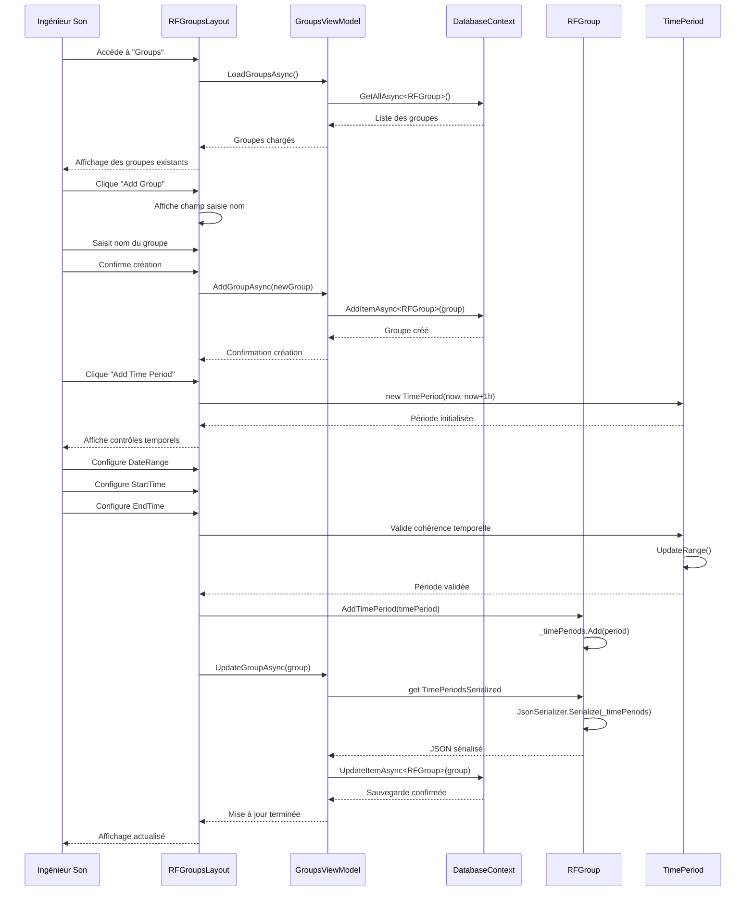
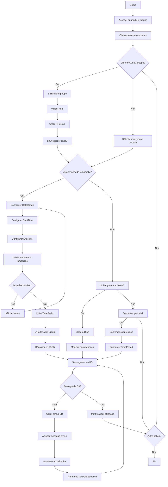

# UC-005: Gestion des groupes temporels

**Résumé :** Ce cas d'utilisation décrit la gestion des groupes d'équipements RF avec planification temporelle multi-créneaux, permettant l'optimisation du spectre par réutilisation intelligente des fréquences selon les périodes d'activité.

**Acteur :** Ingénieur Son/RF

**Précondition :**

- Aucune

**Date de création :** 15 janvier 2025  
**Version :** 1.0

**Post condition :**

- Les groupes temporels sont créés/modifiés avec leurs créneaux horaires
- Les périodes temporelles sont correctement configurées et validées
- Les données sont persistées en base de données SQLite

## Acteurs secondaires

- **Système de base de données** : Stockage et récupération des groupes et périodes

## Scénario nominal

| Acteur | Action |
|--------|--------|
| Ingénieur Son | Accède au module/page "Groups" via l'interface principale |
| Système | Affiche la liste des groupes existants avec leurs périodes temporelles |
| Ingénieur Son | Clique sur "Add Group" et saisit le nom du nouveau groupe |
| Système | Crée un nouveau groupe RFGroup avec le nom spécifié |
| Ingénieur Son | Clique sur "Add Time Period" pour ajouter un créneau horaire |
| Système | Affiche les contrôles de sélection temporelle (DateRangePicker, TimePicker) |
| Ingénieur Son | Configure la plage de dates (début/fin) via le DateRangePicker |
| Ingénieur Son | Définit l'heure de début via le TimePicker (format AM/PM) |
| Ingénieur Son | Définit l'heure de fin via le TimePicker (format AM/PM) |
| Système | Valide la cohérence temporelle (début < fin) |
| Système | Crée un objet TimePeriod avec les paramètres saisis |
| Ingénieur Son | Clique sur "Save" pour confirmer la période |
| Système | Ajoute la TimePeriod au groupe via RFGroup.AddTimePeriod() |
| Système | Sérialise les périodes temporelles en JSON pour le stockage |
| Système | Persiste le groupe en base de données SQLite |
| Système | Met à jour l'affichage avec la nouvelle configuration |

## Scénarios alternatifs

### Scénario alternatif 1: Chevauchement temporel détecté

**Condition initiale** : L'utilisateur configure une période qui chevauche avec une période existante
**Déclenchement** : Lors de la validation d'une nouvelle période temporelle
**Actions** :

| Acteur | Action |
|--------|--------|
| Système | Détecte le chevauchement via l'algorithme DoPeriodsOverlap() |
| Système | Affiche un avertissement de chevauchement temporel |
| Système | Propose de fusionner les groupes ou de modifier les créneaux |
| Ingénieur Son | Choisit l'action à entreprendre (fusionner/modifier/annuler) |
| Système | Exécute l'action choisie |

**Reprise** : Retour au scénario nominal pour finaliser la configuration

### Scénario alternatif 2: Données temporelles incohérentes

**Condition initiale** : L'utilisateur saisit des données temporelles invalides
**Déclenchement** : Lors de la validation des paramètres temporels
**Actions** :

| Acteur | Action |
|--------|--------|
| Système | Valide les contraintes temporelles (StartTime < EndTime) |
| Système | Détecte l'incohérence via TimePeriod.Range setter |
| Système | Affiche un message d'erreur explicite |
| Système | Réinitialise les champs avec des valeurs par défaut |
| Ingénieur Son | Corrige les données saisies |

**Reprise** : Retour au scénario nominal après correction

### Scénario alternatif 3: Échec de sauvegarde base de données

**Condition initiale** : Problème d'accès à la base de données SQLite
**Déclenchement** : Lors de l'exécution de GroupsViewModel.UpdateGroupAsync()
**Actions** :

| Acteur | Action |
|--------|--------|
| Système | Tente la sauvegarde via DatabaseContext.UpdateItemAsync() |
| Système | Détecte l'échec de la transaction SQLite |
| Système | Log l'erreur dans le système de debug |
| Système | Affiche un message d'erreur à l'utilisateur |
| Système | Maintient les données en mémo   ire (non persistées) |
| Ingénieur Son | Peut réessayer la sauvegarde ou annuler l'opération |

**Reprise** : Retour au scénario nominal après résolution du problème

### Scénario alternatif 4: Suppression de période temporelle

**Condition initiale** : L'utilisateur souhaite supprimer une période existante
**Déclenchement** : Clic sur "Delete Time Periods"
**Actions** :

| Acteur | Action |
|--------|--------|
| Ingénieur Son | Clique sur "Delete Time Periods" pour une période spécifique |
| Système | Affiche une demande de confirmation |
| Ingénieur Son | Confirme la suppression |
| Système | Supprime la période via RFGroup.DeleteTimePeriod() |
| Système | Met à jour la sérialisation JSON des périodes |
| Système | Sauvegarde les modifications en base |
| Système | Rafraîchit l'affichage de la liste |

**Reprise** : Le système retourne à l'état d'affichage normal des groupes

## Diagramme de séquence

## Diagramme d'activité

## Points d'extension

- **Import/Export de plannings** : Permettre l'import de plannings depuis des calendriers externes
- **Modèles de groupes** : Créer des templates réutilisables pour des configurations standards
- **Synchronisation temporelle** : Intégration avec des systèmes de chronométrage externes

## Contraintes techniques

- Les périodes temporelles sont stockées en JSON sérialisé dans SQLite
- La validation des chevauchements utilise l'algorithme DoPeriodsOverlap()
- Les contrôles MudBlazor (DateRangePicker, TimePicker) imposent leurs contraintes UI (à améliorer dans le futur)
