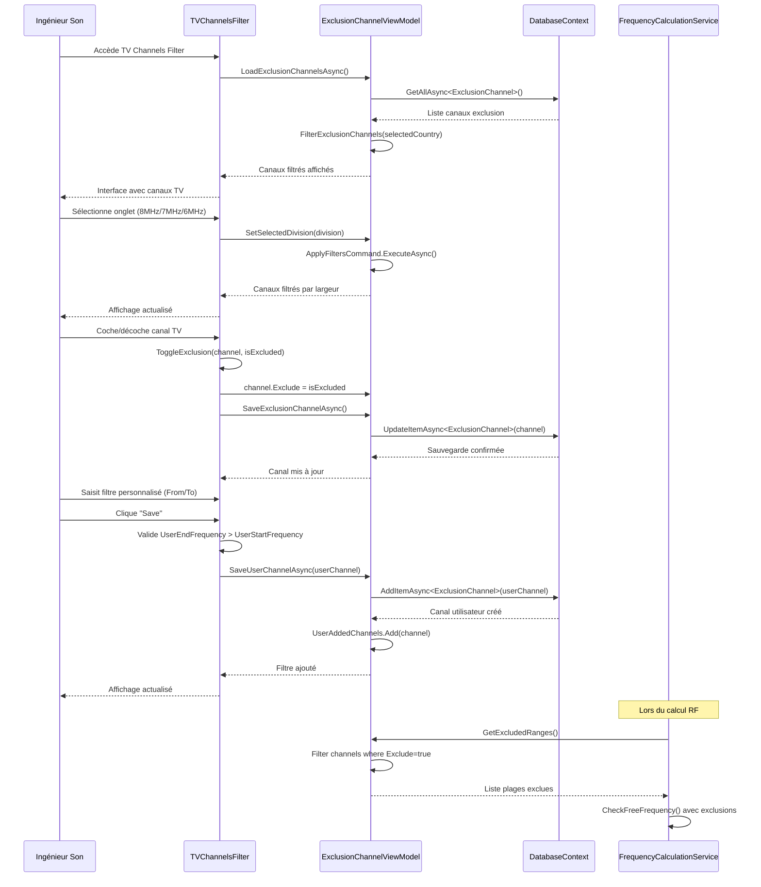
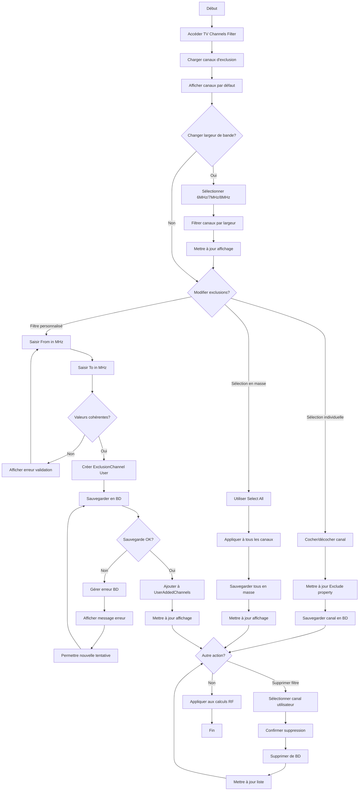

# UC-006: Gestion des filtres RF

**Résumé :** Ce cas d'utilisation décrit la gestion des filtres et exclusions de fréquences RF, permettant d'éviter les interférences avec les canaux TV et de définir des contraintes personnalisées pour l'optimisation du plan fréquences.

**Acteur :** Ingénieur Son

**Précondition :**

- Les canaux TV par défaut sont initialisés (Generic-6MHz, 7MHz, 8MHz). Ceci est réalisé à l'initialisation de la database.

**Date de création :** 16 janvier 2025  
**Version :** 1.2

**Post condition :**

- Les filtres d'exclusion sont configurés et appliqués
- Les canaux TV sélectionnés sont exclus du calcul RF
- Les filtres personnalisés utilisateur sont sauvegardés
- Le système de calcul intègre les nouvelles contraintes

## Acteurs secondaires

- **Système de base de données** : Stockage et récupération des canaux d'exclusion
- **Module de calcul RF** : Utilisation des filtres lors du calcul des fréquences

## Scénario nominal

| Acteur | Action |
|--------|--------|
| Ingénieur Son | Accède au module "TV Channels Filter" |
| Système | Charge les canaux d'exclusion via ExclusionChannelViewModel.LoadExclusionChannelsAsync() |
| Système | Affiche les canaux TV par largeur de bande (6MHz/7MHz/8MHz) |
| Ingénieur Son | Sélectionne un onglet de largeur de bande (Generic-6MHz, 7MHz ou 8MHz) |
| Système | Filtre les canaux via ExclusionChannelViewModel.ApplyFilters() |
| Système | Affiche la liste des canaux avec leur plage de fréquences |
| Ingénieur Son | Coche/décoche les canaux à exclure via les checkboxes |
| Système | Met à jour ExclusionChannel.Exclude pour chaque canal modifié |
| Système | Sauvegarde automatiquement via ExclusionChannelViewModel.SaveExclusionChannelAsync() |
| Ingénieur Son | Ajoute un filtre personnalisé en saisissant From/To (MHz) |
| Système | Valide que la fréquence de début < fréquence de fin |
| Ingénieur Son | Clique "Save" pour confirmer le filtre personnalisé |
| Système | Crée un nouvel ExclusionChannel avec Type="User" |
| Système | Sauvegarde le canal via ExclusionChannelViewModel.SaveUserChannelAsync() |
| Système | Ajoute le canal à la liste des filtres utilisateur |
| Système | Met à jour l'affichage avec le nouveau filtre |

## Scénarios alternatifs

### Scénario alternatif 1: Plage de fréquences invalide

**Condition initiale** : L'utilisateur saisit des fréquences incohérentes
**Déclenchement** : Lors de la validation d'un filtre personnalisé
**Actions** :

| Acteur | Action |
|--------|--------|
| Ingénieur Son | Saisit fréquence de début > fréquence de fin |
| Système | Valide que UserEndFrequency > UserStartFrequency |
| Système | Détecte l'incohérence des données |
| Système | Affiche "Start frequency must be bigger than end frequency" |
| Système | Empêche la sauvegarde du filtre |
| Ingénieur Son | Corrige les valeurs saisies |

**Reprise** : Retour au scénario nominal après correction

### Scénario alternatif 2: Sélection/désélection en masse

**Condition initiale** : L'utilisateur veut modifier plusieurs canaux simultanément
**Déclenchement** : Clic sur la checkbox principale "Select All"
**Actions** :

| Acteur | Action |
|--------|--------|
| Ingénieur Son | Clique sur la checkbox "Select All" dans l'en-tête |
| Système | Exécute SelectAll(boolean IsChecked) |
| Système | Met à jour toutes les checkboxes des canaux visibles |
| Système | Applique l'état (Exclude = IsChecked) à tous les ExclusionChannel |
| Système | Sauvegarde en masse tous les canaux modifiés |
| Système | Met à jour l'affichage global |

**Reprise** : Le système revient à l'état normal d'affichage

### Scénario alternatif 3: Suppression de filtre personnalisé

**Condition initiale** : L'utilisateur souhaite supprimer un filtre qu'il a créé
**Déclenchement** : Clic sur l'icône de suppression
**Actions** :

| Acteur | Action |
|--------|--------|
| Ingénieur Son | Clique sur l'icône "Delete" d'un canal utilisateur |
| Système | Affiche une demande de confirmation |
| Ingénieur Son | Confirme la suppression |
| Système | Exécute ExclusionChannelViewModel.DeleteExclusionChannelCommand |
| Système | Supprime le canal de la base de données |
| Système | Met à jour la liste UserAddedChannels |
| Système | Rafraîchit l'affichage |

**Reprise** : Retour à l'état normal de gestion des filtres

### Scénario alternatif 4: Échec de sauvegarde

**Condition initiale** : Problème d'accès à la base de données
**Déclenchement** : Lors de SaveExclusionChannelAsync() ou SaveUserChannelAsync()
**Actions** :

| Acteur | Action |
|--------|--------|
| Système | Tente la sauvegarde via DatabaseContext.UpdateItemAsync() |
| Système | Détecte l'échec de la transaction SQLite |
| Système | Log l'erreur dans le système de debug |
| Système | Affiche un message d'erreur à l'utilisateur |
| Système | Maintient les modifications en mémoire (non persistées) |
| Ingénieur Son | Peut réessayer l'opération |

**Reprise** : Retour au scénario nominal après résolution

## Diagramme de séquence

## Diagramme d'activité

## Points d'extension

- **Import de fichiers CSV** : Permettre l'import en masse de listes de canaux TV
- **Géolocalisation** : Adapter automatiquement les canaux selon la région/pays
- **Scan temps réel** : Intégration avec des données de scan pour détecter les canaux actifs
- **Présets par événement** : Sauvegarder des configurations de filtres réutilisables

## Contraintes techniques

- Les canaux d'exclusion sont stockés dans la table SQLite ExclusionChannel
- Trois types de largeurs de bande prédéfinis : 6MHz, 7MHz, 8MHz
- Les filtres utilisateur ont le type "User" pour les distinguer des canaux système
- L'intégration avec FrequencyCalculationService via GetExcludedRanges()
- Validation en temps réel des plages de fréquences (UserEndFrequency > UserStartFrequency)
