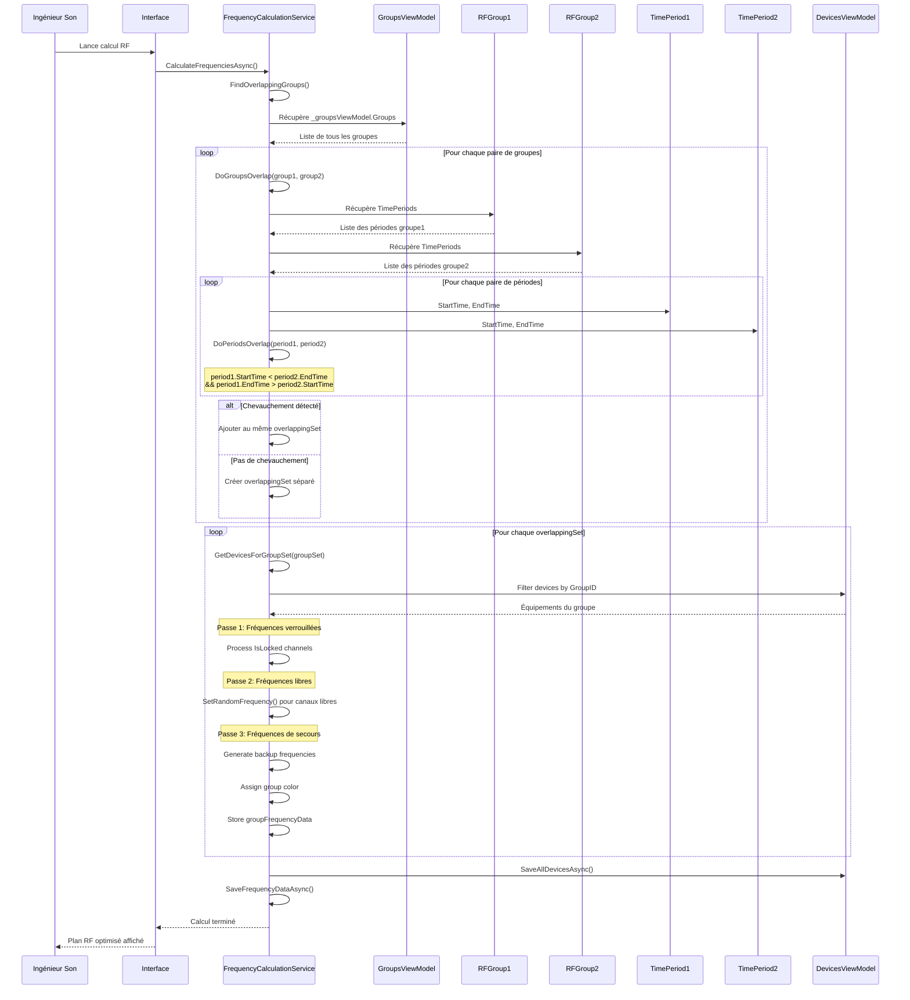
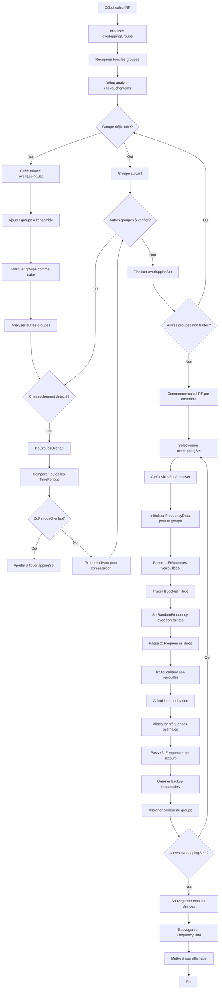

# UC-007: Gestion temporelle avancée

**Résumé :** Ce cas d'utilisation décrit la gestion temporelle avancée permettant la réutilisation intelligente des fréquences RF en fonction des créneaux horaires et des chevauchements temporels entre groupes d'équipements.

**Acteur :** Ingénieur Son/RF

**Précondition :**

- Des groupes avec périodes temporelles sont configurés
- Des équipements RF sont assignés aux groupes
- Au moins deux groupes avec des créneaux temporels différents existent

**Date de création :** 15 janvier 2025  
**Version :** 1.1

**Post condition :**

- Les fréquences sont optimisées selon les créneaux temporels
- La réutilisation fréquentielle est maximisée pour les groupes non-chevauchants
- L'occupation du spectre est optimisée dans le temps
- Les calculs d'intermodulation respectent les contraintes temporelles

## Acteurs secondaires

- **Système de calcul RF** : Module de calcul et d'optimisation des fréquences
- **Algorithme de détection** : Service de détection des chevauchements temporels

## Scénario nominal

| Acteur | Action |
|--------|--------|
| Ingénieur Son | Lance le calcul RF via RFCalcul() |
| Système | Démarre FrequencyCalculationService.CalculateFrequenciesAsync() |
| Système | Exécute `FindOverlappingGroups()` pour analyser les chevauchements |
| Système | Parcourt tous les groupes via _groupsViewModel.Groups |
| Système | Pour chaque groupe, vérifie s'il chevauche avec d'autres groupes |
| Système | Exécute `DoGroupsOverlap(group1, group2)` pour chaque paire |
| Système | Pour chaque paire de TimePeriod, applique `DoPeriodsOverlap()` |
| Système | Calcule: period1.StartTime < period2.EndTime && period1.EndTime > period2.StartTime |
| Système | Regroupe les groupes chevauchants dans overlappingGroups |
| Système | Traite chaque overlappingSet séparément pour l'optimisation |
| Système | Récupère les équipements via `GetDevicesForGroupSet(groupSet)` |
| Système | Applique le calcul RF en 3 passes pour chaque groupSet |
| Système | **Passe 1**: Traite les fréquences verrouillées (IsLocked) |
| Système | **Passe 2**: Calcule les fréquences libres pour les canaux non verrouillés |
| Système | **Passe 3**: Génère les fréquences de secours |
| Système | Stocke les données fréquentielles par groupe avec couleur distincte |
| Système | Sauvegarde les résultats via SaveAllDevicesAsync() et SaveFrequencyDataAsync() |

## Scénarios alternatifs

### Scénario alternatif 1: Groupes complètement disjoints

**Condition initiale** : Aucun chevauchement temporel détecté entre groupes
**Déclenchement** : `DoGroupsOverlap()` retourne false pour toutes les paires
**Actions** :

| Acteur | Action |
|--------|--------|
| Système | Détecte que chaque groupe forme son propre overlappingSet |
| Système | Optimise la réutilisation fréquentielle entre groupes disjoints |
| Système | Le calcul de ses fréquences sera fait totalement séparemment |

**Reprise** : Continuation du calcul RF normal

### Scénario alternatif 2: Chevauchement partiel complexe

**Condition initiale** : Plusieurs groupes avec chevauchements partiels
**Déclenchement** : Détection de patterns de chevauchement complexes
**Actions** :

| Acteur | Action |
|--------|--------|
| Système | Analyse les chevauchements multiples via FindOverlappingGroups() |
| Système | Identifie les clusters de groupes interconnectés |
| Système | Traite chaque cluster comme un ensemble cohérent |
| Système | Optimise les fréquences au niveau du cluster |
| Système | Applique des couleurs distinctes par cluster au niveau du SciChart |

**Reprise** : Retour au calcul RF pour les clusters identifiés

### Scénario alternatif 3: Contraintes temporelles insuffisantes

**Condition initiale** : Trop de groupes chevauchants pour l'optimisation
**Déclenchement** : Saturation du spectre disponible
**Actions** :

| Acteur | Action |
|--------|--------|
| Système | Détecte la saturation via le nombre d'overlappingGroups |
| Système | Priorise les groupes selon leur importance temporelle |
| Système | Applique un algorithme de fallback standard |
| Système | Génère un avertissement à l'utilisateur |
| Ingénieur Son | Peut ajuster les créneaux temporels pour optimiser |

**Reprise** : Retour au scénario nominal avec créneaux ajustés

### Scénario alternatif 4: Échec de calcul d'intermodulation

**Condition initiale** : Erreur dans le calcul des produits d'intermodulation
**Déclenchement** : Exception lors de CalculAllIntermod()
**Actions** :

| Acteur | Action |
|--------|--------|
| Système | Détecte l'échec du calcul d'intermodulation |
| Système | Log l'erreur dans le système de debug |
| Système | Applique un calcul RF simplifié sans intermodulation |
| Système | Affiche un avertissement à l'utilisateur |
| Système | Permet de continuer avec des fréquences sous-optimales |

**Reprise** : Continuation avec plan RF dégradé

## Diagramme de séquence

## Diagramme d'activité

## Points d'extension

- Pas de modifications futures prévues

## Contraintes techniques

- L'algorithme DoPeriodsOverlap() utilise la logique : `StartTime1 < EndTime2 && EndTime1 > StartTime2`
- Les groupes sont traités via un HashSet pour éviter les doublons
- Les couleurs sont assignées cycliquement via un tableau prédéfini (10 couleurs)
- La performance est optimisée par le traitement par clusters d'overlapping
- Les TimePeriods sont sérialisées en JSON pour le stockage SQLite
