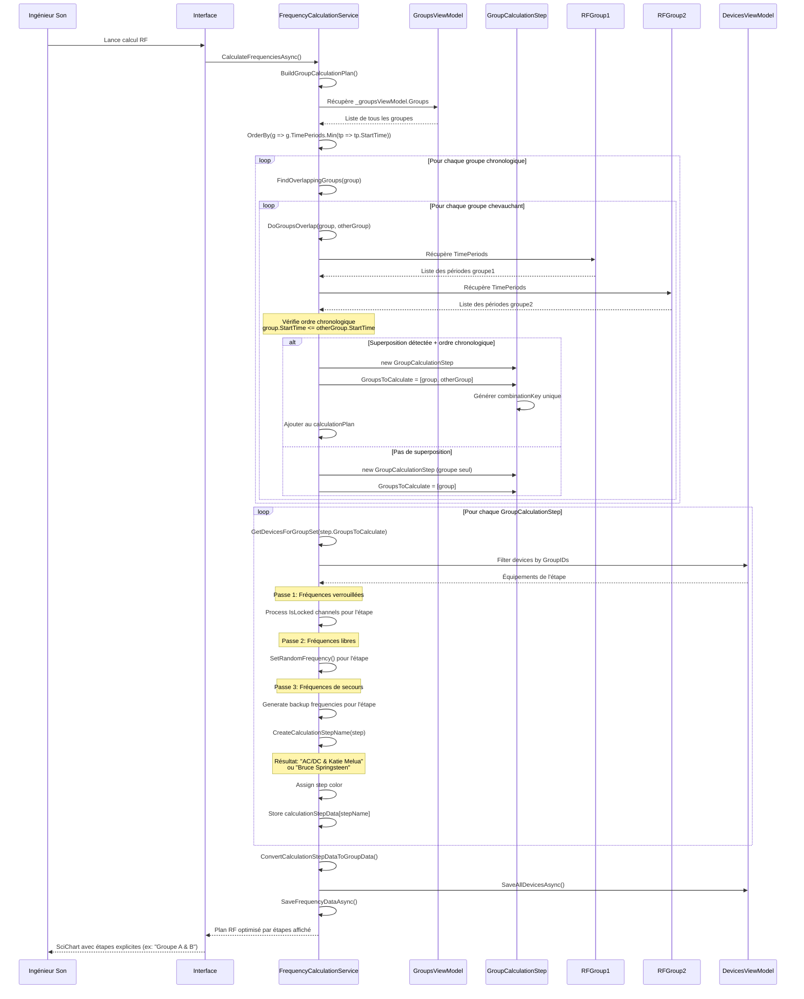

# UC-007: Gestion temporelle avancée

**Résumé :** Ce cas d'utilisation décrit la gestion temporelle avancée permettant l'optimisation intelligente des fréquences RF par **calcul séquentiel d'étapes par paires** selon les superpositions temporelles réelles entre groupes d'équipements.

**Acteur :** Ingénieur Son/RF

**Précondition :**

- Des groupes avec périodes temporelles sont configurés
- Des équipements RF sont assignés aux groupes
- Au moins deux groupes avec des créneaux temporels définis existent

**Date de création :** 15 janvier 2025  
**Version :** 2.0

**Post condition :**

- Les étapes de calcul par paires sont générées automatiquement selon les superpositions
- Les fréquences sont optimisées par étape temporelle (ex: "Groupe A & B")
- Les intermodulations sont calculées pour chaque combinaison temporelle réelle
- L'occupation du spectre est optimisée par étapes séquentielles
- Les données SciChart reflètent les véritables étapes de calcul

## Acteurs secondaires

- **Système de calcul RF** : Module de calcul et d'optimisation des fréquences par étapes
- **Algorithme de planification** : Service BuildGroupCalculationPlan() pour générer les étapes

## Scénario nominal

| Acteur | Action |
|--------|--------|
| Ingénieur Son | Lance le calcul RF via RFCalcul() |
| Système | Démarre FrequencyCalculationService.CalculateFrequenciesAsync() |
| Système | Exécute `BuildGroupCalculationPlan()` pour générer les étapes par paires |
| Système | Trie les groupes par ordre chronologique via OrderBy(g => g.TimePeriods.Min()) |
| Système | Pour chaque groupe, identifie ses superpositions avec `FindOverlappingGroups()` |
| Système | Exécute `DoGroupsOverlap(group1, group2)` pour détecter les chevauchements |
| Système | Pour chaque superposition, applique la logique chronologique `(StartTime <= OtherStartTime)` |
| Système | Génère les étapes par paires : `GroupCalculationStep { GroupsToCalculate, StepName }` |
| Système | **Exemple** : "AC/DC & Katie Melua", "Katie Melua & Bruce Springsteen" |
| Système | Pour chaque étape, calcule les fréquences via `GetDevicesForGroupSet()` |
| Système | Applique le calcul RF en 3 passes pour chaque étape temporelle |
| Système | **Passe 1**: Traite les fréquences verrouillées (IsLocked) de l'étape |
| Système | **Passe 2**: Calcule les fréquences libres avec intermodulations de l'étape |
| Système | **Passe 3**: Génère les fréquences de secours pour l'étape |
| Système | Génère le nom d'étape via `CreateCalculationStepName()` |
| Système | Stocke les données par étape avec couleur distincte dans calculationStepData |
| Système | Convertit pour SciChart via `ConvertCalculationStepDataToGroupData()` |
| Système | Sauvegarde via SaveAllDevicesAsync() et SaveFrequencyDataAsync() |

## Scénarios alternatifs

### Scénario alternatif 1: Groupes complètement disjoints

**Condition initiale** : Aucun chevauchement temporel détecté entre groupes
**Déclenchement** : `DoGroupsOverlap()` retourne false pour toutes les paires
**Actions** :

| Acteur | Action |
|--------|--------|
| Système | Détecte que chaque groupe forme sa propre étape de calcul individuelle |
| Système | Génère des étapes avec un seul groupe : "Nom du Groupe" |
| Système | Optimise l'utilisation spectrale par réutilisation entre étapes distinctes |
| Système | Affiche dans SciChart des étapes séparées avec couleurs distinctes |

**Reprise** : Continuation du calcul RF normal par étapes individuelles

### Scénario alternatif 2: Superpositions multiples complexes

**Condition initiale** : Un groupe se superpose avec plusieurs autres à des moments différents
**Déclenchement** : Détection de patterns de superposition en chaîne
**Actions** :

| Acteur | Action |
|--------|--------|
| Système | Analyse les superpositions multiples via BuildGroupCalculationPlan() |
| Système | Génère plusieurs étapes par paires selon l'ordre chronologique |
| Système | **Exemple** : Groupe2 chevauche Groupe1 puis Groupe3 |
| Système | **Résultat** : "Groupe1 & Groupe2", "Groupe2 & Groupe3" |
| Système | Calcule chaque étape avec ses propres intermodulations |
| Système | Affiche les étapes distinctes dans SciChart avec légendes explicites |

**Reprise** : Chaque étape est traitée séquentiellement avec optimisation par paire

### Scénario alternatif 3: Contraintes temporelles insuffisantes

**Condition initiale** : Trop de groupes dans une même étape pour l'optimisation
**Déclenchement** : Saturation du spectre disponible pour une étape
**Actions** :

| Acteur | Action |
|--------|--------|
| Système | Détecte la saturation via le nombre d'appareils dans l'étape |
| Système | Priorise les groupes selon leur importance temporelle |
| Système | Applique un algorithme de fallback pour l'étape concernée |
| Système | Génère un avertissement spécifique à l'étape |
| Ingénieur Son | Peut ajuster les créneaux temporels pour optimiser les étapes |

**Reprise** : Retour au scénario nominal avec nouvelles étapes générées

### Scénario alternatif 4: Échec de génération d'étape

**Condition initiale** : Erreur dans BuildGroupCalculationPlan()
**Déclenchement** : Exception lors de la création des étapes de calcul
**Actions** :

| Acteur | Action |
|--------|--------|
| Système | Détecte l'échec de génération d'étapes |
| Système | Log l'erreur dans le système de debug |
| Système | Applique un calcul RF global de fallback (mode legacy) |
| Système | Affiche un avertissement à l'utilisateur |
| Système | Permet de continuer avec calcul non-optimisé temporellement |

**Reprise** : Continuation avec plan RF dégradé sans étapes temporelles

## Diagramme de séquence

## Diagramme d'activité

```mermaid
flowchart TD
    A[Début calcul RF] --> B[BuildGroupCalculationPlan]
    B --> C[Trier groupes chronologiquement]
    C --> D[Initialiser calculationPlan]
    
    D --> E[Pour chaque groupe]
    E --> F[FindOverlappingGroups]
    F --> G{Superpositions détectées?}
    
    G -->|Oui| H[Pour chaque groupe chevauchant]
    H --> I{Ordre chronologique respecté?}
    I -->|Oui| J[Créer GroupCalculationStep par paire]
    I -->|Non| K[Ignorer cette paire]
    
    J --> L[Générer combinationKey unique]
    L --> M{Déjà traité?}
    M -->|Non| N[Ajouter au calculationPlan]
    M -->|Oui| O[Passer au suivant]
    
    N --> P{Autres superpositions?}
    O --> P
    K --> P
    P -->|Oui| H
    P -->|Non| Q{Groupe isolé?}
    
    G -->|Non| Q
    Q -->|Oui| R[Créer étape individuelle]
    R --> S["GroupsToCalculate = groupe seul"]
    S --> T[Ajouter au calculationPlan]
    
    T --> U{Autres groupes?}
    Q -->|Non| U
    U -->|Oui| E
    U -->|Non| V[Démarrer calcul par étapes]
    
    V --> W[Pour chaque GroupCalculationStep]
    W --> X[GetDevicesForGroupSet]
    X --> Y[Initialiser FrequencyData pour l'étape]
    
    Y --> Z[Passe 1: Fréquences verrouillées]
    Z --> AA[Traiter IsLocked = true pour l'étape]
    AA --> BB[SetRandomFrequency avec contraintes d'étape]
    
    BB --> CC[Passe 2: Fréquences libres]
    CC --> DD[Traiter canaux non verrouillés de l'étape]
    DD --> EE[Calcul intermodulation pour l'étape]
    EE --> FF[Allocation fréquences optimales par étape]
    
    FF --> GG[Passe 3: Fréquences de secours]
    GG --> HH[Générer backup frequencies pour l'étape]
    HH --> II[CreateCalculationStepName]
    II --> JJ[Générer nom dynamique]
    JJ --> KK["Ex: 'AC/DC & Katie Melua'"]
    
    KK --> LL[Assigner couleur unique à l'étape]
    LL --> MM[Stocker dans calculationStepData]
    
    MM --> NN{Autres étapes?}
    NN -->|Oui| W
    NN -->|Non| OO[ConvertCalculationStepDataToGroupData]
    
    OO --> PP[Sauvegarder tous les devices]
    PP --> QQ[Sauvegarder FrequencyData]
    QQ --> RR[Mettre à jour SciChart avec noms d'étapes]
    RR --> SS[Fin]
    
    style J fill:#e3f2fd
    style R fill:#f3e5f5
    style JJ fill:#e8f5e8
    style RR fill:#fff3e0
```

## Points d'extension

- **Optimisation des transitions** : Minimiser les changements de fréquences entre étapes consécutives
- **Timeline interactive** : Visualiser les étapes dans le temps
- **Templates temporels** : Sauvegarder des configurations d'étapes réutilisables
- **Analyse prédictive** : Prévoir les conflits avant génération des étapes

## Contraintes techniques

- Les étapes sont générées via `BuildGroupCalculationPlan()` selon l'ordre chronologique
- La logique de superposition utilise `DoGroupsOverlap()` et `DoPeriodsOverlap()`
- Les noms d'étapes sont générés dynamiquement : "Groupe A & B" ou "Groupe Seul"
- La conversion pour SciChart utilise des fake group IDs (1000+) avec noms préservés
- Les couleurs sont assignées séquentiellement (10 couleurs cycliques)
- La performance est optimisée par traitement séquentiel des étapes temporelles
- Les données sont stockées par étape dans `calculationStepData` puis converties pour l'affichage
