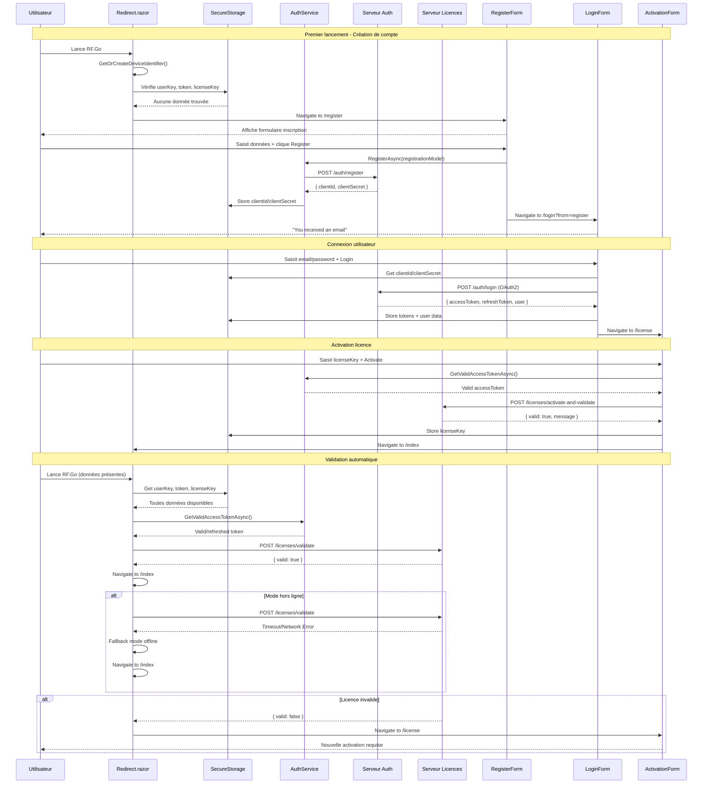
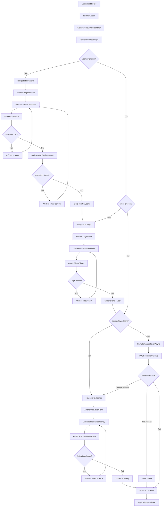

# UC-008: Authentification et validation de licence

**Résumé :** Ce cas d'utilisation décrit le processus complet d'authentification et de validation de licence depuis le lancement de l'application, incluant la création de compte, la connexion, l'activation de licence et la validation en ligne/hors ligne.

**Acteur :** Ingénieur Son

**Précondition :**

- Connexion internet disponible (optionnelle pour mode hors ligne sauf pour la première connexion)
- Serveur d'authentification et de licences accessible

**Date de création :** 19 mars 2025  
**Version :** 1.0

**Post condition :**

- L'utilisateur est authentifié et sa licence est validée
- L'accès à l'application principale est accordé
- Les tokens et informations sont stockés localement
- L'état de la licence est vérifié et maintenu

## Acteurs secondaires

- **Serveur d'authentification** : Validation des identifiants, génération de tokens et activation des clés de licence
- **SecureStorage local** : Stockage sécurisé des tokens et informations utilisateur
- **AuthService** : Service d'authentification et gestion des tokens

## Scénario nominal - Premier lancement (création de compte)

| Acteur | Action |
|--------|--------|
| Utilisateur | Lance l'application RF.Go |
| Système | Exécute Redirect.razor en point d'entrée |
| Système | Récupère deviceIdentifier via GUID.GetOrCreateDeviceIdentifier() |
| Système | Vérifie SecureStorage pour userKey, licenseKey, user, token |
| Système | Détecte l'absence d'userKey |
| Système | Redirige vers /register |
| Système | Affiche RegisterForm avec champs (FirstName, LastName, Email, Password) |
| Utilisateur | Saisit ses informations personnelles |
| Utilisateur | Crée un mot de passe complexe (8 chars, majuscule, minuscule, chiffre) |
| Utilisateur | Accepte les conditions d'utilisation |
| Utilisateur | Clique "Register" |
| Système | Valide le formulaire (email, force du mot de passe, confirmation) |
| Système | Appelle AuthService.RegisterAsync(registrationModel) |
| Système | Envoie requête POST vers /auth/register avec les données utilisateur |
| Serveur | Crée le compte utilisateur et génère clientId/clientSecret |
| Système | Stocke clientId et clientSecret via TokenStorage |
| Système | Redirige vers /login?from=register |
| Système | Affiche message "You just received an email. Please confirm your email and copy your license" |

## Scénario nominal - Connexion utilisateur existant

| Acteur | Action |
|--------|--------|
| Utilisateur | Lance l'application (userKey présent, token absent) |
| Système | Détecte userKey mais pas de token valide |
| Système | Redirige vers /login |
| Système | Affiche LoginForm |
| Utilisateur | Saisit email et mot de passe |
| Utilisateur | Clique "Login" |
| Système | Récupère clientId et clientSecret depuis TokenStorage |
| Système | Envoie requête POST vers /auth/login avec credentials OAuth2 |
| Système | Inclut headers (X-API-KEY, X-DEVICE-ID, grant_type=password) |
| Serveur | Valide les identifiants et génère accessToken/refreshToken |
| Système | Stocke les tokens et informations utilisateur via SecureStorage |
| Système | Redirige vers /license (si pas de licenseKey) |

## Scénario nominal - Activation de licence

| Acteur | Action |
|--------|--------|
| Utilisateur | Arrive sur /license (après connexion ou userKey sans licence) |
| Système | Affiche page License avec options "Buy a license" et "Activate a license" |
| Utilisateur | Clique "Activate a license" |
| Système | Affiche ActivationForm |
| Utilisateur | Saisit la clé de licence reçue par email |
| Utilisateur | Clique "Activate" |
| Système | Récupère accessToken via AuthService.GetValidAccessTokenAsync() |
| Système | Envoie POST vers /licenses/activate-and-validate |
| Système | Inclut headers (X-API-KEY, X-DEVICE-ID, X-USER-KEY, Authorization Bearer) |
| Serveur | Valide et active la licence pour le deviceId |
| Système | Stocke licenseKey dans SecureStorage |
| Système | Redirige vers /index (application principale) |

## Scénario nominal - Validation automatique au démarrage

| Acteur | Action |
|--------|--------|
| Utilisateur | Lance l'application (tous les tokens présents) |
| Système | Détecte userKey, token et licenseKey dans SecureStorage |
| Système | Appelle AuthService.GetValidAccessTokenAsync() pour rafraîchir si nécessaire |
| Système | Prépare headers d'authentification (API-KEY, USER-KEY, DEVICE-ID, LICENSE-KEY) |
| Système | Envoie POST vers /licenses/validate avec licenseKey et deviceId |
| Serveur | Vérifie la validité de la licence pour l'appareil |
| Système | Reçoit réponse `{ "valid": true, "message": "..." }` |
| Système | Redirige vers /index (accès autorisé) |

## Scénarios alternatifs

### Scénario alternatif 1: Mode hors ligne (pas de connexion réseau)

**Condition initiale** : Pas de connexion internet disponible lors de la validation
**Déclenchement** : Exception réseau lors de l'appel API /licenses/validate
**Actions** :

| Acteur | Action |
|--------|--------|
| Système | Tente la validation en ligne mais échoue (timeout/erreur réseau) |
| Système | Capture l'exception réseau |
| Système | Active le mode hors ligne (fallback) |
| Système | Redirige vers /index sans validation serveur |
| Système | Application fonctionne avec les données locales |

**Reprise** : L'application fonctionne normalement en mode hors ligne

### Scénario alternatif 2: Licence invalide ou expirée

**Condition initiale** : La licence stockée n'est plus valide
**Déclenchement** : Réponse serveur `{ "valid": false }` lors de la validation
**Actions** :

| Acteur | Action |
|--------|--------|
| Système | Reçoit réponse de validation négative |
| Système | Affiche le message d'erreur du serveur |
| Système | Redirige vers /license pour nouvelle activation |
| Utilisateur | Doit saisir une nouvelle clé de licence valide |

**Reprise** : Retour au scénario d'activation de licence

### Scénario alternatif 3: Échec de création de compte

**Condition initiale** : Erreur lors de l'inscription (email déjà utilisé, serveur indisponible)
**Déclenchement** : Erreur HTTP lors de AuthService.RegisterAsync()
**Actions** :

| Acteur | Action |
|--------|--------|
| Système | Reçoit erreur du serveur d'authentification |
| Système | Affiche message d'erreur spécifique |
| Système | Maintient l'utilisateur sur la page d'inscription |
| Utilisateur | Corrige les informations (nouvel email) ou réessaie |

**Reprise** : Retour au processus d'inscription

### Scénario alternatif 4: Token expiré lors de l'utilisation

**Condition initiale** : Token expire pendant l'utilisation de l'application
**Déclenchement** : AuthService.GetValidAccessTokenAsync() détecte expiration
**Actions** :

| Acteur | Action |
|--------|--------|
| Système | Détecte que l'accessToken est expiré |
| Système | Utilise refreshToken pour obtenir un nouveau token |
| Système | Met à jour le token dans SecureStorage |
| Système | Continue l'opération avec le nouveau token |
| Système | Si refresh échoue, redirige vers /login |

**Reprise** : Continuation normale ou re-authentification

### Scénario alternatif 5: Suppression des données utilisateur

**Condition initiale** : L'utilisateur veut supprimer ses données locales
**Déclenchement** : Clic sur "Delete user" dans la page License
**Actions** :

| Acteur | Action |
|--------|--------|
| Utilisateur | Clique "Delete user" |
| Système | Exécute SecureStorage.RemoveAll() |
| Système | Supprime userKey, tokens, licenseKey |
| Système | Redirige vers /register au prochain lancement |

**Reprise** : Nouveau processus d'inscription requis

## Diagramme de séquence

## Diagramme d'activité

## Points d'extension

- **Authentification biométrique** : Intégration Touch/Face ID pour authentification rapide
- **Authentification à deux facteurs** : SMS ou authenticator app pour sécurité renforcée
- **Gestion d'équipes** : Comptes organisationnels avec rôles et permissions
- **Synchronisation multi-appareils** : Partage de licences entre appareils d'une équipe
- **Renouvellement automatique** : Notification et renouvellement automatique des licences

## Contraintes techniques

- Les tokens utilisent le standard OAuth2 avec refresh token
- Le stockage sécurisé utilise SecureStorage.SetAsync() pour la persistance
- L'identification d'appareil utilise GUID.GetOrCreateDeviceIdentifier() unique
- Les headers API incluent X-API-KEY, X-USER-KEY, X-DEVICE-ID, X-LICENSE-KEY
- Le mode hors ligne permet le fonctionnement sans validation serveur
- La validation de licence se fait au démarrage et peut être rafraîchie dynamiquement 