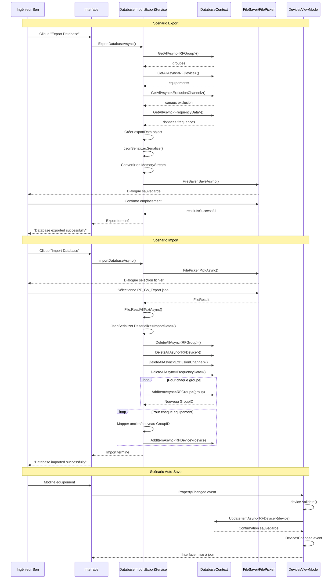
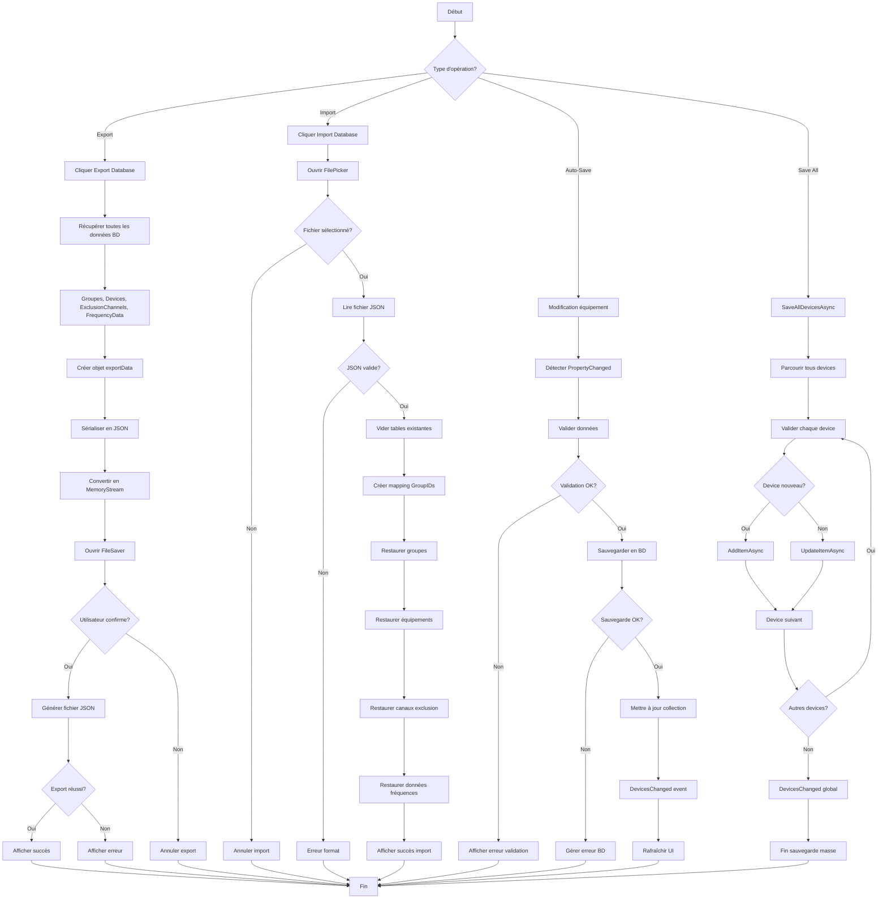

# UC-010: Gestion des sessions RF

**Résumé :** Ce cas d'utilisation décrit la gestion complète des sessions RF, incluant la sauvegarde, la restauration et l'export/import des configurations d'équipements, groupes et paramètres de fréquences pour permettre la réutilisation et l'archivage des configurations.

**Acteur :** Ingénieur Son/RF

**Précondition :**

- L'utilisateur a configuré des équipements et/ou groupes

**Date de création :** 15 janvier 2025  
**Version :** 1.1

**Post condition :**

- Les données de session sont sauvegardées en base ou exportées
- Les configurations peuvent être restaurées fidèlement
- L'état complet de l'application est préservé
- Les fichiers d'export sont générés avec intégrité

## Acteurs secondaires

- **Système de base de données** : Stockage persistant des données de session
- **Système de fichiers** : Export/import de fichiers de configuration
- **Module d'import/export** : DatabaseImportExportService

## Scénario nominal - Export de session

| Acteur | Action |
|--------|--------|
| Ingénieur Son | Clique sur "Export Database" |
| Système | Exécute DatabaseImportExportService.ExportDatabaseAsync() |
| Système | Récupère toutes les données via `GetAllAsync<T>()` pour chaque table |
| Système | Collecte RFGroup, RFDevice, ExclusionChannel, FrequencyData |
| Système | Crée un objet exportData avec timestamp |
| Système | Sérialise en JSON avec JsonSerializer |
| Système | Convertit en MemoryStream pour la sauvegarde |
| Système | Ouvre FileSaver.Default.SaveAsync() |
| Ingénieur Son | Choisit l'emplacement et confirme la sauvegarde |
| Système | Génère le fichier "RF_Go_Export.json" |
| Système | Affiche confirmation de réussite via Snackbar |

## Scénario nominal - Import de session

| Acteur | Action |
|--------|--------|
| Ingénieur Son | Clique sur "Import Database" |
| Système | Exécute DatabaseImportExportService.ImportDatabaseAsync() |
| Système | Ouvre FilePicker avec filtres JSON |
| Ingénieur Son | Sélectionne le fichier RF_Go_Export.json |
| Système | Lit le fichier via File.ReadAllTextAsync() |
| Système | Désérialise le JSON avec `JsonSerializer.Deserialize<ImportData>()` |
| Système | Vide les tables existantes via `DeleteAllAsync<T>()` |
| Système | Restaure les groupes et mappe les anciens/nouveaux IDs |
| Système | Restaure les équipements en appliquant les nouveaux GroupIDs |
| Système | Restaure les canaux d'exclusion et données de fréquences |
| Système | Affiche confirmation de succès |

## Scénarios alternatifs

### Scénario alternatif 1: Sauvegarde automatique continue (n'est pas vraiment alternatif mais plutôt une conséquence d'une modification sur un device)

**Condition initiale** : L'utilisateur travaille normalement sur l'application
**Déclenchement** : Modification d'équipement, groupe ou paramètre
**Actions** :

| Acteur | Action |
|--------|--------|
| Ingénieur Son | Modifie un équipement (nom, fréquence, canal) |
| Système | Détecte PropertyChanged event |
| Système | Exécute automatiquement SaveDeviceAsync() |
| Système | Valide les données via device.Validate() |
| Système | Sauvegarde via `DatabaseContext.UpdateItemAsync<RFDevice>()` |
| Système | Met à jour la collection `ObservableCollection<RFDevice>` |
| Système | Déclenche DevicesChanged event |
| Système | Rafraîchit l'interface automatiquement |

**Reprise** : L'utilisateur continue son travail avec auto-sauvegarde

### Scénario alternatif 2: Échec d'export (permissions fichiers)

**Condition initiale** : Problème de permissions ou d'espace disque
**Déclenchement** : Lors de FileSaver.Default.SaveAsync()
**Actions** :

| Acteur | Action |
|--------|--------|
| Système | Tente la sauvegarde via FileSaver |
| Système | Détecte result.IsSuccessful = false |
| Système | Log l'erreur dans le système de debug |
| Système | Affiche "Failed to export database" via Snackbar |
| Ingénieur Son | Vérifie les permissions et l'espace disque |
| Ingénieur Son | Peut réessayer l'export |

**Reprise** : Retour au scénario nominal après résolution

### Scénario alternatif 3: Corruption de fichier d'import

**Condition initiale** : Le fichier JSON est corrompu ou incompatible
**Déclenchement** : Lors de `JsonSerializer.Deserialize<ImportData>()`
**Actions** :

| Acteur | Action |
|--------|--------|
| Système | Tente la désérialisation du fichier |
| Système | Détecte JsonException ou format invalide |
| Système | Log l'erreur de corruption |
| Système | Affiche "Invalid or corrupted import file" |
| Système | Maintient la base de données intacte |
| Ingénieur Son | Peut choisir un autre fichier ou annuler |

**Reprise** : Retour à l'état normal sans modification des données

### Scénario alternatif 4: Sauvegarde en masse d'équipements

**Condition initiale** : L'utilisateur a modifié plusieurs équipements
**Déclenchement** : Clic sur calcul RF
**Actions** :

| Acteur | Action |
|--------|--------|
| Ingénieur Son | Lance SaveAllDevicesAsync() |
| Système | Parcourt tous les devices dans la collection |
| Système | Valide chaque device via device.Validate() |
| Système | Traite les nouveaux devices (ID = 0) via AddItemAsync() |
| Système | Met à jour les devices existants via UpdateItemAsync() |
| Système | Déclenche DevicesChanged event global |
| Système | Confirme la sauvegarde en masse |

**Reprise** : Tous les équipements sont synchronisés avec la base

## Diagramme de séquence

## Diagramme d'activité

## Points d'extension

- **Sauvegarde automatique périodique** : Backup automatique selon intervalle configurable
- **Versioning des sessions** : Gestion des versions multiples de configurations
- **Synchronisation cloud** : Backup automatique vers services cloud
- **Templates de sessions** : Création de modèles réutilisables
- **Historique des modifications** : Tracking des changements avec possibilité de rollback

## Contraintes techniques

- Les données sont sérialisées au format JSON avec JsonSerializer
- L'export utilise FileSaver.Default pour la compatibilité multi-plateforme
- L'import utilise FilePicker avec filtres spécifiques (.json)
- La validation des données utilise device.Validate() avant sauvegarde
- Le mapping des IDs utilise Dictionnary int,int pour les correspondances
- La sauvegarde auto utilise ObservableCollection et PropertyChanged events
